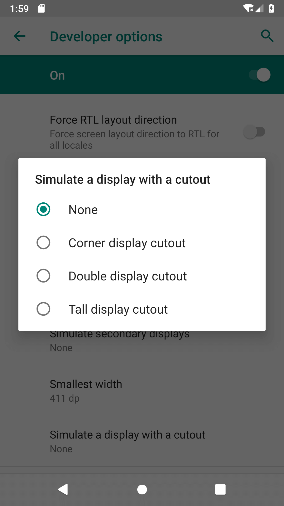
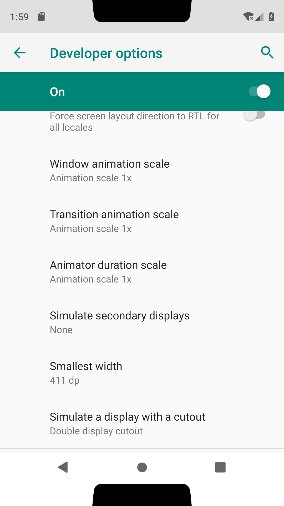
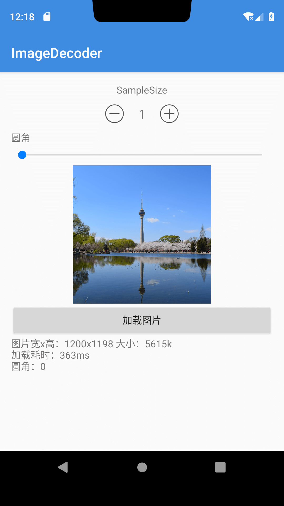
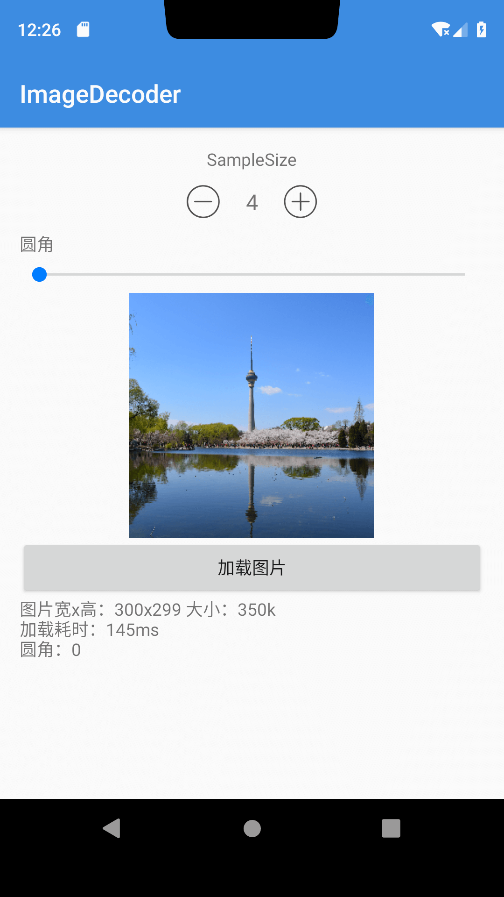
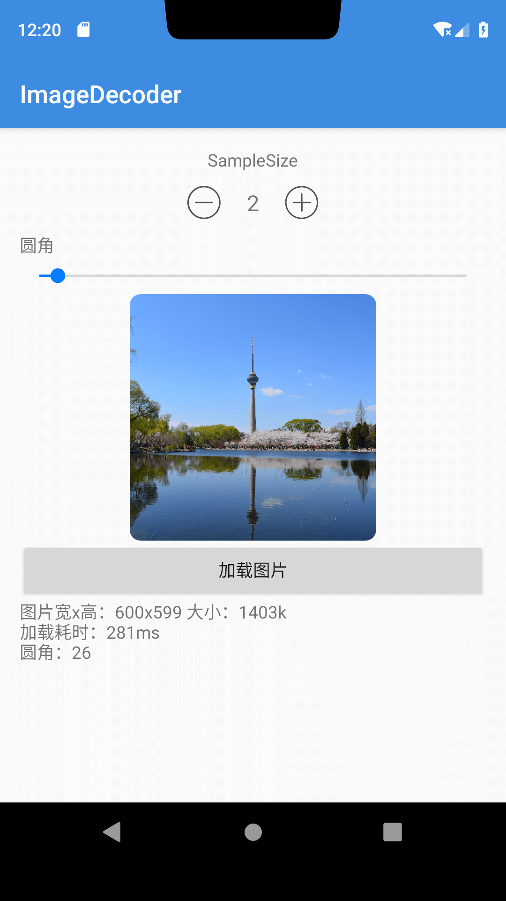
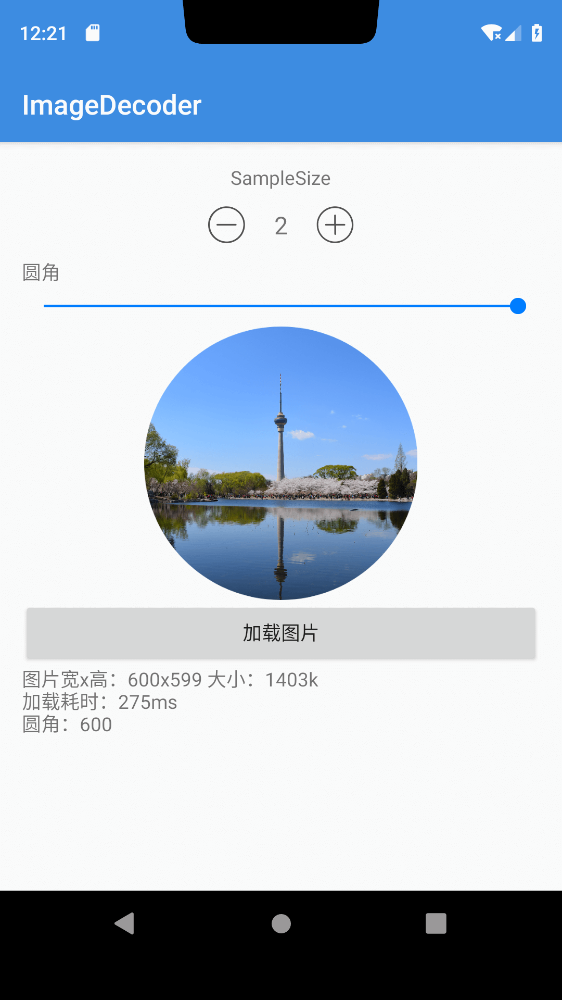

## Android 9新特性

### 官方文档：

* 原文 [https://developer.android.com/about/versions/pie/](https://developer.android.com/about/versions/pie/)
* 中文 [https://developer.android.google.cn/about/versions/pie/](https://developer.android.google.cn/about/versions/pie/)

### 显示屏缺口支持(刘海屏)

**模拟刘海屏**

1. 启用开发者选项。
2. 在 Developer options 屏幕中，向下滚动至 Drawing 部分并选择 Simulate a display with a cutout。
3. 选择屏幕缺口的大小。

步骤示例：




### ImageDecoder

**基本用法**

```java
    ImageDecoder.Source source = ImageDecoder.createSource(context.getAssets(), "sample.png");
        try {
        bitmap = ImageDecoder.decodeBitmap(source, new ImageDecoder.OnHeaderDecodedListener() {
            @Override
            public void onHeaderDecoded(ImageDecoder decoder, ImageDecoder.ImageInfo info, ImageDecoder.Source source) {
                decoder.setTargetSampleSize(sampleSize);
                addCorner(decoder);
            }
        });
    } catch (IOException e) {
        e.printStackTrace();
    }

    private void addCorner(ImageDecoder decoder) {
        if (cornerProgress == 0) {
            return;
        }
        decoder.setPostProcessor(new PostProcessor() {
            @Override
            public int onPostProcess(Canvas canvas) {
                // This will create rounded corners.
                Path path = new Path();
                path.setFillType(Path.FillType.INVERSE_EVEN_ODD);
                int width = canvas.getWidth();
                int height = canvas.getHeight();
                path.addRoundRect(0, 0, width, height, cornerProgress, cornerProgress, Path.Direction.CW);
                Paint paint = new Paint();
                paint.setAntiAlias(true);
                paint.setColor(Color.TRANSPARENT);
                paint.setXfermode(new PorterDuffXfermode(PorterDuff.Mode.SRC));
                canvas.drawPath(path, paint);
                return PixelFormat.TRANSLUCENT;
            }
        });
    }
```




缩放4倍：



圆角矩形：



圆角半径足够大，变成圆形：


