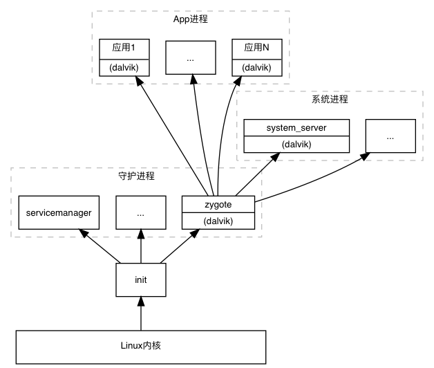

## 应用程序启动流程

### 目录

* ##### [启动流程简介](#1)

* ##### [启动流程分析](#2)
  1. [创建App进程](#2.1)
  2. [启动主线程](#2.2)
  3. [创建Application对象](#2.3)
  4. [启动主Activity](#2.4)
  5. [加载Views](#2.5)

<h3 id="1">启动流程简介</h3>

官方文档[
App startup time](https://developer.android.com/topic/performance/vitals/launch-time)给出了冷启动流程：

系统进程负责：
> 1. Loading and launching the app.
> 2. Displaying a blank starting window for the app immediately after launch.
> 3. Creating the app process.

简单来说就是创建App进程。App进程被创建完成之后，完成以下任务：

> 1. Creating the app object——创建Application对象。
> 2. Launching the main thread.——启动主线程。
> 3. Creating the main activity.——启动主Activity。
> 4. Inflating views.——加载Views。
> 5. Laying out the screen.——放置screen。
> 6. Performing the initial draw.——执行最初的绘制。

应用程序冷启动重要环节示意图：(原图地址：https://developer.android.com/topic/performance/images/cold-launch.png)


<h3 id="2">启动流程分析</h3>

<h4 id="2.1">创建App进程</h4> 

App进程由其父进程zygote创建(fork)。通过`adb shell ps`可以查看进程树：
```
$ adb shell ps
USER           PID  PPID     VSZ    RSS WCHAN            ADDR S NAME
root             1     0   16928   3204 0                   0 S init
root          1692     1 1359724 130416 0                   0 S zygote
u0_a43        4334  1692 1479728 105876 0                   0 S com.android.calculator2
```
例如启动一个计算器应用，可以看到其对应的进程名为\"com.android.calculator2\"，其父进程为zygote，zygote的父进程为init。系统开机之后，首先启动init进程，init进程会启动zygote进程，等等。进程树如下：



假定系统已经开机完成，正常展示系统桌面。此时点击桌面图标，从这里开始讨论应用程序的启动。ActivityManagerService首先请求zygote进程fork一个子进程，并指定进程主类为ActivityThread(entryPoint = \"android.app.ActivityThread\")。

fork完成之后，ActivityThread.main(String[] args)方法被执行：
```java
/**
 * This manages the execution of the main thread in an
 * application process, scheduling and executing activities,
 * broadcasts, and other operations on it as the activity
 * manager requests.
 *
 * {@hide}
 */
public final class ActivityThread {

        public static void main(String[] args) {

        Process.setArgV0("<pre-initialized>");

        Looper.prepareMainLooper();

        ActivityThread thread = new ActivityThread();
        thread.attach(false);

        if (sMainThreadHandler == null) {
            sMainThreadHandler = thread.getHandler();
        }

        Looper.loop();
    }
}
```
刚创建时进程名还是\"<pre-initialized\>\"，顾名思义，预初始化。接下来这个进程通过`thread.attach`告诉ActivityManagerService已经创建成功，这里需要提一下，ActivityManagerService在请求zygote创建子进程之前会保存一个ProcessRecord对象，目的是当子进程创建出来之后知道该赋予其什么样的属性。

ActivityManagerService.java:
```java
    private final boolean attachApplicationLocked(IApplicationThread thread,
            int pid) {
        // Find the application record that is being attached...  either via
        // the pid if we are running in multiple processes, or just pull the
        // next app record if we are emulating process with anonymous threads.
        ProcessRecord app;
        if (pid != MY_PID && pid >= 0) {
            synchronized (mPidsSelfLocked) {
                app = mPidsSelfLocked.get(pid);
            }
        } else {
            app = null;
        }

        thread.bindApplication(...);
        //...
        if (mStackSupervisor.attachApplicationLocked(app)) {
            didSomething = true;
        }
    }
```

ActivityStackSupervisor.java:
```java
    boolean attachApplicationLocked(ProcessRecord app){
        realStartActivityLocked(app);
    }
    final boolean realStartActivityLocked(app){
        app.thread.scheduleLaunchActivity(intent);
    }
```
thread.bindApplication通过Handler转主线程调用handleBindApplication方法，此时进程名正式改为应用包名：
```java
    private void handleBindApplication(AppBindData data) {
        // send up app name; do this *before* waiting for debugger
        Process.setArgV0(data.processName);
    }
```

至此认为App进程创建完成。

<h4 id="2.2">启动主线程</h4> 

ActivityThread.java
```java
    private void handleBindApplication(AppBindData data) {

        Looper.prepareMainLooper();

        if (sMainThreadHandler == null) {
            sMainThreadHandler = thread.getHandler();
        }        

        Looper.loop();

    }
```

<h4 id="2.3">创建Application对象</h4> 

ActivityThread.java
```java
    private void handleBindApplication(AppBindData data) {
        // packageInfo = new LoadedApk
        data.info = getPackageInfoNoCheck(data.appInfo, data.compatInfo);

        // (Application) cl.loadClass(className).newInstance();
        // app.attachBaseContext()
        // app.onCreate()
        Application app = data.info.makeApplication(data.restrictedBackupMode, null);
        mInitialApplication = app;
    }
```

<h4 id="2.4">启动主Activity</h4> 

ActivityStackSupervisor.java:
```java
    boolean attachApplicationLocked(ProcessRecord app){
        realStartActivityLocked(app);
    }
    final boolean realStartActivityLocked(app){
        app.thread.scheduleLaunchActivity(intent);
    }
```

App进程由scheduleLaunchActivity经过Handler调用handleLaunchActivity方法，开始启动Activity。

第一步：创建Activity对象(ActivityThread.java)：

```java
java.lang.ClassLoader cl = appContext.getClassLoader();
activity = mInstrumentation.newActivity(
                    cl, component.getClassName(), r.intent);
```

第二步：创建PhoneWindow对象(Activity.java):
```java
    final void attach(...){
        mWindow = new PhoneWindow(this, window, activityConfigCallback);
    }
```

第三步：调用onCreate：
```java
    mInstrumentation.callActivityOnCreate(activity, r.state);
```

此时Activity的生命周期方法onCreate被调用，接下来是加载Views。

<h4 id="2.5">加载Views</h4>

Activity的onCreate方法中调用：
```java
    public void setContentView(@LayoutRes int layoutResID) {
        getWindow().setContentView(layoutResID);
        initWindowDecorActionBar();
    }
```
PhoneWindow.java:
```java
    @Override
    public void setContentView(int layoutResID) {
        // Note: FEATURE_CONTENT_TRANSITIONS may be set in the process of installing the window
        // decor, when theme attributes and the like are crystalized. Do not check the feature
        // before this happens.
        if (mContentParent == null) {
            installDecor();
        }
        mLayoutInflater.inflate(layoutResID, mContentParent);
    }
```

Activity.java:
```java
    public void handleResumeActivity() {
        // decor = DecorView 
        View decor = r.window.getDecorView();
        decor.setVisibility(View.INVISIBLE);
        // wm = WindowManagerImpl
        ViewManager wm = a.getWindowManager();
        // a = Activity
        a.mDecor = decor;
        a.mWindowAdded = true;
        wm.addView(decor, l);
    }
```
WindowManagerImpl.java
```java
    @Override
    public void addView(@NonNull View view, @NonNull ViewGroup.LayoutParams params) {
        applyDefaultToken(params);
        mGlobal.addView(view, params, mContext.getDisplay(), mParentWindow);
    }
```
WindowManagerGlobal.java
```java
    // view = DecorView
    // parentWindow = PhoneWindow
    public void addView(View view, ViewGroup.LayoutParams params,
            Display display, Window parentWindow) {
        final WindowManager.LayoutParams wparams = (WindowManager.LayoutParams) params;
        ViewRootImpl root = new ViewRootImpl(view.getContext(), display);
        // ArrayList<View> mViews
        mViews.add(view);
        // ArrayList<ViewRootImpl> mRoots
        mRoots.add(root);
        // ArrayList<WindowManager.LayoutParams> mParams
        mParams.add(wparams);
        // do this last because it fires off messages to start doing things
        root.setView(view, wparams, panelParentView);
    }
```
ViewRootImpl.java
```java
    // view = DecorView
    // panelParentView = null
    public void setView(View view, WindowManager.LayoutParams attrs, View panelParentView) {
        // Schedule the first layout -before- adding to the window
        // manager, to make sure we do the relayout before receiving
        // any other events from the system.
        requestLayout();
        mWindowSession.addToDisplay(...);
        // view.mParent = ViewRootImpl
        view.assignParent(this);
    }
```
mWindowSession为：
```java
public final class WindowManagerGlobal {
    public static IWindowSession getWindowSession() {
        synchronized (WindowManagerGlobal.class) {
            if (sWindowSession == null) {
                try {
                    InputMethodManager imm = InputMethodManager.getInstance();
                    IWindowManager windowManager = getWindowManagerService();
                    sWindowSession = windowManager.openSession(
                            new IWindowSessionCallback.Stub() {
                                @Override
                                public void onAnimatorScaleChanged(float scale) {
                                    ValueAnimator.setDurationScale(scale);
                                }
                            },
                            imm.getClient(), imm.getInputContext());
                } catch (RemoteException e) {
                    throw e.rethrowFromSystemServer();
                }
            }
            return sWindowSession;
        }
    }
}
```
addToDisplay最后调用了：
```java
public class WindowManagerService extends IWindowManager.Stub
        implements Watchdog.Monitor, WindowManagerPolicy.WindowManagerFuncs {
    public int addWindow(...) {

    }
}
```