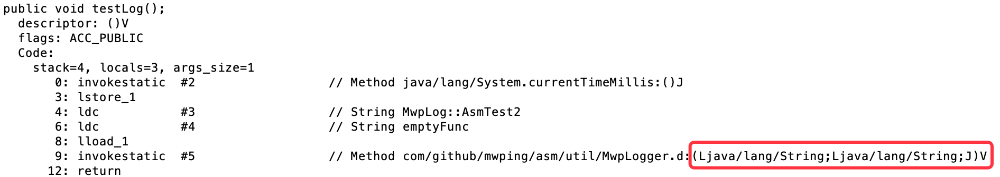

## ASM指南

### 目录

* ##### [关于ASM](#1)
  1. [官网地址](#1.1)

* ##### [使用方法](#2)
  1. [打印Log示例](#2.1)

<h3 id="1">关于ASM</h3>

<h4 id="1.1">官网地址</h4> 
[https://asm.ow2.io/index.html](https://asm.ow2.io/index.html)

<h3 id="2">使用方法</h3>

<h4 id="2.1">打印Log示例</h4>

编写两个类，一个期望自动生成Log，一个手动：
```java
public class AsmTest {
    @MwpLog
    public void testLog() {
    }
}
```
```java
public class AsmTest2 {
    public void testLog() {
        long startTime = System.currentTimeMillis();
        MwpLogger.d("MwpLog::AsmTest2", "emptyFunc", startTime);
    }
}
```

javac编译成.class，javap -v查看第二个类的字节码：
```
  public void testLog();
    descriptor: ()V
    flags: ACC_PUBLIC
    Code:
      stack=4, locals=3, args_size=1
         0: invokestatic  #2                  // Method java/lang/System.currentTimeMillis:()J
         3: lstore_1
         4: ldc           #3                  // String MwpLog::AsmTest2
         6: ldc           #4                  // String emptyFunc
         8: lload_1
         9: invokestatic  #5                  // Method com/github/mwping/asm/util/MwpLogger.d:(Ljava/lang/String;Ljava/lang/String;J)V
        12: return
```

生成`long startTime = System.currentTimeMillis();`的字节码：
```java
    private int visitCurrentTimeMillis() {
        try {
            Class<System> cls = System.class;
            Method method = cls.getMethod("currentTimeMillis");
            int id = newLocal(Type.LONG_TYPE);
            mv.visitMethodInsn(INVOKESTATIC,
                    Type.getInternalName(cls),
                    method.getName(),
                    Type.getMethodDescriptor(method),
                    false
            );
            mv.visitIntInsn(LSTORE, id);
            return id;
        } catch (NoSuchMethodException e) {
            e.printStackTrace();
        }
        return -1;
    }
```

生成`MwpLogger.d`静态方法调用的字节码：
```
    private void callLog() {
        mv.visitLdcInsn("MwpLog::" + className.substring(className.lastIndexOf("/") + 1));
        mv.visitLdcInsn(methodName + " execute");
        mv.visitVarInsn(LLOAD, startTimeId);
        mv.visitMethodInsn(INVOKESTATIC,
                TypeUtils.getInternalName("com.github.mwping.asm.util.MwpLogger"),
                "d",
                "(Ljava/lang/String;Ljava/lang/String;J)V",
                false
        );
    }
```
visitMethodInsn的第4个参数值是\"(Ljava/lang/String;Ljava/lang/String;J)V\"，手动拼很麻烦，可以从上面的javap -v输出的内容里面拷贝：


编译完成之后，把第一个类的.class文件拖到Android Studio查看，生成字节码成功：
```
public class AsmTest {
    public AsmTest() {
    }

    @MwpLog
    public void testLog() {
        long var1 = System.currentTimeMillis();
        MwpLogger.d("MwpLog::AsmTest", "testLog execute", var1);
    }
}
```

在MainActivity的onCreate方法打上MwpLog注解进行测试：
```java
    @MwpLog
    @Override
    protected void onCreate(Bundle savedInstanceState) {
        super.onCreate(savedInstanceState);
        setContentView(R.layout.activity_main);
    }
```
打开App，查看Log：
```
D/MwpLog::MainActivity:  
    ┌─────────────────────────────────────────────────
    │onCreate execute
    │cost time: 113
    └─────────────────────────────────────────────────
```