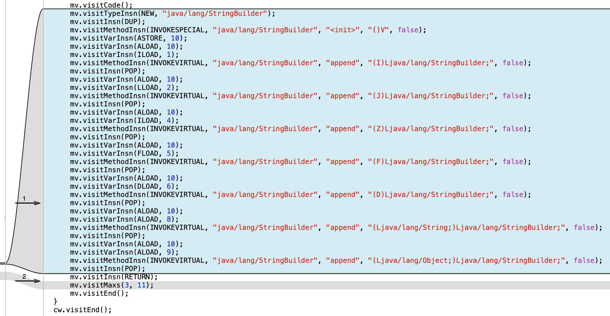

## ASM指南

### 目录

* ##### [关于ASM](#1)
  1. [官网地址](#1.1)

* ##### [打印Log示例](#2)
  1. [查看ASMifier文档](#2.1)
  2. [使用ASMifier](#2.2)
  3. [为方法生成字节码](#2.3)

<h3 id="1">关于ASM</h3>

<h4 id="1.1">官网地址</h4> 
[https://asm.ow2.io/index.html](https://asm.ow2.io/index.html)

<h3 id="2">打印Log示例</h3>

<h4 id="2.1">查看ASMifier文档</h4>

文档连接：[https://asm.ow2.io/asm4-guide.pdf](https://asm.ow2.io/asm4-guide.pdf)，使用方法：
```
java -classpath asm.jar:asm-util.jar \
org.objectweb.asm.util.ASMifier \
java.lang.Runnable
```

<h4 id="2.2">使用ASMifier</h4>

1.依赖asm-all库：
```
compile 'org.ow2.asm:asm-all:6.0_BETA'
```

2.找到asm.jar，路径一般为：
```
/Users/lixiang/.gradle/caches/modules-2/files-2.1/org.ow2.asm/asm-all/6.0_BETA/535f141f6c8fc65986a3469839a852a3266d1025/asm-all-6.0_BETA.jar
```

3.编写一个测试类：
```java
public class AsmTest {
    @MwpLog
    public void testLog(int anInt, long aLong, boolean aBoolean, float aFloat,
                        double aDouble, String aString, LogObject object) {
    }
}
```
build项目，找到AsmTest.class:
> /Users/lixiang/Mwp/Github/TheMatrix/TheMatrixApp/app/build/intermediates/javac/debug/compileDebugJavaWithJavac/classes/com/github/mwping/lordhelperapp/util/AsmTest.class

4.使用ASMifier:
```
java -classpath /Users/lixiang/.gradle/caches/modules-2/files-2.1/org.ow2.asm/asm-all/6.0_BETA/535f141f6c8fc65986a3469839a852a3266d1025/asm-all-6.0_BETA.jar:asm-util.jar \
org.objectweb.asm.util.ASMifier \
/Users/lixiang/Mwp/Github/TheMatrix/TheMatrixApp/app/build/intermediates/javac/debug/compileDebugJavaWithJavac/classes/com/github/mwping/lordhelperapp/util/AsmTest.class
```
输出按java格式化：
```java
package asm.com.github.mwping.lordhelperapp.util;

import java.util.*;

import org.objectweb.asm.*;

public class AsmTestDump implements Opcodes {

    public static byte[] dump() throws Exception {

        ClassWriter cw = new ClassWriter(0);
        FieldVisitor fv;
        MethodVisitor mv;
        AnnotationVisitor av0;

        cw.visit(V1_7, ACC_PUBLIC + ACC_SUPER, "com/github/mwping/lordhelperapp/util/AsmTest", null, "java/lang/Object", null);

        {
            mv = cw.visitMethod(ACC_PUBLIC, "<init>", "()V", null, null);
            mv.visitCode();
            mv.visitVarInsn(ALOAD, 0);
            mv.visitMethodInsn(INVOKESPECIAL, "java/lang/Object", "<init>", "()V", false);
            mv.visitInsn(RETURN);
            mv.visitMaxs(1, 1);
            mv.visitEnd();
        }
        {
            mv = cw.visitMethod(ACC_PUBLIC, "testLog", "(IJZFDLjava/lang/String;Lcom/github/mwping/lordhelperapp/util/LogObject;)V", null, null);
            {
                av0 = mv.visitAnnotation("Lcom/github/mwping/asm/annotation/MwpLog;", false);
                av0.visitEnd();
            }
            mv.visitCode();
            mv.visitInsn(RETURN);
            mv.visitMaxs(0, 10);
            mv.visitEnd();
        }
        cw.visitEnd();

        return cw.toByteArray();
    }
}
```

<h4 id="2.3">为方法生成字节码</h4>

修改类AsmTest.java:
```java
public class AsmTest {
    @MwpLog
    public void testLog(int anInt, long aLong, boolean aBoolean, float aFloat,
                        double aDouble, String aString, LogObject object) {
        StringBuilder builder = new StringBuilder();
        builder.append(anInt);
        builder.append(aLong);
        builder.append(aBoolean);
        builder.append(aFloat);
        builder.append(aDouble);
        builder.append(aString);
        builder.append(object);
    }
}
```
重新执行命令，获取格式化结果：
```java
package asm.com.github.mwping.lordhelperapp.util;

import java.util.*;

import org.objectweb.asm.*;

public class AsmTestDump implements Opcodes {

    public static byte[] dump() throws Exception {

        ClassWriter cw = new ClassWriter(0);
        FieldVisitor fv;
        MethodVisitor mv;
        AnnotationVisitor av0;

        cw.visit(V1_7, ACC_PUBLIC + ACC_SUPER, "com/github/mwping/lordhelperapp/util/AsmTest", null, "java/lang/Object", null);

        {
            mv = cw.visitMethod(ACC_PUBLIC, "<init>", "()V", null, null);
            mv.visitCode();
            mv.visitVarInsn(ALOAD, 0);
            mv.visitMethodInsn(INVOKESPECIAL, "java/lang/Object", "<init>", "()V", false);
            mv.visitInsn(RETURN);
            mv.visitMaxs(1, 1);
            mv.visitEnd();
        }
        {
            mv = cw.visitMethod(ACC_PUBLIC, "testLog", "(IJZFDLjava/lang/String;Lcom/github/mwping/lordhelperapp/util/LogObject;)V", null, null);
            {
                av0 = mv.visitAnnotation("Lcom/github/mwping/asm/annotation/MwpLog;", false);
                av0.visitEnd();
            }
            mv.visitCode();
            mv.visitTypeInsn(NEW, "java/lang/StringBuilder");
            mv.visitInsn(DUP);
            mv.visitMethodInsn(INVOKESPECIAL, "java/lang/StringBuilder", "<init>", "()V", false);
            mv.visitVarInsn(ASTORE, 10);
            mv.visitVarInsn(ALOAD, 10);
            mv.visitVarInsn(ILOAD, 1);
            mv.visitMethodInsn(INVOKEVIRTUAL, "java/lang/StringBuilder", "append", "(I)Ljava/lang/StringBuilder;", false);
            mv.visitInsn(POP);
            mv.visitVarInsn(ALOAD, 10);
            mv.visitVarInsn(LLOAD, 2);
            mv.visitMethodInsn(INVOKEVIRTUAL, "java/lang/StringBuilder", "append", "(J)Ljava/lang/StringBuilder;", false);
            mv.visitInsn(POP);
            mv.visitVarInsn(ALOAD, 10);
            mv.visitVarInsn(ILOAD, 4);
            mv.visitMethodInsn(INVOKEVIRTUAL, "java/lang/StringBuilder", "append", "(Z)Ljava/lang/StringBuilder;", false);
            mv.visitInsn(POP);
            mv.visitVarInsn(ALOAD, 10);
            mv.visitVarInsn(FLOAD, 5);
            mv.visitMethodInsn(INVOKEVIRTUAL, "java/lang/StringBuilder", "append", "(F)Ljava/lang/StringBuilder;", false);
            mv.visitInsn(POP);
            mv.visitVarInsn(ALOAD, 10);
            mv.visitVarInsn(DLOAD, 6);
            mv.visitMethodInsn(INVOKEVIRTUAL, "java/lang/StringBuilder", "append", "(D)Ljava/lang/StringBuilder;", false);
            mv.visitInsn(POP);
            mv.visitVarInsn(ALOAD, 10);
            mv.visitVarInsn(ALOAD, 8);
            mv.visitMethodInsn(INVOKEVIRTUAL, "java/lang/StringBuilder", "append", "(Ljava/lang/String;)Ljava/lang/StringBuilder;", false);
            mv.visitInsn(POP);
            mv.visitVarInsn(ALOAD, 10);
            mv.visitVarInsn(ALOAD, 9);
            mv.visitMethodInsn(INVOKEVIRTUAL, "java/lang/StringBuilder", "append", "(Ljava/lang/Object;)Ljava/lang/StringBuilder;", false);
            mv.visitInsn(POP);
            mv.visitInsn(RETURN);
            mv.visitMaxs(3, 11);
            mv.visitEnd();
        }
        cw.visitEnd();

        return cw.toByteArray();
    }
}
```

使用diff工具查看两次输出的区别：



把AsmTest.java还原:
```java
public class AsmTest {
    @MwpLog
    public void testLog() {

    }
}
```

重写AdviceAdapter以下几个方法，其中onMethodExit内容均从上面的diff部分拷贝过来:
```java
    @Override
    public AnnotationVisitor visitAnnotation(String desc, boolean visible) {
        if (desc.contains("MwpLog")) {
            enableLog = true;
        }
        return super.visitAnnotation(desc, visible);
    }

    @Override
    protected void onMethodEnter() {
        if (enableLog) {

        }
    }

    @Override
    protected void onMethodExit(int opcode) {
        if (enableLog) {
            mv.visitTypeInsn(NEW, "java/lang/StringBuilder");
            mv.visitInsn(DUP);
            mv.visitMethodInsn(INVOKESPECIAL, "java/lang/StringBuilder", "<init>", "()V", false);
            mv.visitVarInsn(ASTORE, 10);
            mv.visitVarInsn(ALOAD, 10);
            mv.visitVarInsn(ILOAD, 1);
            mv.visitMethodInsn(INVOKEVIRTUAL, "java/lang/StringBuilder", "append", "(I)Ljava/lang/StringBuilder;", false);
            mv.visitInsn(POP);
            mv.visitVarInsn(ALOAD, 10);
            mv.visitVarInsn(LLOAD, 2);
            mv.visitMethodInsn(INVOKEVIRTUAL, "java/lang/StringBuilder", "append", "(J)Ljava/lang/StringBuilder;", false);
            mv.visitInsn(POP);
            mv.visitVarInsn(ALOAD, 10);
            mv.visitVarInsn(ILOAD, 4);
            mv.visitMethodInsn(INVOKEVIRTUAL, "java/lang/StringBuilder", "append", "(Z)Ljava/lang/StringBuilder;", false);
            mv.visitInsn(POP);
            mv.visitVarInsn(ALOAD, 10);
            mv.visitVarInsn(FLOAD, 5);
            mv.visitMethodInsn(INVOKEVIRTUAL, "java/lang/StringBuilder", "append", "(F)Ljava/lang/StringBuilder;", false);
            mv.visitInsn(POP);
            mv.visitVarInsn(ALOAD, 10);
            mv.visitVarInsn(DLOAD, 6);
            mv.visitMethodInsn(INVOKEVIRTUAL, "java/lang/StringBuilder", "append", "(D)Ljava/lang/StringBuilder;", false);
            mv.visitInsn(POP);
            mv.visitVarInsn(ALOAD, 10);
            mv.visitVarInsn(ALOAD, 8);
            mv.visitMethodInsn(INVOKEVIRTUAL, "java/lang/StringBuilder", "append", "(Ljava/lang/String;)Ljava/lang/StringBuilder;", false);
            mv.visitInsn(POP);
            mv.visitVarInsn(ALOAD, 10);
            mv.visitVarInsn(ALOAD, 9);
            mv.visitMethodInsn(INVOKEVIRTUAL, "java/lang/StringBuilder", "append", "(Ljava/lang/Object;)Ljava/lang/StringBuilder;", false);
            mv.visitInsn(POP);
        }
    }
```

build项目，重新查看AsmTest.class:
```java
public class AsmTest {
    public AsmTest() {
    }

    @MwpLog
    public void testLog(int anInt, long aLong, boolean aBoolean, float aFloat, double aDouble, String aString, LogObject object) {
        StringBuilder var10 = new StringBuilder();
        var10.append(anInt);
        var10.append(aLong);
        var10.append(aBoolean);
        var10.append(aFloat);
        var10.append(aDouble);
        var10.append(aString);
        var10.append(object);
    }
}
```

字节码生成成功！