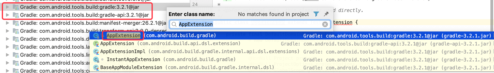
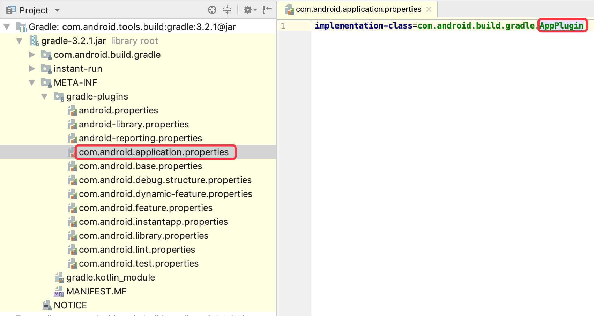

## App构建流程分析

### 目录

* ##### [构建流程](#1)
  1. [官方文档](#1.1)

* ##### [流程分析](#2)
  1. [配置源码](#2.1)
  2. [找到插件主类](#2.2)
  3. [自定义AppPlugin](#2.3)

<h3 id="1">构建流程</h3>

<h4 id="1.1">官方文档</h4> 

[Configure your build](https://developer.android.com/studio/build/)


(原图地址:https://developer.android.com/images/tools/studio/build-process_2x.png)


<h3 id="2">流程分析</h3>

<h4 id="2.1">配置源码</h4> 

新建项目，新建buildSrc模块，buildSrc/build.gradle内容如下：
```
apply plugin: 'groovy'
apply plugin: 'maven'

repositories {
    jcenter()
    mavenCentral()
    google()
}

dependencies {
    compile gradleApi() //gradle sdk
    compile localGroovy() //groovy sdk
    compile 'com.android.tools.build:gradle:3.2.1'
}
```
sync gradle之后效果如下：



<h4 id="2.2">找到插件主类</h4> 

app/build.gradle一般是这样开头：
```
apply plugin: 'com.android.application'
```
通过插件名找到主类`AppPlugin.java`



```java
/** Gradle plugin class for 'application' projects, applied on the base application module */
public class AppPlugin extends AbstractAppPlugin {
    // ...
}
```

<h4 id="2.3">自定义AppPlugin</h4> 
1.创建插件类：

```java
class MyAppPlugin extends AppPlugin {
    MwpLogger logger;

    @Inject
    MyAppPlugin(ToolingModelBuilderRegistry registry) {
        super(registry)
    }

    @Override
    void apply(Project project) {
        super.apply(project)
        logger = new MwpLogger(project);
        logger.error(project.getName() + " apply MyAppPlugin!")
    }
}
```

2.使用自定义插件：

把app/build.gradle中的
```
apply plugin: 'com.android.application'
```
替换为
```
import com.github.mwping.buildsrc.MyAppPlugin

apply plugin: MyAppPlugin
```

3.查看build日志：
```
┌─────────────────────────────────────────────────
│ app apply MyAppPlugin!
└─────────────────────────────────────────────────
:app:checkDebugClasspath UP-TO-DATE
:app:preBuild UP-TO-DATE
:app:preDebugBuild UP-TO-DATE
```