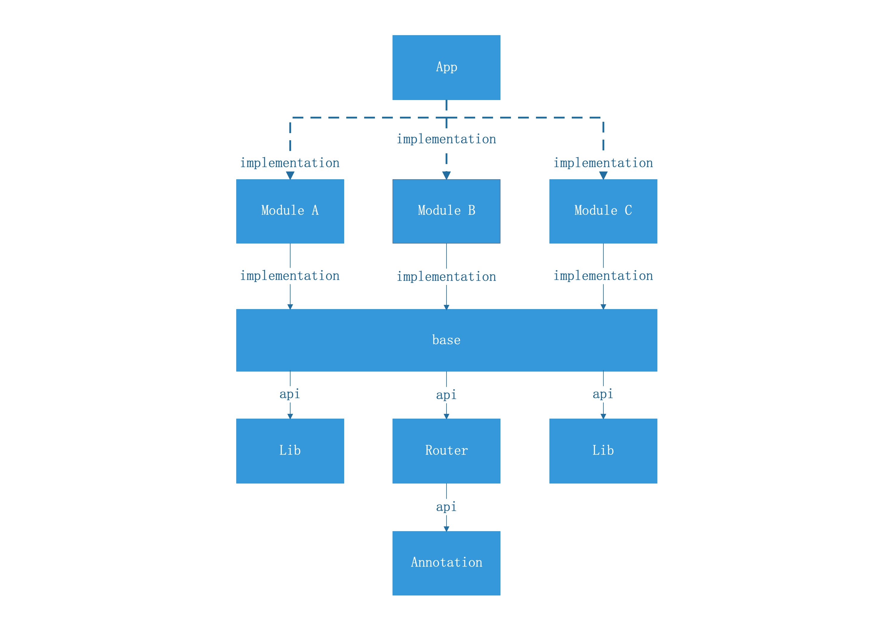

## 组件化

### 目录

* ##### [项目依赖树](#1)

* ##### [组件化实现](#2)
	1. [配置根目录gradle](#2.1)
	2. [配置模块gradle](#2.2)
	3. [添加注解](#2.3)
	4. [添加注解处理器](#2.4)
	5. [配置路径](#2.5)
	6. [添加路由分发逻辑](#2.6)
	
* ##### [使用](#3)

<h3 id="1">项目依赖树</h3>



说明：

1. 设置变量assembleMode；
2. 当assembleMode=true时，App依赖ModuleA、B、C；
3. 当assembleMode=false时，App不依赖ModuleA、B、C，这三者可以独立运行；

<h3 id="2">组件化实现</h3>

<h4 id="2.1">配置根目录gradle</h4>

```
ext {
    // assembleMode=true: 发布模式，子模块作为library，assembleMode=false: 调试模式，子模块作为独立的应用，
    assembleMode=true
}
```

<h4 id="2.2">配置模块gradle</h4>

```
if (assembleMode) {
    apply plugin: 'com.android.library'
} else {
    apply plugin: 'com.android.application'
}

android {
    defaultConfig {

    	// other configs

        if (!assembleMode) {
            applicationId "com.github.mwping.androidguides"
            versionCode 1
            versionName "1.0.0"
        } else {
            // do nothing
        }
    }

    sourceSets {
        main {
            // 独立app模式下使用debug下的AndroidManifest.xml
            if (assembleMode) {
                manifest.srcFile 'src/main/AndroidManifest.xml'
                java {
                    exclude '**/test/**'
                }
            } else {
                manifest.srcFile 'src/main/module/AndroidManifest.xml'
            }
        }
    }
}

dependencies {

	// other dependencies

	implementation project(':base')
    annotationProcessor project(':processor')
}

```

<h4 id="2.3">添加注解</h4>

```java
@Retention(RetentionPolicy.SOURCE)
@Target({ElementType.TYPE})
public @interface RoutePath {
    String value();
}

```

<h4 id="2.4">添加注解处理器</h4>

```java
@AutoService(Processor.class)
public class RouteProcessor extends AbstractProcessor {
    private Filer mFiler;

    @Override
    public synchronized void init(ProcessingEnvironment processingEnvironment) {
        super.init(processingEnvironment);
        mFiler = processingEnv.getFiler();
    }

    @Override
    public boolean process(Set<? extends TypeElement> set, RoundEnvironment roundEnvironment) {
        doProcess(set, roundEnvironment);
        return true;
    }

    private void doProcess(Set<? extends TypeElement> set, RoundEnvironment roundEnvironment) {
        Set<? extends Element> routePathSet = roundEnvironment.getElementsAnnotatedWith(RoutePath.class);
        if (routePathSet.isEmpty()) {
            return;
        }
        buildRoutePaths(routePathSet);
    }

    private void buildRoutePaths(Set<? extends Element> routePathSet) {
        for (Element element : routePathSet) {
            if (element instanceof TypeElement) {
                buildClassPath((TypeElement) element);
            }
        }
    }

    private void buildClassPath(TypeElement element) {
        String path = element.getAnnotation(RoutePath.class).value();
        String moduleName = Utils.generateModuleName(path);

        FieldSpec.Builder fieldBuilder = FieldSpec.builder(Class.class, "TARGET_CLASS",
                Modifier.FINAL, Modifier.PUBLIC, Modifier.STATIC).initializer("$T.class", ClassName.get(element));

        TypeSpec module = TypeSpec.classBuilder(moduleName)
                .addModifiers(Modifier.PUBLIC, Modifier.FINAL)
                .addField(fieldBuilder.build())
                .addJavadoc("Auto generated by {@link com.github.mwping.module.processor.RouteProcessor}, do not modify this class!\n" +
                        "see doc https://github.com/square/javapoet\n")
                .build();

        JavaFile javaFile = JavaFile.builder("com.github.mwping.module", module)
                .build();
        try {
            javaFile.writeTo(mFiler);
        } catch (IOException e) {
            e.printStackTrace();
        }
    }

    @Override
    public SourceVersion getSupportedSourceVersion() {
        return SourceVersion.RELEASE_7;
    }

    @Override
    public Set<String> getSupportedAnnotationTypes() {
        Set<String> set = new LinkedHashSet<>();
        set.add(RoutePath.class.getName());
        return set;
    }
}
```

<h4 id="2.5">配置路径</h4>

```java
@RoutePath("/module/login")
public class LoginActivity extends AppCompatActivity implements LoaderCallbacks<Cursor> {
	// ...
}
```

运行项目，会自动生成类：
```java
/**
 * Auto generated by {@link com.github.mwping.module.processor.RouteProcessor}, do not modify this class!
 * see doc https://github.com/square/javapoet
 */
public final class Module$Login {
  public static final Class TARGET_CLASS = LoginActivity.class;
}
```

<h4 id="2.5">添加路由分发逻辑</h4>

```java
public class Router {
    private static volatile Router INSTANCE;
    private HashMap<String, Class> pathMap;

    private Router() {
        pathMap = new HashMap<>();
    }

    public static Router getInstance() {
        if (INSTANCE == null) {
            synchronized (Router.class) {
                if (INSTANCE == null) {
                    INSTANCE = new Router();
                }
            }
        }
        return INSTANCE;
    }

    @MwpLog
    public boolean jump(Context context, String url) {
        Uri uri = Uri.parse(url);
        String host = uri.getHost();
        String path = uri.getPath();
        if (TextUtils.isEmpty(path)) {
            return false;
        }
        if (pathMap.get(path) == null) {
            try {
                Class moduleClass = Class.forName("com.github.mwping.module." + Utils.generateModuleName(path));
                Field field = moduleClass.getField("TARGET_CLASS");
                Class targetClass = (Class) field.get(null);
                pathMap.put(path, targetClass);
            } catch (Exception e) {
                e.printStackTrace();
            }
        }
        Class targetClass = pathMap.get(path);
        if (targetClass == null) {
            return false;
        }
        Intent intent = new Intent(context, targetClass);
        if (!(context instanceof Activity)) {
            intent.addFlags(Intent.FLAG_ACTIVITY_NEW_TASK);
        }
        context.startActivity(intent);
        return true;
    }
}
```

<h3 id="3">使用</h3>

```java
	Router.getInstance().jump(context, "/module/login");
```