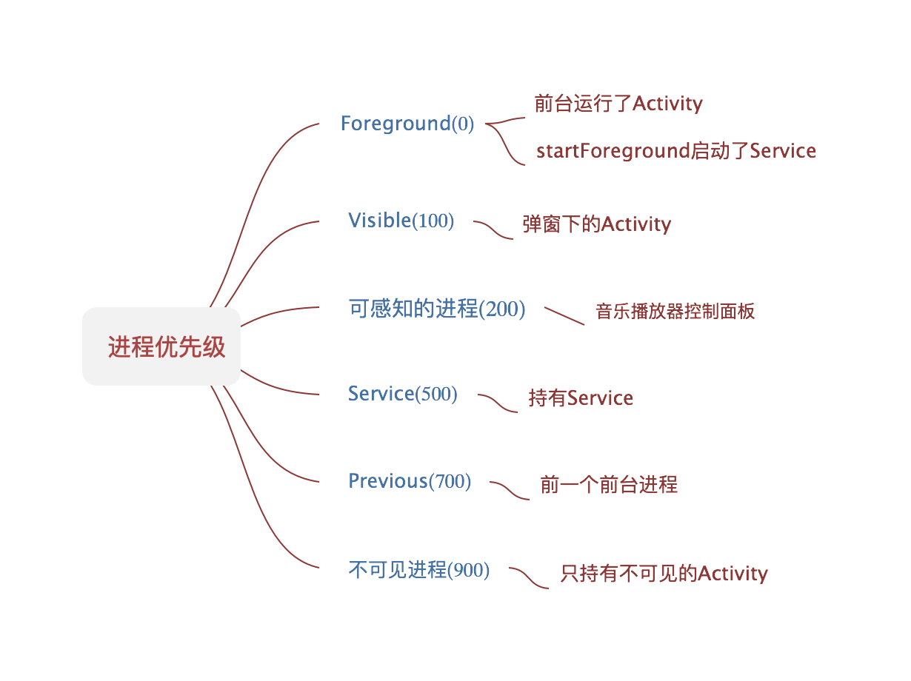
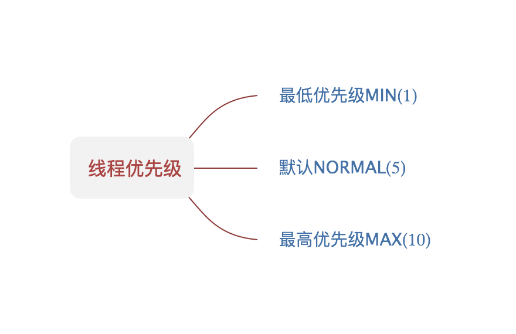
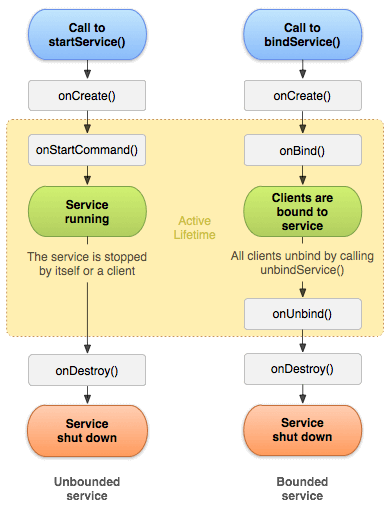
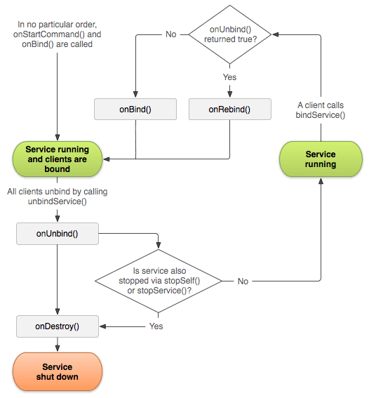
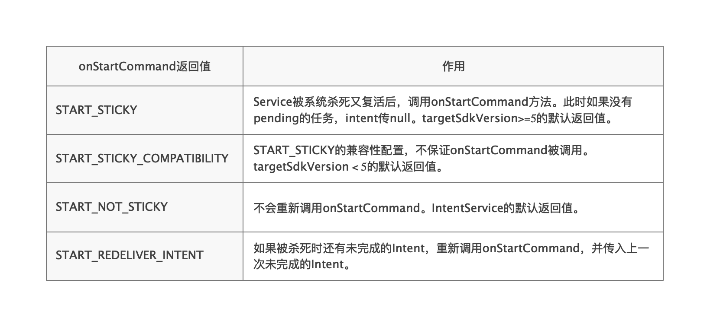

## [后台任务最佳实践](https://developer.android.com/training/best-background)

* ##### [进程和线程](#1)

* ##### [后台任务处理方式的选择](#2)

* ##### [Service生命周期](#3)

* ##### [onStartCommand返回值含义](#4)

* ##### [前台服务](#5)

* ##### [可延迟的任务](#6)

<h3 id="1">进程和线程</h3>

[ProcessList](https://android.googlesource.com/platform/frameworks/base/+/master/services/core/java/com/android/server/am/ProcessList.java)定义了进程优先级：



线程优先级是：




<h3 id="2">后台任务处理方式的选择</h3>


<h3 id="3">Service生命周期</h3>

官网[Bound services overview](https://developer.android.com/guide/components/bound-services.html)和[services](https://developer.android.com/guide/components/services)详细介绍并配图说明了Service的生命周期：





IntentService生命周期和Service基本一致，只是处理完所有任务之后，会stopSelf()结束自己。

<h3 id="4">onStartCommand返回值含义</h3>



<h3 id="5">前台服务</h3>

前台服务具有更高的优先级，更难被系统杀掉，但是需要发送状态栏通知，让用户能感知到服务的存在。

用法：

1.声明权限：
```
    <uses-permission android:name="android.permission.FOREGROUND_SERVICE" />
```
2.调用方法：
```java
	startForeground(int id, notification)
```
需要额外[创建notification](https://developer.android.com/training/notify-user/build-notification)。

<h3 id="6">可延迟的任务</h3>

可延迟的任务可以使用JobScheduler，让自定义任务在设定的条件被触发时再执行，如：手机连接USB、WIFI连接。


