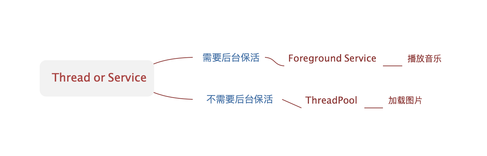

## [后台任务最佳实践](https://developer.android.com/training/best-background)

* ##### [进程优先级](#1)

* ##### [后台任务处理方式的选择](#2)

* ##### [Service生命周期](#3)

* ##### [onStartCommand返回值含义](#4)

<h3 id="1">进程优先级</h3>

[ProcessList](https://android.googlesource.com/platform/frameworks/base/+/master/services/core/java/com/android/server/am/ProcessList.java)定义了进程优先级：

<h3 id="2">后台任务处理方式的选择</h3>

<h3 id="3">Service生命周期</h3>

官网[Bound services overview](https://developer.android.com/guide/components/bound-services.html)和[services](https://developer.android.com/guide/components/services)详细介绍并配图说明了Service的生命周期：

IntentService生命周期和Service基本一致，只是处理完所有任务之后，会stopSelf()结束自己。

<h3 id="4">onStartCommand返回值含义</h3>

