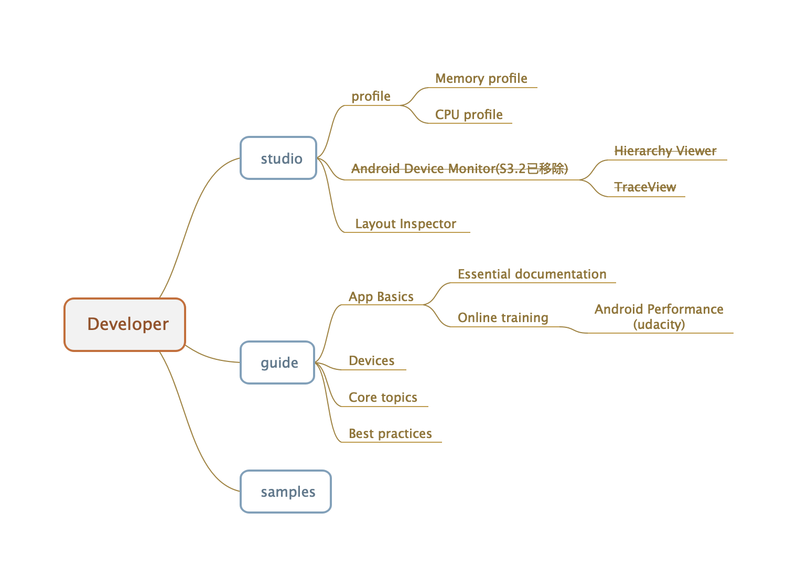

## Android开发者官方教程实践

* ##### [官网](#1)
  1. [官网地址](#1.1)
  2. [目录结构](#1.2)

<h3 id="1">官网</h3>

<h4 id="1.1">官网地址</h4>

[https://developer.android.com/index.html](https://developer.android.com/index.html)

<h4 id="1.2">目录结构</h4>

