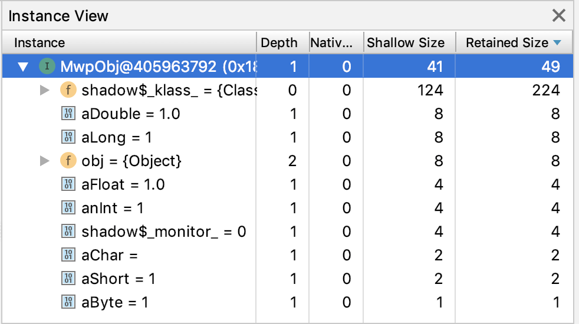

## [内存优化实践](https://developer.android.com/studio/profile/memory-profiler)

各个类型占用的字节数


如下类：
```java
public class MwpObj {
    byte aByte = 1;
    char aChar = 1;
    short aShort = 1;
    int anInt = 1;
    long aLong = 1;
    float aFloat = 1;
    double aDouble = 1;
    Object obj = new Object();
}
```

占用内存的情况如下(已字节为单位)：


