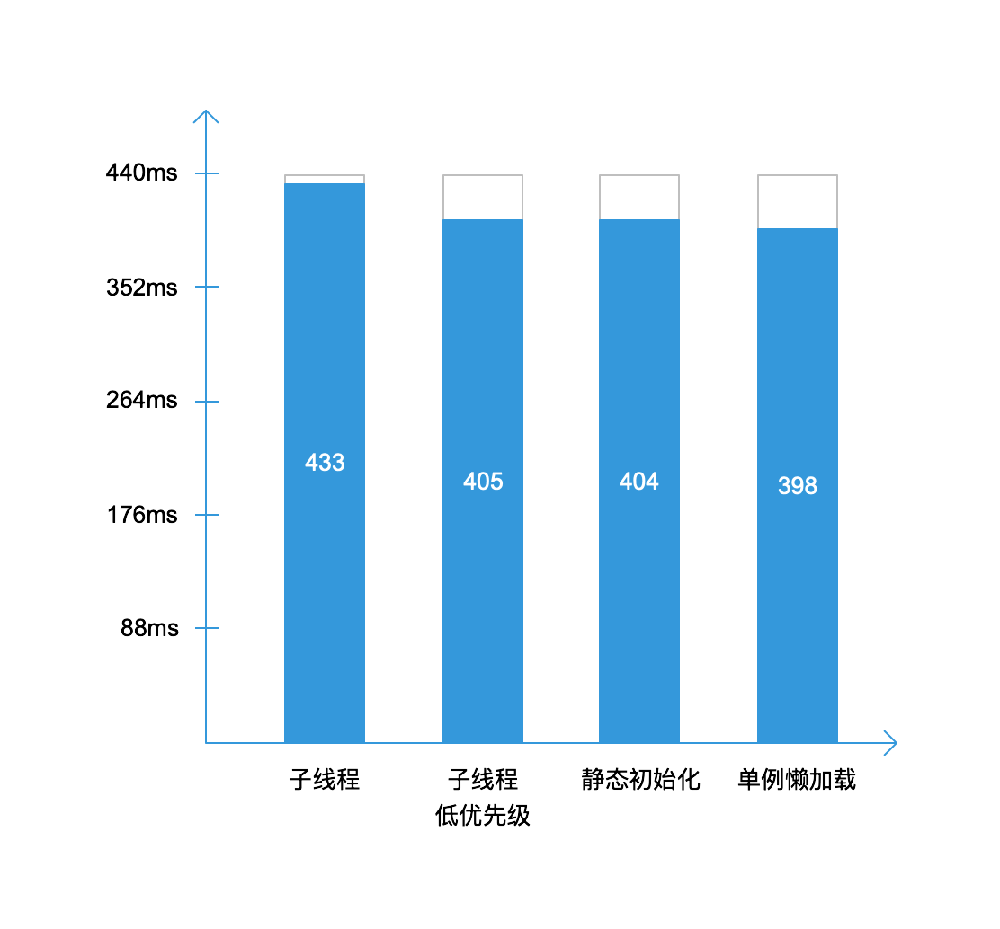

## [启动优化实践](https://developer.android.com/topic/performance/vitals/launch-time)

命令行查看启动耗时：
```
adb shell am start -S -W topic.android.sample.performance/.MainActivity
Stopping: topic.android.sample.performance
Starting: Intent { act=android.intent.action.MAIN cat=[android.intent.category.LAUNCHER] cmp=topic.android.sample.performance/.MainActivity }
Status: ok
Activity: topic.android.sample.performance/.MainActivity
ThisTime: 407
TotalTime: 407
WaitTime: 451
Complete
```

启动阶段各个操作对启动时间的影响：



解决方案：

* 布局扁平化；
* ViewStub延时加载不需要立即可见的View；
* 耗时操作放到子线程；
* 子线程考虑使用低优先级；
* 增加启动背景防止白屏等待；
* 使用单例懒加载避免大量的静态变量直接初始化，也降低启动过程GC带来的耗时；
* 不要过早的startService，减少CPU资源竞争。