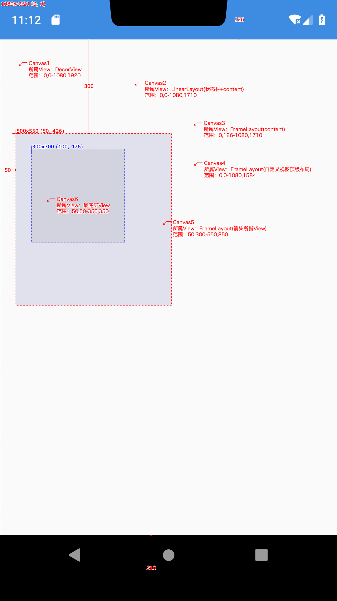

## 图解draw流程(硬件渲染篇)

### 目录

* ##### [确认RenderNode上下左右坐标](#1)

* ##### [重绘View树](#2)

<h3 id="1">确认RenderNode上下左右坐标</h3>

layout阶段完成：
```java
    public void layout(int l, int t, int r, int b) {
        // ...
        setFrame(l, t, r, b);
        // ...
    }

    protected boolean setFrame(int left, int top, int right, int bottom) {
        // ...
        mLeft = left;
        mTop = top;
        mRight = right;
        mBottom = bottom;
        mRenderNode.setLeftTopRightBottom(mLeft, mTop, mRight, mBottom);
        // ...
    }
```

<h3 id="2">重绘View树</h3>

View绘制伪代码：

```java
public final class ThreadedRenderer {
    void draw(View view, AttachInfo attachInfo, DrawCallbacks callbacks,
            FrameDrawingCallback frameDrawingCallback) {
        updateRootDisplayList(view, callbacks);
        nSyncAndDrawFrame(mNativeProxy, frameInfo, frameInfo.length);
    }

    private void updateRootDisplayList(View view, DrawCallbacks callbacks) {
        updateViewTreeDisplayList(view);
        // 屏幕宽高
        DisplayListCanvas canvas = mRootNode.start(mSurfaceWidth, mSurfaceHeight);
        canvas.drawRenderNode(view.updateDisplayListIfDirty());
        mRootNode.end(canvas);
    }

    private void updateViewTreeDisplayList(View view) {
        view.mPrivateFlags |= View.PFLAG_DRAWN;
        view.mRecreateDisplayList = (view.mPrivateFlags & View.PFLAG_INVALIDATED)
                == View.PFLAG_INVALIDATED;
        view.mPrivateFlags &= ~View.PFLAG_INVALIDATED;
        view.updateDisplayListIfDirty();
        view.mRecreateDisplayList = false;
    }
}
```

View.java:
```java
    /**
     * Gets the RenderNode for the view, and updates its DisplayList (if needed and supported)
     * @hide
     */
    @NonNull
    public RenderNode updateDisplayListIfDirty() {
        final RenderNode renderNode = mRenderNode;
        final DisplayListCanvas canvas = renderNode.start(width, height);
        // Fast path for layouts with no backgrounds
        if ((mPrivateFlags & PFLAG_SKIP_DRAW) == PFLAG_SKIP_DRAW) {
            dispatchDraw(canvas);
        } else {
            draw(canvas);
        }
        renderNode.end(canvas);
        return renderNode;
    }

    public void draw(Canvas canvas) {
        // draw the background, if needed
        drawBackground(canvas);
        // draw the content
        if (!dirtyOpaque) onDraw(canvas);
        // draw the children
        dispatchDraw(canvas);
    }

    @Override
    protected void dispatchDraw(Canvas canvas) {
        for (int i = 0; i < childrenCount; i++) {
            drawChild(canvas, transientChild, drawingTime);
        }
    }

    protected boolean drawChild(Canvas canvas, View child, long drawingTime) {
        return child.draw(canvas, this, drawingTime);
    }

    boolean draw(Canvas canvas, ViewGroup parent, long drawingTime) {
        renderNode = updateDisplayListIfDirty();
        ((DisplayListCanvas) canvas).drawRenderNode(renderNode);
    }
```



1. Canvas1包含了Canvas2的绘制命令；
2. Canvas2包含了Canvas3的绘制命令；
3. Canvas3包含了Canvas4的绘制命令；
4. Canvas4包含了Canvas5的绘制命令；
5. Canvas5包含了Canvas6的绘制命令；
6. 递推可知Canvas1包含了整个View树的绘制命令，故由ThreadedRenderer的mRootNode可以遍历到所有绘制命令，最后通过nSyncAndDrawFrame方法交给GPU去渲染画面。
