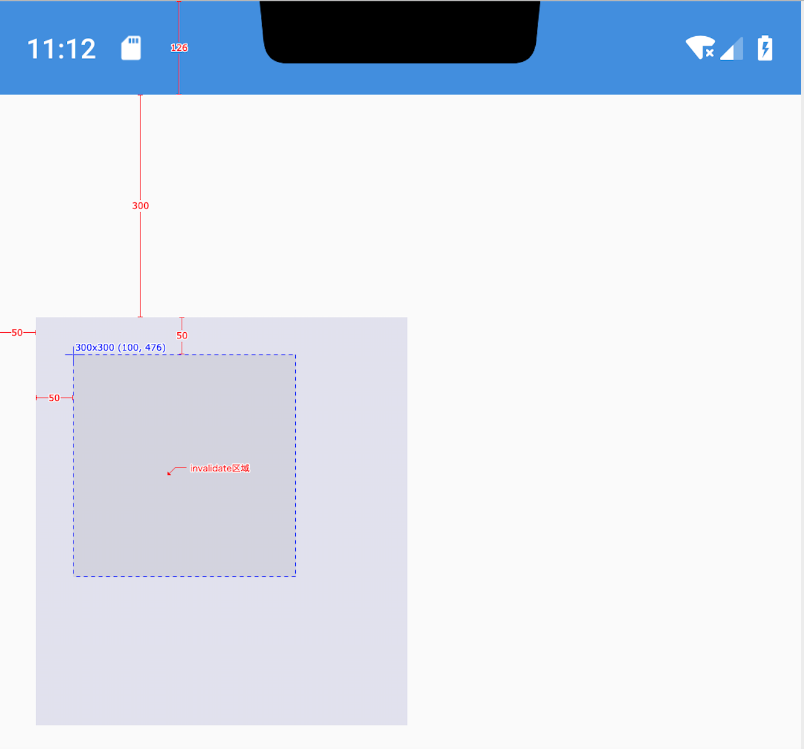
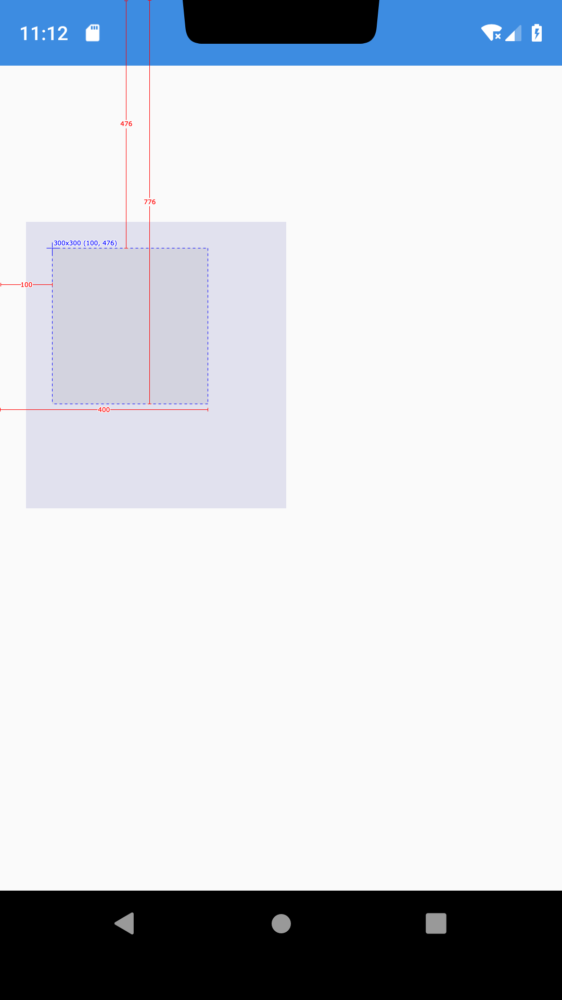
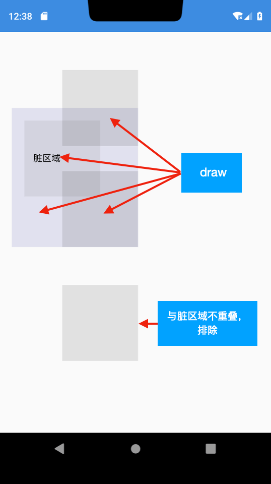

## 图解View绘制原理(软件渲染篇)

### 目录

* ##### [确认脏区域](#1)

* ##### [发起重绘](#2)

* ##### [重绘View树](#3)

* ##### [移动画布](#4)

* ##### [初始绘制](#5)

<h3 id="1">确认脏区域</h3>

* 根据invalidate本身的View的mLeft、mRight、mBottom、mTop得到初始脏区域：Rect(0, 0 - 300, 300)；

* 父布局根据该View的mLeft=50、mTop=50，将脏区域矩形偏移，变为：Rect(50, 50 - 350, 350)；

* 祖父布局根据父布局的mLeft=50、mTop=300，将脏区域矩形偏移，变为：Rect(100, 350 - 400, 650)；

* 依次类推，直到布局的顶级根节点DecorView，偏移状态栏的高度(此处为126)，变为：Rect(100, 476 - 400, 776)。



最终确认脏区域在屏幕上的脏区域为Rect(100, 476 - 400, 776)，如下图：



<h3 id="2">发起重绘</h3>

确认脏区域完毕，由ViewRootImpl发起重绘：

```java
    @Override
    public ViewParent invalidateChildInParent(int[] location, Rect dirty) {
    	// ...
        invalidateRectOnScreen(dirty);
        // ...
        return null;
    }

    private void invalidateRectOnScreen(Rect dirty) {
    	// ...
        scheduleTraversals();
        // ...
    }

    void doTraversal() {
    	// ...
        performTraversals();
        // ...
    }

    private void performTraversals() {
    	// ...
        performDraw();
        // ...
    }
    private boolean draw(boolean fullRedrawNeeded) {
    	// ...
    	drawSoftware(surface, mAttachInfo, xOffset, yOffset,
                        scalingRequired, dirty, surfaceInsets);
    	// ...
    }
    /**
     * @return true if drawing was successful, false if an error occurred
     */
    private boolean drawSoftware(Surface surface, AttachInfo attachInfo, int xoff, int yoff,
            boolean scalingRequired, Rect dirty, Rect surfaceInsets) {
        // Draw with software renderer.
        final Canvas canvas = surface.lockCanvas(dirty);
        // DecorView
        mView.draw(canvas);
        surface.unlockCanvasAndPost(canvas);
    }
```

<h3 id="3">重绘View树</h3>

draw流程由DecorView的draw(Canvas canvas)开始，简化后伪代码如下：

View.java:
```java
    public void draw(Canvas canvas) {
        // draw the background, if needed
        drawBackground(canvas);

        // draw the content
        onDraw(canvas);

        // draw the children
        dispatchDraw(canvas);
    }
```
ViewGroup.java:
```java
    @Override
    protected void dispatchDraw(Canvas canvas) {
        final int childrenCount = mChildrenCount;
        for (int i = 0; i < childrenCount; i++) {
            // 只画可见的View或处于动画中的View
            if ((child.mViewFlags & VISIBILITY_MASK) == VISIBLE || child.getAnimation() != null) {
                drawChild(canvas, child, drawingTime);
            }
        }
    }

    protected boolean drawChild(Canvas canvas, View child, long drawingTime) {
        return child.draw(canvas, this, drawingTime);
    }

    /**
     * This method is called by ViewGroup.drawChild() to have each child view draw itself.
     *
     * This is where the View specializes rendering behavior based on layer type,
     * and hardware acceleration.
     */
    boolean draw(Canvas canvas, ViewGroup parent, long drawingTime) {

        // 排除与脏区域不相交的View
        if (canvas.quickReject(mLeft, mTop, mRight, mBottom, Canvas.EdgeType.BW)) {
            return ;
        }

        int restoreTo = canvas.save();
        canvas.translate(mLeft, mTop);
        // Fast path for layouts with no backgrounds
        if ((mPrivateFlags & PFLAG_SKIP_DRAW) == PFLAG_SKIP_DRAW) {
            mPrivateFlags &= ~PFLAG_DIRTY_MASK;
            // 没有设置background的ViewGroup走这
            dispatchDraw(canvas);
        } else {
            // 设置了background或者setWillNotDraw(false)走这
            draw(canvas);
        }
        if (restoreTo >= 0) {
            canvas.restoreToCount(restoreTo);
        }
    }
```



<h3 id="4">移动画布</h3>

一次重绘过程，所有View都共用同一个Canvas，如果大家都在坐标(0, 0)画东西，岂不是都重合了？这个问题由以下代码来解决：
```java
    int restoreTo = canvas.save();
    canvas.translate(mLeft, mTop);
    draw(canvas);
    canvas.restoreToCount(restoreTo);
```

<h3 id="5">初始绘制</h3>

当首次进入Activity时，脏区域应当占据整个屏幕(除去系统状态栏)：

ViewRootImpl.java
```java
    @Override
    public ViewParent invalidateChildInParent(int[] location, Rect dirty) {
        if (dirty == null) {
            invalidate();
            return null;
        }
    }
    
    void invalidate() {
        mDirty.set(0, 0, mWidth, mHeight);
        if (!mWillDrawSoon) {
            scheduleTraversals();
        }
    }
```
