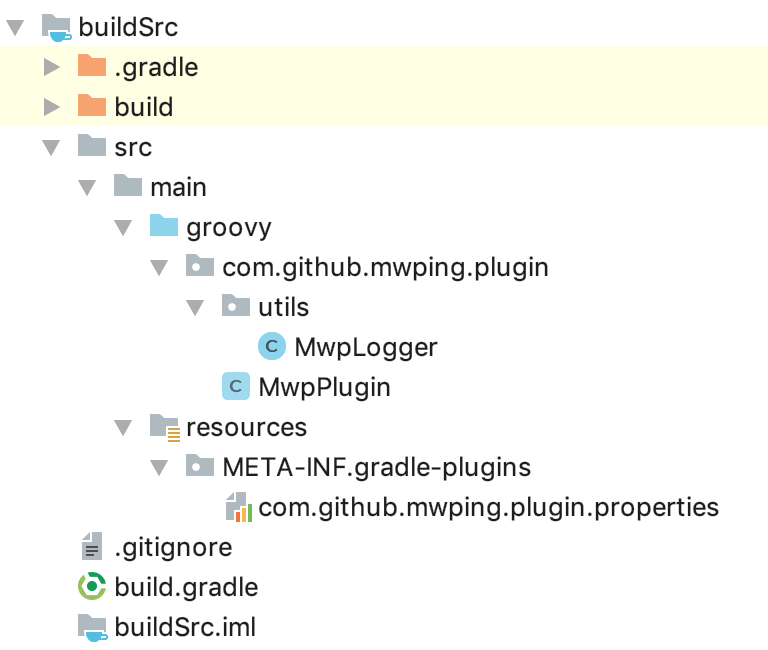
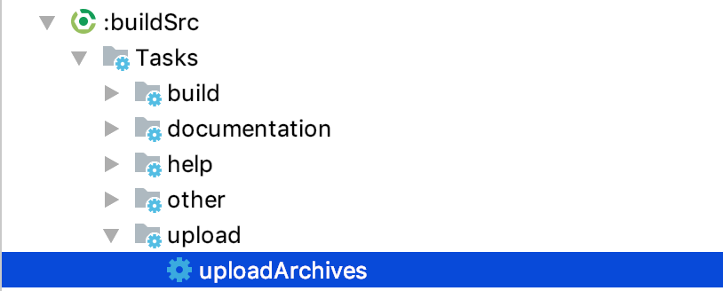
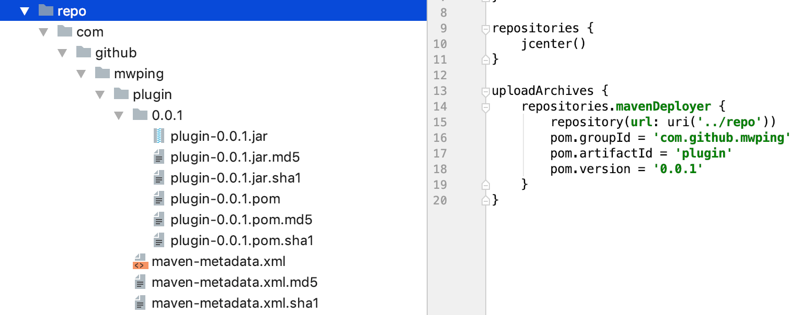
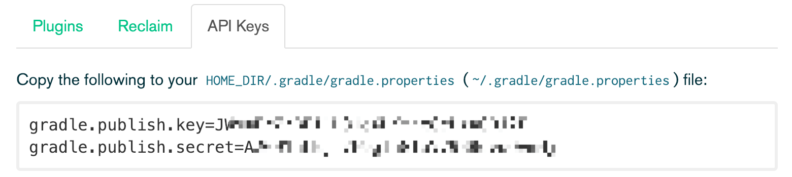
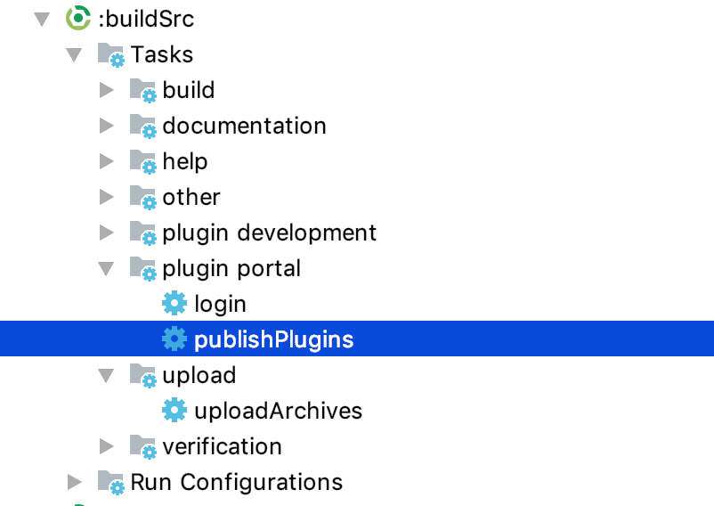

## Gradle插件开发与发布指南

### 目录

* ##### [插件开发](#1)
  1. [创建Module](#1.1)
  2. [配置项目](#1.2)
  3. [调试插件](#1.3)

* ##### [插件发布](#2)
  1. [发布到本地仓库](#2.1)
  2. [发布到远程仓库](#2.2)


<h3 id="1">插件开发</h3>

<h4 id="1.1">创建Module</h4>

1. module名必须为buildSrc
2. 新建目录：buildSrc/src/main/groovy
3. 新建目录：buildSrc/src/main/resources/META-INF/gradle-plugins

<h4 id="1.2">配置项目</h4>

groovy目录下新建包名，如com.github.mwping.plugin，包下新建插件主类：MwpPlugin.groovy：
```java
package com.github.mwping.plugin

import com.github.mwping.plugin.utils.MwpLogger
import org.gradle.api.Plugin
import org.gradle.api.Project


class MwpPlugin implements Plugin<Project> {

    @Override
    void apply(Project project) {
        MwpLogger logger = new MwpLogger(project)
        logger.error("apply MwpPlugin")
    }
}
```
为了方便打印信息，增加MwpLogger.java：
```java
package com.github.mwping.plugin.utils;

import org.gradle.api.Project;
import org.gradle.api.logging.Logger;

public class MwpLogger {
    private static final char TOP_LEFT_CORNER = '┌';
    private static final char BOTTOM_LEFT_CORNER = '└';
    private static final char HORIZONTAL_LINE = '│';
    private static final String DIVIDER = "─────────────────────────────────────────────────";
    private Project project;
    private Logger logger;

    public MwpLogger(Project project) {
        this.project = project;
        logger = project.getLogger();
    }

    public void error(String s) {
        String info = String.format("%1$s\n%2$s %3$s\n%4$s", TOP_LEFT_CORNER + DIVIDER, HORIZONTAL_LINE, s, BOTTOM_LEFT_CORNER + DIVIDER);
        logger.error(info);
    }
}
```

gradle-plugins目录下新建文件com.github.mwping.plugin.properties：
```
implementation-class=com.github.mwping.plugin.MwpPlugin
```

修改buildSrc/build.gradle文件：
```
apply plugin: 'groovy'

dependencies {
    compile gradleApi() //gradle sdk
    compile localGroovy() //groovy sdk
}

repositories {
    jcenter()
}
```
项目整体目录如下：


<h4 id="1.3">调试插件</h4>
在当前项目的application类型的module(如app)的build.gradle文件添加：
```
apply plugin: 'com.android.application'
apply plugin: com.github.mwping.plugin.MwpPlugin // add this line
```

命令行输入./gradlew clean -p app查看日志：
```
$ ./gradlew clean -p app

> Configure project :app 
┌─────────────────────────────────────────────────
│ apply MwpPlugin
└─────────────────────────────────────────────────


BUILD SUCCESSFUL in 1s
1 actionable task: 1 up-to-date
```

<h4 id="2.1">发布到本地仓库</h4>

buildSrc/build.gradle修改成：
```
apply plugin: 'groovy'
apply plugin: 'maven' // add this line

dependencies {
    compile gradleApi() //gradle sdk
    compile localGroovy() //groovy sdk
}

repositories {
    jcenter()
}

// add this code
uploadArchives {
    repositories.mavenDeployer {
        repository(url: uri('../repo'))
        pom.groupId = 'com.github.mwping'
        pom.artifactId = 'plugin'
        pom.version = '0.0.1'
    }
}
```
双击执行uploadArchives：


生成如下目录：


使用：

项目根目录build.gradle添加配置：
```
buildscript {

    repositories {
        google()
        jcenter()

        //add this code
        maven {
            url uri('repo')
        }
    }
    dependencies {
        classpath 'com.android.tools.build:gradle:3.2.1'
        classpath "org.greenrobot:greendao-gradle-plugin:3.2.2"
        classpath 'com.github.mwping:plugin:0.0.1'//add this line: groupId:artifactId:version
    }
}
```
app/build.gradle修改：
```
apply plugin: 'com.android.application'
//apply plugin: com.github.mwping.plugin.MwpPlugin
apply plugin: 'com.github.mwping.plugin' // add this line
```

<h4 id="2.2">发布到远程仓库</h4>

参考

1. 官网：[https://plugins.gradle.org/](https://plugins.gradle.org/)
2. 发布文档：[https://plugins.gradle.org/docs/submit](https://plugins.gradle.org/docs/submit)

步骤：

1.创建账号

2.获取API Key：


3.添加API key配置：

进入目录：
```
$ cd ~/.gradle/
$ open .
```
目录下新建文件：gradle.properties：
```
gradle.publish.key=your-api-key
gradle.publish.secret=your-api-secret
```

buildSrc/build.gradle修改成：
```
plugins {
    id "com.gradle.plugin-publish" version "0.10.0"
    id "java-gradle-plugin"
}

apply plugin: 'groovy'
apply plugin: 'maven'

dependencies {
    compile gradleApi() //gradle sdk
    compile localGroovy() //groovy sdk
}

repositories {
    jcenter()
}

version = '0.0.2'
group = "com.github.mwping"
gradlePlugin {
    plugins {
        mwpPlugin {
            id = 'com.github.mwping.plugin'
            implementationClass = 'com.github.mwping.plugin.MwpPlugin'
        }
    }
}

pluginBundle {
    website = 'https://mwping.github.io/'
    vcsUrl = 'https://github.com/mwping/TheMatrix'
    description = 'Hello Gradle Plugin!'
    tags = ['test', 'integration']

    plugins {
        mwpPlugin {
            displayName = 'Mwp Study Plugin'
        }
    }
}

uploadArchives {
    repositories.mavenDeployer {
        repository(url: uri('../repo'))
        pom.groupId = 'com.github.mwping'
        pom.artifactId = 'plugin'
        pom.version = version
    }
}
```

双击执行publishPlugins：


执行成功之后，进入[官网](https://plugins.gradle.org)-个人主页，能看到插件正在审核中：

