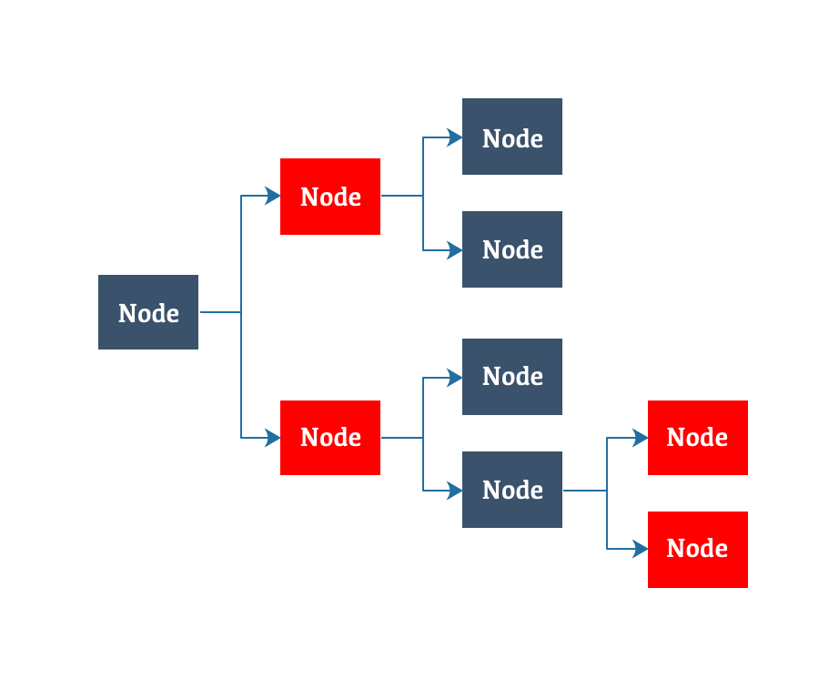

## 图解数据结构

### 目录

* ##### [Map家族图谱](#1)

* ##### [HashMap](#2)
  1. [设计目的](#2.1)
  2. [图解](#2.2)
  3. [使用场景](#2.3)

* ##### [LinkedHashMap](#3)
  1. [设计目的](#3.1)
  2. [图解](#3.2)
  3. [使用场景](#3.3)

* ##### [ConcurrentHashMap](#4)
  1. [设计目的](#4.1)
  2. [图解](#4.2)
  3. [使用场景](#4.3)

* ##### [TreeMap](#5)
  1. [设计目的](#5.1)
  2. [图解](#5.2)
  3. [使用场景](#5.3)

* ##### [ArrayMap](#6)
  1. [设计目的](#6.1)
  2. [图解](#6.2)
  3. [使用场景](#6.3)

<h3 id="1">Map家族图谱</h3>


<h3 id="2">HashMap</h3>

<h4 id="2.1">设计目的</h4> 

为put/get方法提供常量级别的时间复杂度。

<h4 id="2.2">图解</h4> 


[红黑树(维基百科)](https://zh.wikipedia.org/wiki/%E7%BA%A2%E9%BB%91%E6%A0%91)

1. 节点是红色或黑色。
2. 根是黑色。
3. 所有叶子都是黑色（叶子是NIL节点）。
4. 每个红色节点必须有两个黑色的子节点。（从每个叶子到根的所有路径上不能有两个连续的红色节点。）
5. 从任一节点到其每个叶子的所有简单路径都包含相同数目的黑色节点。

<h4 id="2.3">使用场景</h4> 

1. 适合较大量数据的存储和查找。

```java
HashMap<String, String> map = new HashMap<>();
map.put("2", "深圳");
map.put("1", "北京");
```
遍历顺序：
```
{1=北京, 2=深圳}
```

<h3 id="3">LinkedHashMap</h3>

<h4 id="3.1">设计目的</h4> 

在HashMap的基础上提供按插入顺序迭代的特性。

<h4 id="3.2">图解</h4> 

LinkedHashMap数据结构和HashMap基本一致，不同的是多了一个双向链表结构：


<h4 id="3.3">使用场景</h4>

如果期望遍历顺序和插入顺序一致，则可用LinkedHashMap。

```java
HashMap<String, String> map = new LinkedHashMap<>();
map.put("2", "深圳");
map.put("1", "北京");
```
遍历顺序：
```
{2=深圳, 1=北京}
```

<h3 id="4">ConcurrentHashMap</h3>

<h4 id="4.1">设计目的</h4> 

线程安全的HashMap。

<h4 id="4.2">图解</h4> 

和HashMap一样。

<h4 id="4.3">使用场景</h4>

并发环境下使用。

```java
ConcurrentHashMap<String, String> map = new ConcurrentHashMap<>();
map.put("2", "深圳");
map.put("1", "北京");
```
遍历顺序：
```
{1=北京, 2=深圳}
```

<h3 id="5">TreeMap</h3>

<h4 id="5.1">设计目的</h4> 

按key排序。

<h4 id="5.2">图解</h4> 



<h4 id="5.3">使用场景</h4>

需要按key排序。

```java
TreeMap<String, String> map = new TreeMap<>();
map.put("c", "重庆");
map.put("b", "北京");
map.put("a", "安庆");
```
遍历顺序：
```
{a=安庆, b=北京, c=重庆}
```

<h3 id="6">ArrayMap</h3>

<h4 id="6.1">设计目的</h4> 

more memory efficient，比HashMap更省内存，但是查找效率比HashMap低，时间换空间。

<h4 id="6.2">图解</h4> 

使用两个数组，一个int数组存放每个Item的hash值，一个Object数组存放键值对：
```java
    int[] mHashes;
    Object[] mArray;
```


<h4 id="6.3">使用场景</h4> 

因为数组的插入、删除、扩容效率低，ArrayMap适应的场景：

1. <1000对象；
2. Map嵌套；

```java
ArrayMap<String, String> map = new ArrayMap<>();
map.put("2", "深圳");
map.put("1", "北京");
```
遍历顺序：
```
{1=北京, 2=深圳}
```
