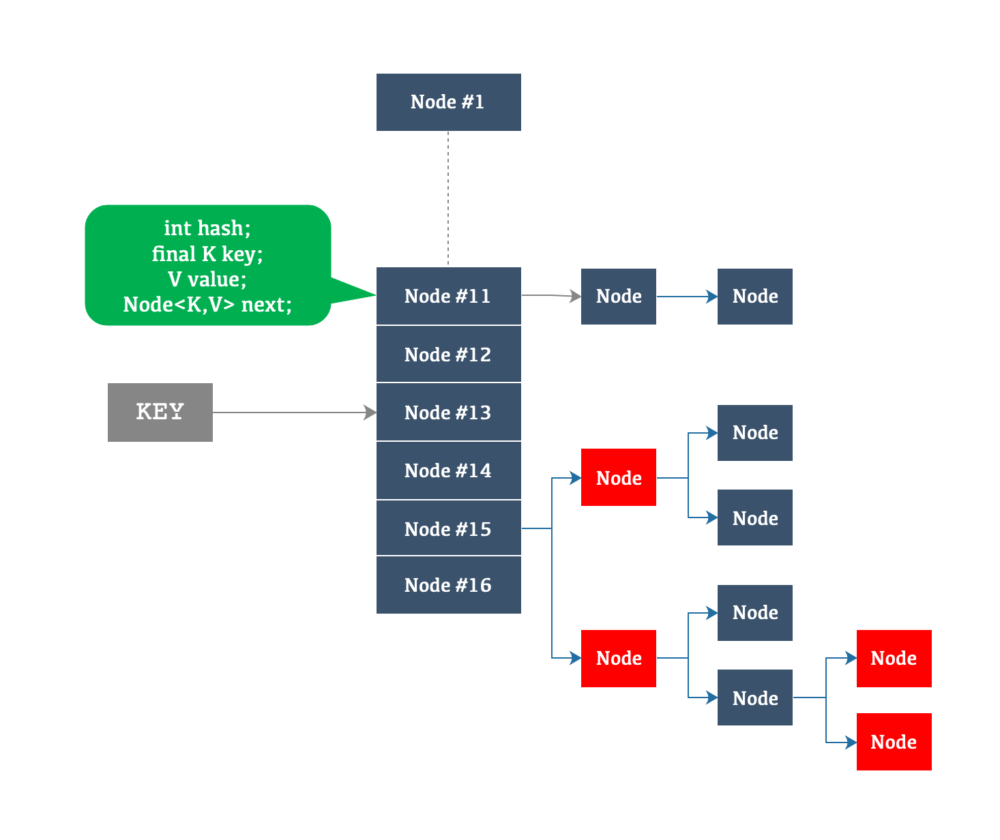

## 图解数据结构

### 目录

* ##### [ArrayMap](#1)
  1. [设计目的](#1.1)
  2. [图解](#1.2)
  3. [使用场景](#1.3)

* ##### [HashMap](#2)
  1. [设计目的](#2.1)
  2. [图解](#2.2)
  3. [使用场景](#2.3)

<h3 id="1">ArrayMap</h3>

<h4 id="1.1">设计目的</h4> 

more memory efficient，比HashMap更省内存，但是查找效率比HashMap低，时间换空间。

<h4 id="1.2">图解</h4> 

使用两个数组，一个int数组存放每个Item的hash值，一个Object数组存放键值对：
```java
    int[] mHashes;
    Object[] mArray;
```


<h4 id="1.3">使用场景</h4> 

因为数组的插入、删除、扩容效率低，ArrayMap适应的场景：

1. <1000对象；
2. Map嵌套；

<h3 id="2">HashMap</h3>

<h4 id="2.1">设计目的</h4> 

为put/get方法提供常量级别的时间复杂度。

<h4 id="2.2">图解</h4> 



[红黑树(维基百科)](https://zh.wikipedia.org/wiki/%E7%BA%A2%E9%BB%91%E6%A0%91)

1. 节点是红色或黑色。
2. 根是黑色。
3. 所有叶子都是黑色（叶子是NIL节点）。
4. 每个红色节点必须有两个黑色的子节点。（从每个叶子到根的所有路径上不能有两个连续的红色节点。）
5. 从任一节点到其每个叶子的所有简单路径都包含相同数目的黑色节点。

<h4 id="2.3">使用场景</h4> 

1. 适合较大量数据的存储和查找。
