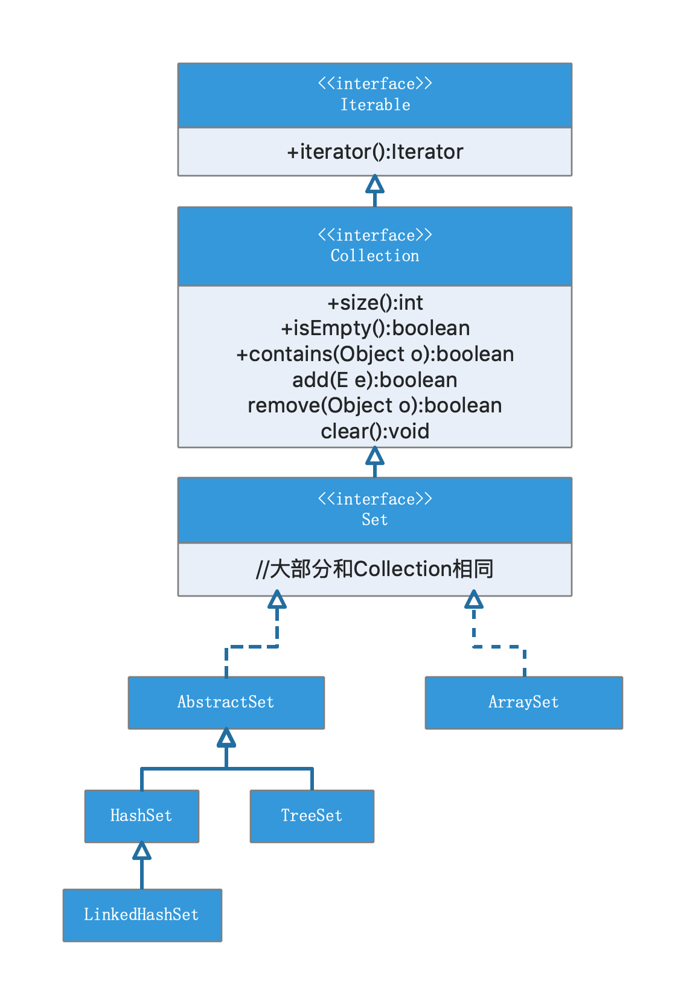

## 图解Set和List家族

### 目录

* ##### [Set家族图谱](#1)

* ##### [Set数据结构](#2)

* ##### [List数据结构](#3)

* ##### [List和Set的选择](#4)

<h3 id="1">Set家族图谱</h3>

<h3 id="2">Set数据结构</h3>

1. HashSet：基于HashMap
2. LinkedHashSet：基于LinkedHashMap
3. TreeSet：基于TreeMap
4. ArraySet：类似于ArrayMap

<h3 id="3">List数据结构</h3>

1. ArrayList: 数组
2. LinkedList：链表

<h3 id="4">List和Set的选择</h3>

