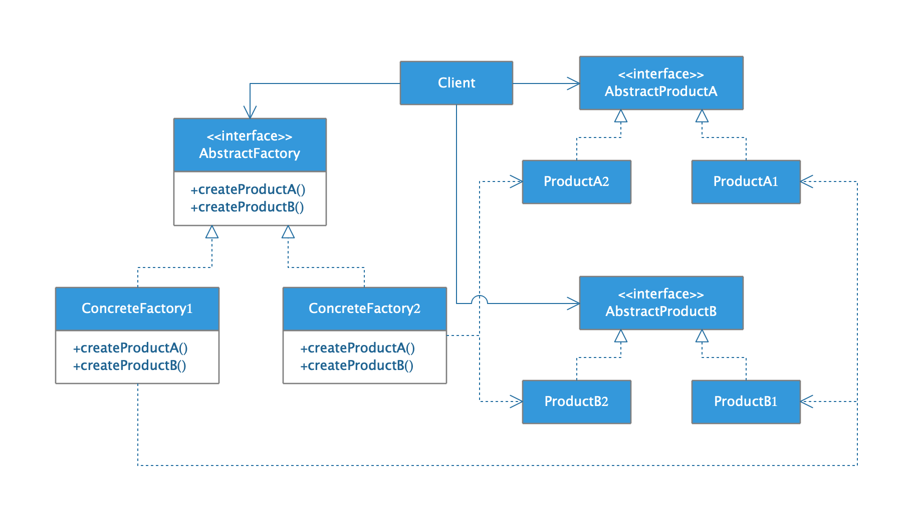

## 抽象工厂模式

* ##### [抽象工厂模式](#1)
  1. [定义](#1.1)
  2. [类图](#1.2)

* ##### [应用](#2)

<h3 id="1">抽象工厂模式</h3>

<h4 id="1.1">定义</h4> 

提供一个接口，用于创建相关或依赖对象的家族，而不需要明确指定具体类。

<h4 id="1.2">类图</h4> 

<h3 id="2">应用</h3> 