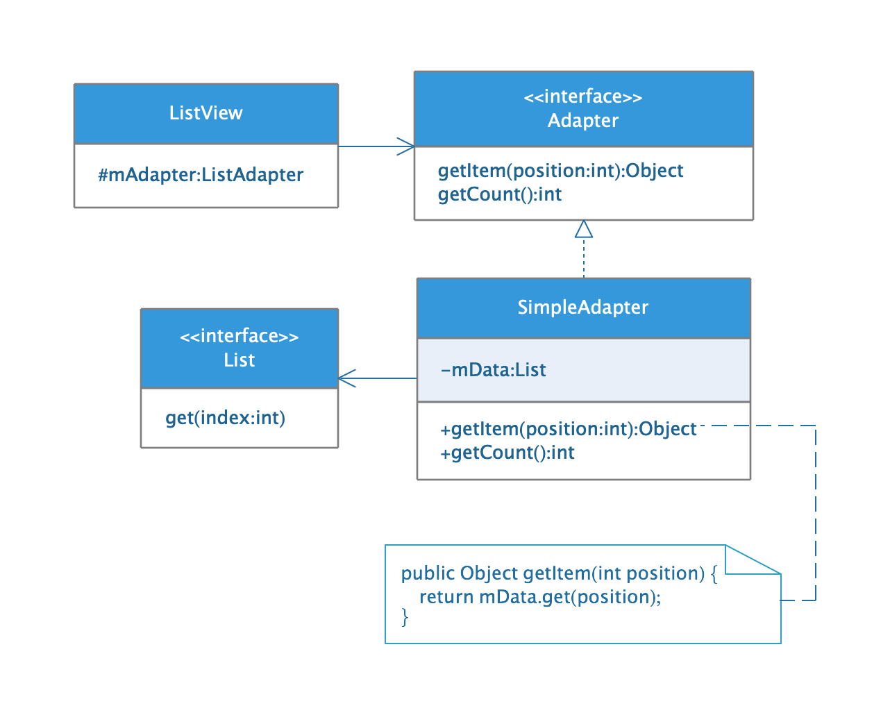

## 适配器模式

* ##### [适配器模式](#1)
  1. [定义](#1.1)
  2. [类图](#1.2)

* ##### [应用](#2)

<h3 id="1">适配器模式</h3>

<h4 id="1.1">定义</h4> 

将一个类的接口，转换成客户期望的另一个接口。适配器让原本不兼容的类可以合作无间。

<h4 id="1.2">类图</h4> 

以ListView为例：

<h3 id="2">应用</h3>

