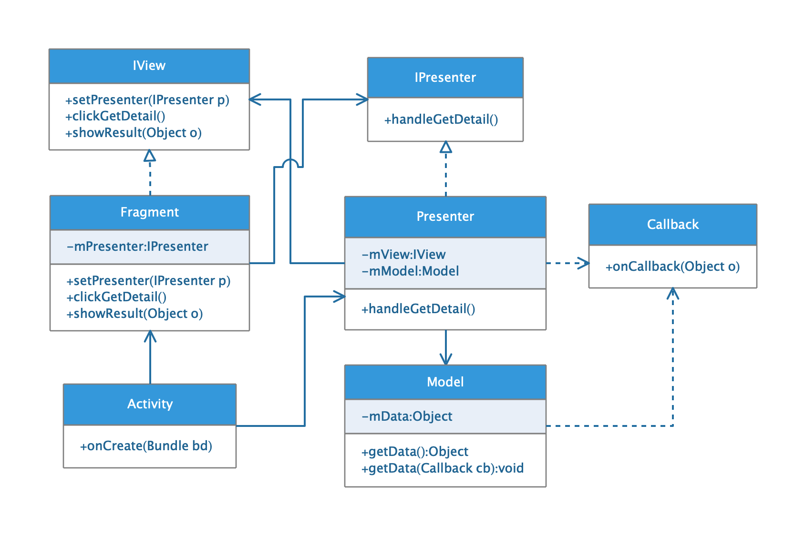

## 架构模式

* ##### [MVC](#1)
  1. [类图](#1.1)

* ##### [MVP](#2)
  1. [参考文档](#2.1)
  2. [类图](#2.2)

<h3 id="1">MVC</h3>

<h4 id="1.1">类图</h4>

<h3 id="2">MVP</h3>

<h4 id="2.1">参考文档</h4>

[https://github.com/googlesamples/android-architecture](https://github.com/googlesamples/android-architecture)

<h4 id="2.2">类图</h4>

