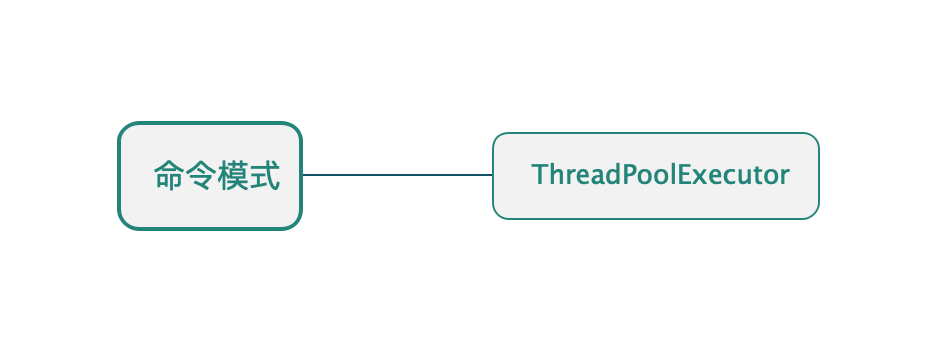

## 命令模式

* ##### [命令模式](#1)
  1. [定义](#1.1)
  2. [类图](#1.2)

* ##### [应用](#2)
  1. [ThreadPoolExecutor](#2.1)

<h3 id="1">命令模式</h3>

<h4 id="1.1">定义</h4> 

将请求封装成对象。

<h4 id="1.2">类图</h4> 

以线程池为例：


<h3 id="2">应用</h3>



<h4 id="2.1">ThreadPoolExecutor</h4> 

```java
public interface Runnable {
    public abstract void run();
}
```
```java
public class ThreadPoolExecutor extends AbstractExecutorService {
    public void execute(Runnable command) {
        // ...
    }
}
```