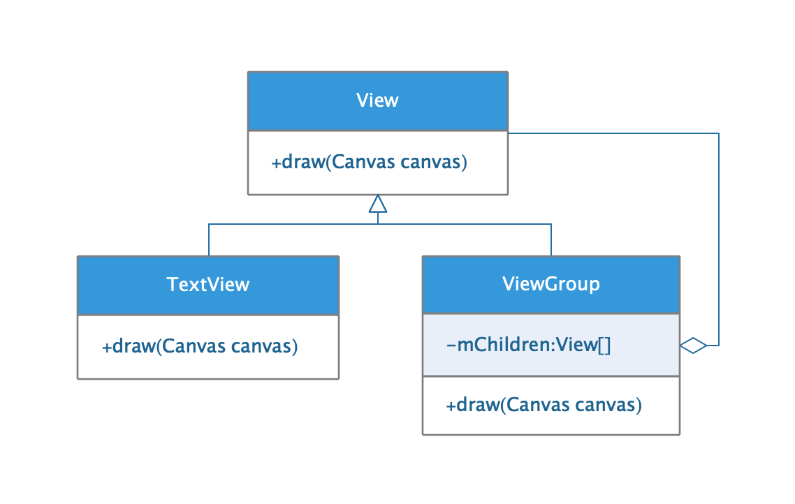
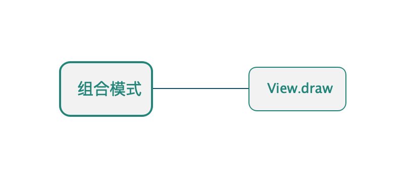

## 组合模式

* ##### [组合模式](#1)
  1. [定义](#1.1)
  2. [类图](#1.2)

* ##### [应用](#2)

<h3 id="1">组合模式</h3>

<h4 id="1.1">定义</h4> 

将对象组合成树形结构来表现\"整体/部分\"层次结构。组合能让客户以一致的方式处理个别对象以及对象组合。

<h4 id="1.2">类图</h4> 

<h3 id="2">应用</h3>

