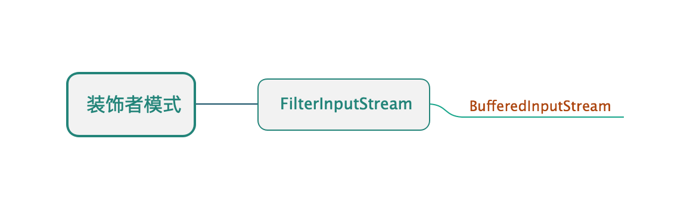

## 装饰者模式

* ##### [装饰者模式](#1)
  1. [定义](#1.1)
  2. [类图](#1.2)

* ##### [应用](#2)

<h3 id="1">装饰者模式</h3>

<h4 id="1.1">定义</h4> 

动态地将责任附加到对象上。想要扩展功能，装饰者提供有别于继承的另一种选择。

<h4 id="1.2">类图</h4> 

以InputStream为例：

<h3 id="2">应用</h3>

