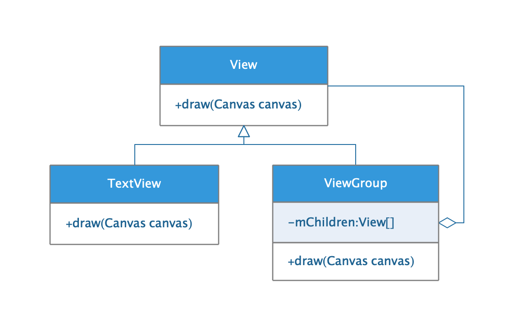
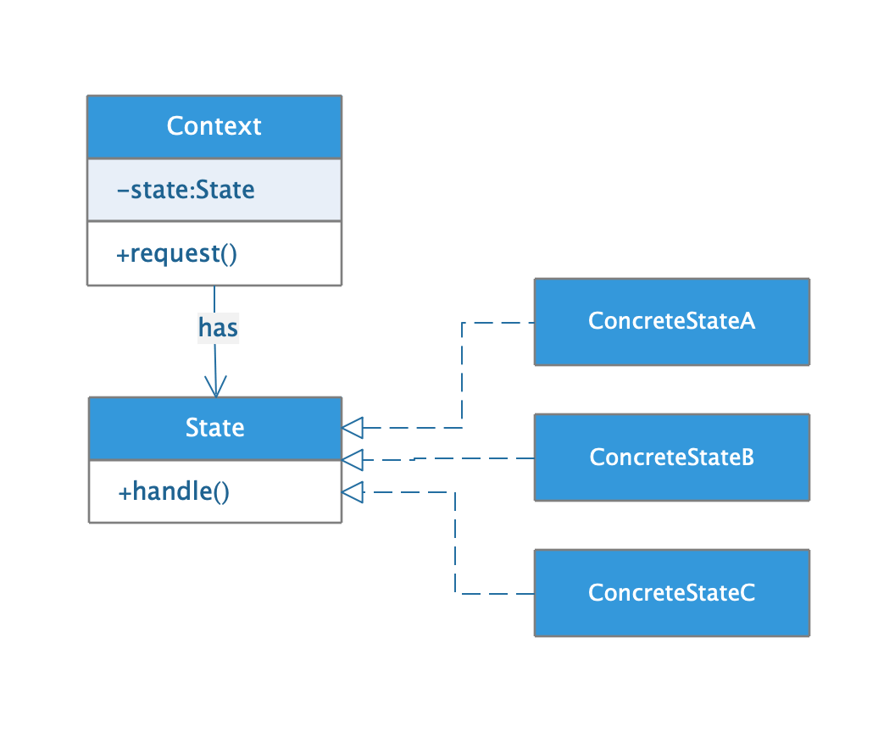
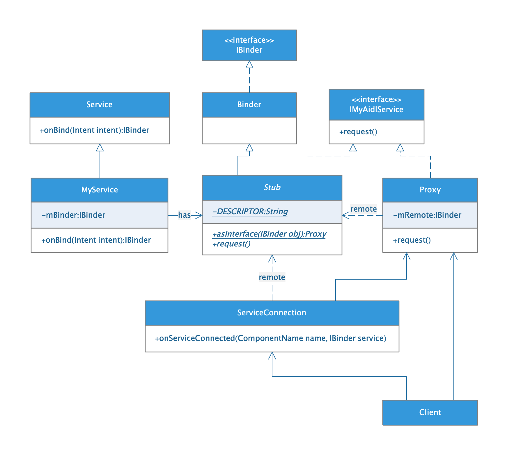

## 设计模式

* ##### [面向对象](#1)
  1. [OO特征](#1.1)
  2. [OO原则](#1.2)
  3. [设计模式一览](#1.3)

* ##### [单例模式](#2)
  1. [定义](#2.1)
  2. [类图](#2.2)
  3. [单例模式VS静态变量](#2.3)
  4. [应用：EventBus](#2.4)

* ##### [策略模式](#3)
  1. [定义](#3.1)
  2. [类图](#3.2)
  3. [应用：TimeInterpolator](#3.3)

* ##### [观察者模式](#4)
  1. [定义](#4.1)
  2. [类图](#4.2)

* ##### [装饰者模式](#5)
  1. [定义](#5.1)
  2. [类图](#5.2)

* ##### [工厂方法模式](#6)
  1. [定义](#6.1)
  2. [类图](#6.2)
  3. [应用:ThreadFactory](#6.3)

* ##### [抽象工厂模式](#7)
  1. [定义](#7.1)
  2. [类图](#7.2)

* ##### [命令模式](#8)
  1. [定义](#8.1)
  2. [类图](#8.2)
  3. [应用:ThreadPoolExecutor](#8.3)

* ##### [适配器模式](#9)
  1. [定义](#9.1)
  2. [类图](#9.2)

* ##### [外观模式](#10)
  1. [定义](#10.1)
  2. [类图](#10.2)

* ##### [模板方法模式](#11)
  1. [定义](#11.1)
  2. [类图](#11.2)
  3. [应用:View.draw](#11.3)

* ##### [迭代器模式](#12)
  1. [定义](#12.1)
  2. [类图](#12.2)

* ##### [组合模式](#13)
  1. [定义](#13.1)
  2. [类图](#13.2)

* ##### [状态模式](#14)
  1. [定义](#14.1)
  2. [类图](#14.2)

* ##### [代理模式](#15)
  1. [定义](#15.1)
  2. [远程代理](#15.2)
  3. [保护代理](#15.3)
  4. [同步代理](#15.4)

<h3 id="1">面向对象</h3>

<h4 id="1.1">OO特征</h4>


<h4 id="1.2">OO原则</h4>


<h4 id="1.3">设计模式一览</h4>


<h3 id="2">单例模式</h3>

<h4 id="2.1">定义</h4> 

确保一个类只有一个实例，并提供一个全局访问点。

<h4 id="2.2">类图</h4> 


<h4 id="2.3">单例模式VS静态变量</h4>


<h4 id="2.4">应用1：EventBus</h4>

```java
public class EventBus {

    static volatile EventBus defaultInstance;
    
    /** Convenience singleton for apps using a process-wide EventBus instance. */
    public static EventBus getDefault() {
        EventBus instance = defaultInstance;
        if (instance == null) {
            synchronized (EventBus.class) {
                instance = EventBus.defaultInstance;
                if (instance == null) {
                    instance = EventBus.defaultInstance = new EventBus();
                }
            }
        }
        return instance;
    }
}
```

<h3 id="3">策略模式</h3>

<h4 id="3.1">定义</h4> 

定义算法族，分别封装起来，让他们之间可以互相替换，此模式让算法的变化独立于使用算法的客户。

<h4 id="3.2">类图</h4> 

以动画时间插值器为例：


<h4 id="3.3">应用:TimeInterpolator</h4>

```java
public class ValueAnimator extends Animator implements AnimationHandler.AnimationFrameCallback {

    // The time interpolator to be used if none is set on the animation
    private static final TimeInterpolator sDefaultInterpolator =
            new AccelerateDecelerateInterpolator();

    private TimeInterpolator mInterpolator = sDefaultInterpolator;
    
    @Override
    public void setInterpolator(TimeInterpolator value) {
        if (value != null) {
            mInterpolator = value;
        } else {
            mInterpolator = new LinearInterpolator();
        }
    }

    void animateValue(float fraction) {
        fraction = mInterpolator.getInterpolation(fraction);
        // ...
    }
}
```

<h3 id="4">观察者模式</h3>

<h4 id="4.1">定义</h4> 

定义对象间一对多的依赖，当一个对象改变状态时，它的所有依赖者都会收到通知并自动更新。

<h4 id="4.2">类图</h4> 

以ListView用到的观察者模式为例：


<h3 id="5">装饰者模式</h3>

<h4 id="5.1">定义</h4> 

动态地将责任附加到对象上。想要扩展功能，装饰者提供有别于继承的另一种选择。

<h4 id="5.2">类图</h4> 

以InputStream为例：


<h3 id="6">工厂方法模式</h3>

<h4 id="6.1">定义</h4> 

定义一个创建对象的接口，但由子类决定要实例化的类是哪一个。工厂方法让类把实例化延迟到子类。

<h4 id="6.2">类图</h4> 


<h4 id="6.3">应用:ThreadFactory</h4> 

```java
public interface ThreadFactory {

    Thread newThread(Runnable r);
    
}
```

```java
    public ThreadPoolExecutor(int corePoolSize,
                              int maximumPoolSize,
                              long keepAliveTime,
                              TimeUnit unit,
                              BlockingQueue<Runnable> workQueue,
                              ThreadFactory threadFactory,
                              RejectedExecutionHandler handler) {
    	// ...
        this.threadFactory = threadFactory;
        // ...
    }
```

<h3 id="7">抽象工厂模式</h3>

<h4 id="7.1">定义</h4> 

提供一个接口，用于创建相关或依赖对象的家族，而不需要明确指定具体类。

<h4 id="7.2">类图</h4> 


<h3 id="8">命令模式</h3>

<h4 id="8.1">定义</h4> 

将请求封装成对象。

<h4 id="8.2">类图</h4> 

以线程池为例：


<h4 id="8.3">应用:ThreadPoolExecutor</h4>

```java
public interface Runnable {
    public abstract void run();
}
```
```java
public class ThreadPoolExecutor extends AbstractExecutorService {
    public void execute(Runnable command) {
        // ...
    }
}
```

<h3 id="9">适配器模式</h3>

<h4 id="9.1">定义</h4> 

将一个类的接口，转换成客户期望的另一个接口。适配器让原本不兼容的类可以合作无间。

<h4 id="9.2">类图</h4> 

以ListView为例：


<h3 id="10">外观模式</h3>

<h4 id="10.1">定义</h4> 

提供一个统一的接口，用来访问子系统中的一群接口。外观定义了一个高层接口，让子系统更容易使用。

<h4 id="10.2">类图</h4> 


<h3 id="11">模板方法模式</h3>

<h4 id="11.1">定义</h4> 

在一个方法中定义一个算法的骨架，而将一些步骤延迟到子类中。模板方法使得子类可以在不改变算法结构的情况下，重新定义算法中的某些步骤。

<h4 id="11.2">类图</h4> 

以View的绘制流程为例：


<h4 id="11.3">应用:View.draw</h4>

```java
    public void draw(Canvas canvas) {
        // draw the background, if needed
        drawBackground(canvas);
        // draw the content
        if (!dirtyOpaque) onDraw(canvas);
        // draw the children
        dispatchDraw(canvas);
    }
```

<h3 id="12">迭代器模式</h3>

<h4 id="12.1">定义</h4> 

封装遍历，提供一种方法顺序访问一个聚合对象中的各个元素，而又不暴露其内部的表示。

<h4 id="12.2">类图</h4> 

以List为例：


<h3 id="13">组合模式</h3>

<h4 id="13.1">定义</h4> 

将对象组合成树形结构来表现\"整体/部分\"层次结构。组合能让客户以一致的方式处理个别对象以及对象组合。

<h4 id="13.2">类图</h4> 



<h3 id="14">状态模式</h3>

<h4 id="14.1">定义</h4> 

运行对象在内部状态改变时改变它的行为，对象看起来好像修改了它的类。

<h4 id="14.2">类图</h4> 



<h3 id="15">代理模式</h3>

<h4 id="15.1">定义</h4>

为另一个对象提供一个替身或者占位符以控制对这个对象的访问。

<h4 id="15.2">远程代理</h4>



<h4 id="15.3">保护代理</h4>


<h4 id="15.4">同步代理</h4>


