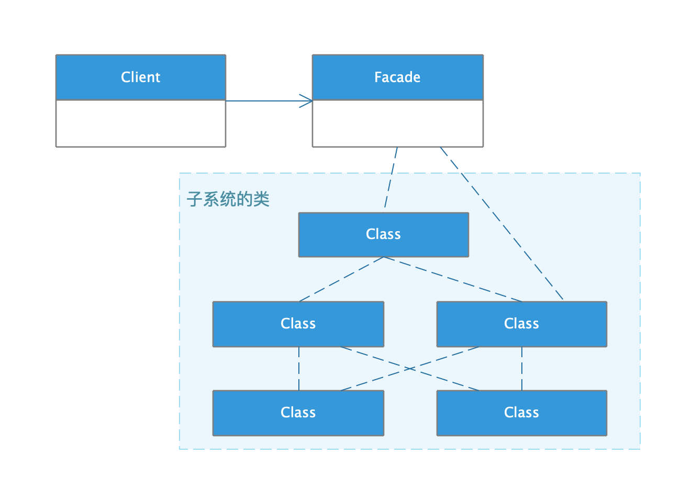

## 外观模式

* ##### [外观模式](#1)
  1. [定义](#1.1)
  2. [类图](#1.2)

* ##### [应用](#2)

<h3 id="1">外观模式</h3>

<h4 id="1.1">定义</h4> 

提供一个统一的接口，用来访问子系统中的一群接口。外观定义了一个高层接口，让子系统更容易使用。

<h4 id="1.2">类图</h4> 

<h3 id="2">应用</h3>
