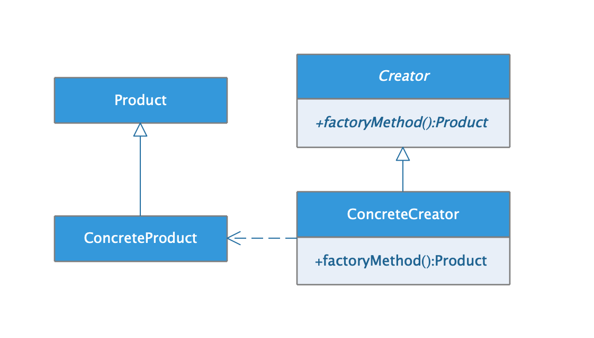

## 工厂方法模式

* ##### [工厂方法模式](#1)
  1. [定义](#1.1)
  2. [类图](#1.2)

* ##### [应用](#2)
  1. [ThreadFactory](#2.1)

<h3 id="1">工厂方法模式</h3>

<h4 id="1.1">定义</h4> 

定义一个创建对象的接口，但由子类决定要实例化的类是哪一个。工厂方法让类把实例化延迟到子类。

<h4 id="1.2">类图</h4> 



<h4 id="2">应用</h4> 


<h4 id="2.1">ThreadFactory</h4> 
```java
    public ThreadPoolExecutor(int corePoolSize,
                              int maximumPoolSize,
                              long keepAliveTime,
                              TimeUnit unit,
                              BlockingQueue<Runnable> workQueue,
                              ThreadFactory threadFactory,
                              RejectedExecutionHandler handler) {
    	// ...
        this.threadFactory = threadFactory;
        // ...
    }
```