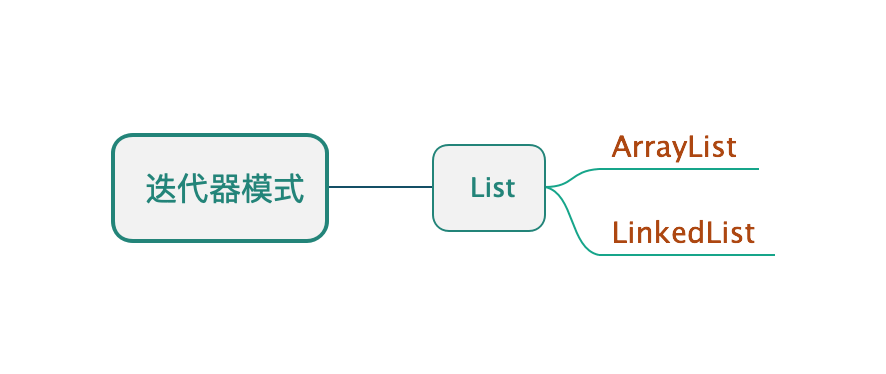

## 迭代器模式

* ##### [迭代器模式](#1)
  1. [定义](#1.1)
  2. [类图](#1.2)

* ##### [应用](#2)

<h3 id="1">迭代器模式</h3>

<h4 id="1.1">定义</h4> 

封装遍历，提供一种方法顺序访问一个聚合对象中的各个元素，而又不暴露其内部的表示。

<h4 id="1.2">类图</h4> 

以List为例：

<h3 id="2">应用</h3>

