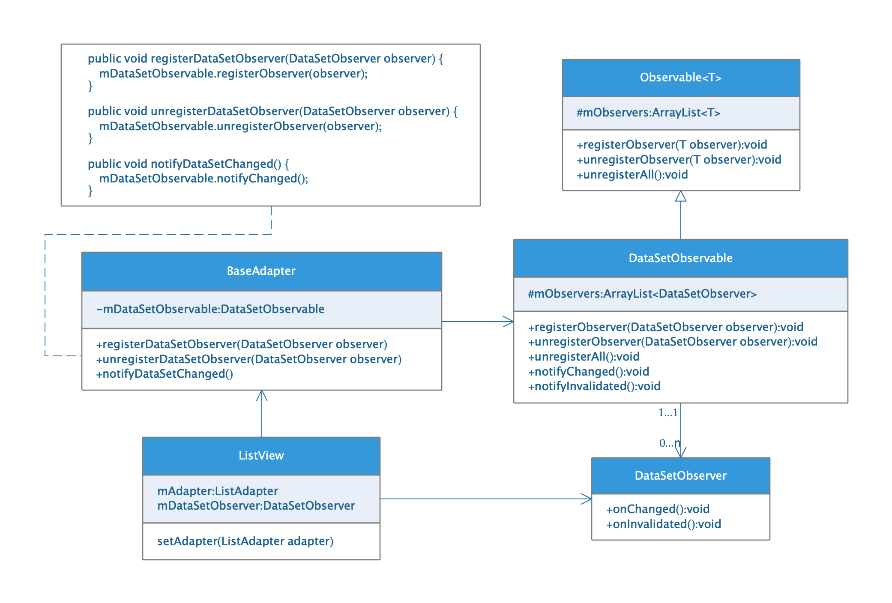
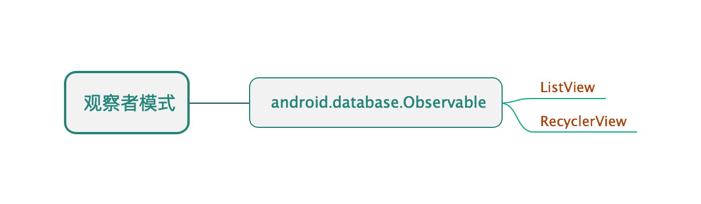

## 观察者模式

* ##### [观察者模式](#1)
  1. [定义](#1.1)
  2. [类图](#1.2)

* ##### [应用](#2)

<h3 id="1">观察者模式</h3>

<h4 id="1.1">定义</h4> 

定义对象间一对多的依赖，当一个对象改变状态时，它的所有依赖者都会收到通知并自动更新。

<h4 id="1.2">类图</h4> 

以ListView用到的观察者模式为例：

<h3 id="2">应用</h3>

