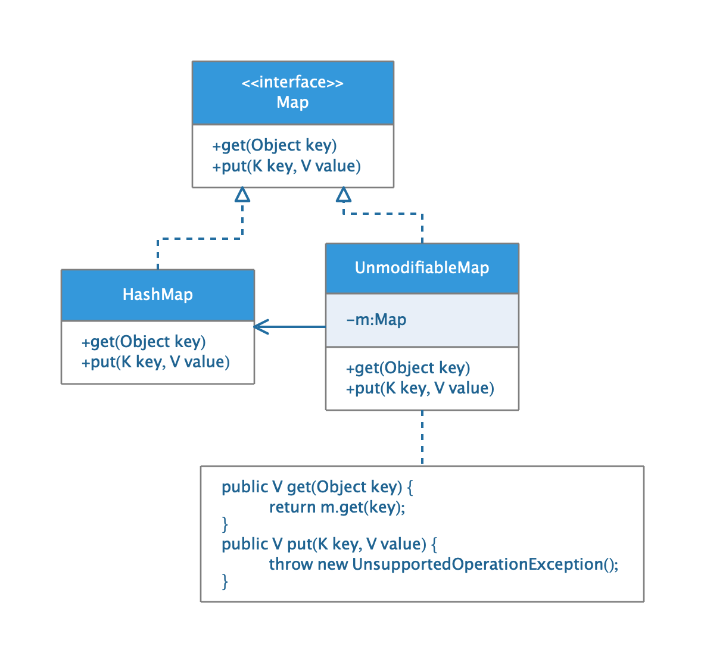
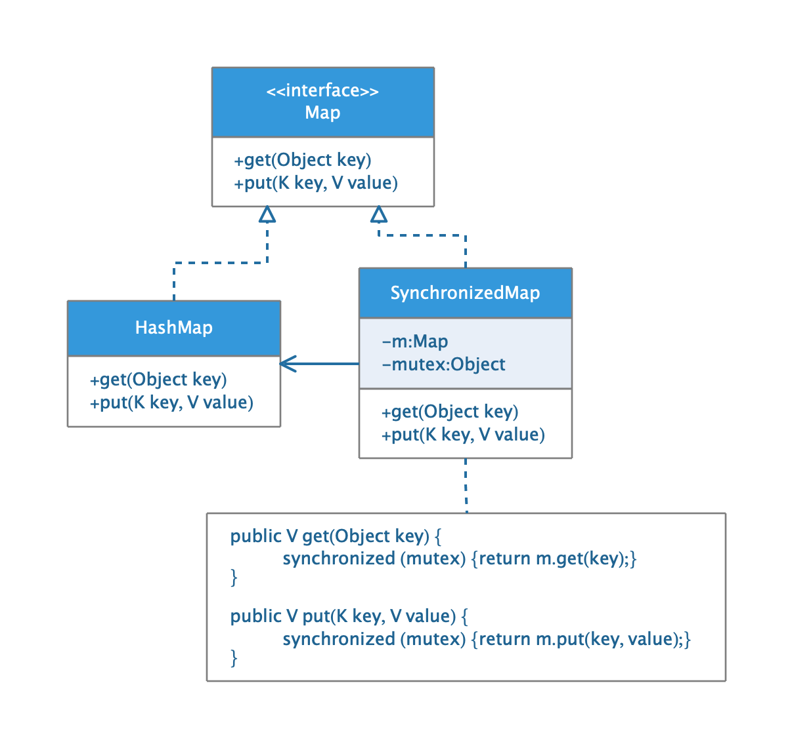

## 代理模式

* ##### [代理模式](#1)

* ##### [远程代理](#2)

* ##### [保护代理](#3)

* ##### [同步代理](#4)

<h3 id="1">代理模式</h3>

为另一个对象提供一个替身或者占位符以控制对这个对象的访问。

<h3 id="2">远程代理</h3>

<h3 id="3">保护代理</h3>

<h3 id="4">同步代理</h3>

