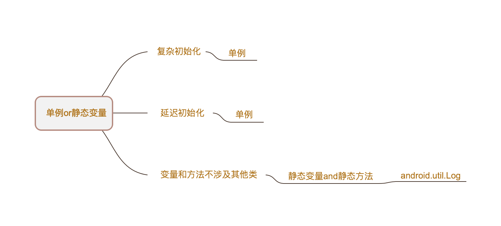

## 单例模式

* ##### [单例模式](#1)
  1. [定义](#1.1)
  2. [类图](#1.2)

* ##### [单例模式VS静态变量](#2)

* ##### [应用](#3)
  1. [EventBus](#3.1)

<h3 id="1">单例模式</h3>

<h4 id="1.1">定义</h4> 

确保一个类只有一个实例，并提供一个全局访问点。

<h4 id="1.2">类图</h4> 


<h3 id="2">单例模式VS静态变量</h3>




<h3 id="3">应用</h3>


<h4 id="3.1">EventBus</h4> 

```java
public class EventBus {

    static volatile EventBus defaultInstance;
    
    /** Convenience singleton for apps using a process-wide EventBus instance. */
    public static EventBus getDefault() {
        EventBus instance = defaultInstance;
        if (instance == null) {
            synchronized (EventBus.class) {
                instance = EventBus.defaultInstance;
                if (instance == null) {
                    instance = EventBus.defaultInstance = new EventBus();
                }
            }
        }
        return instance;
    }
}
```