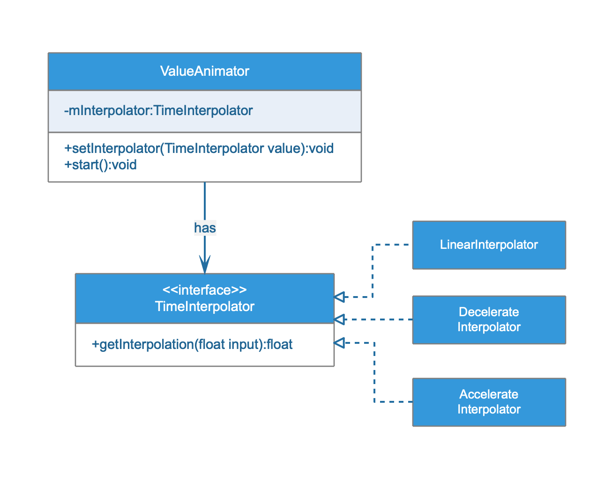
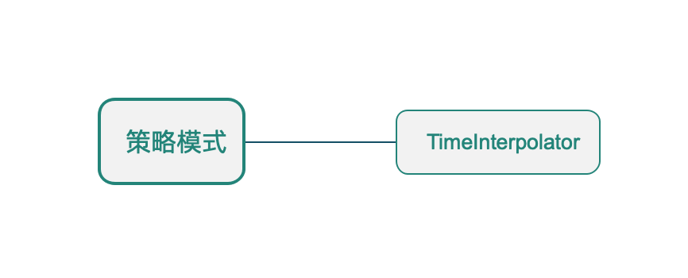

## 策略模式

* ##### [策略模式](#1)
  1. [定义](#1.1)
  2. [类图](#1.2)

* ##### [应用](#2)
  1. [TimeInterpolator](#2.1)

<h3 id="1">策略模式</h3>

<h4 id="1.1">定义</h4> 

定义算法族，分别封装起来，让他们之间可以互相替换，此模式让算法的变化独立于使用算法的客户。

<h4 id="1.2">类图</h4> 

以动画时间插值器为例：



<h3 id="2">应用</h3>



<h4 id="2.1">TimeInterpolator</h4> 

```java
public class ValueAnimator extends Animator implements AnimationHandler.AnimationFrameCallback {

    // The time interpolator to be used if none is set on the animation
    private static final TimeInterpolator sDefaultInterpolator =
            new AccelerateDecelerateInterpolator();

    private TimeInterpolator mInterpolator = sDefaultInterpolator;
    
    @Override
    public void setInterpolator(TimeInterpolator value) {
        if (value != null) {
            mInterpolator = value;
        } else {
            mInterpolator = new LinearInterpolator();
        }
    }

    void animateValue(float fraction) {
        fraction = mInterpolator.getInterpolation(fraction);
        // ...
    }
}
```