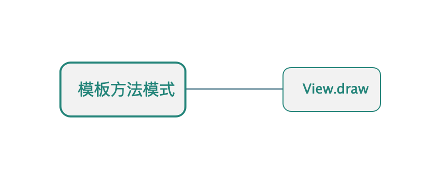

## 模板方法模式

* ##### [模板方法模式](#1)
  1. [定义](#1.1)
  2. [类图](#1.2)

* ##### [应用](#2)
  1. [View.draw](#2.1)

<h3 id="1">模板方法模式</h3>

<h4 id="1.1">定义</h4> 

在一个方法中定义一个算法的骨架，而将一些步骤延迟到子类中。模板方法使得子类可以在不改变算法结构的情况下，重新定义算法中的某些步骤。

<h4 id="1.2">类图</h4> 

以View的绘制流程为例：


<h3 id="2">应用</h3>



<h4 id="2.1">View.draw</h4> 

```java
    public void draw(Canvas canvas) {
        // draw the background, if needed
        drawBackground(canvas);
        // draw the content
        if (!dirtyOpaque) onDraw(canvas);
        // draw the children
        dispatchDraw(canvas);
    }
```