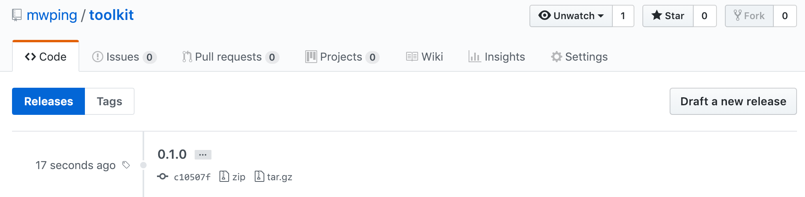
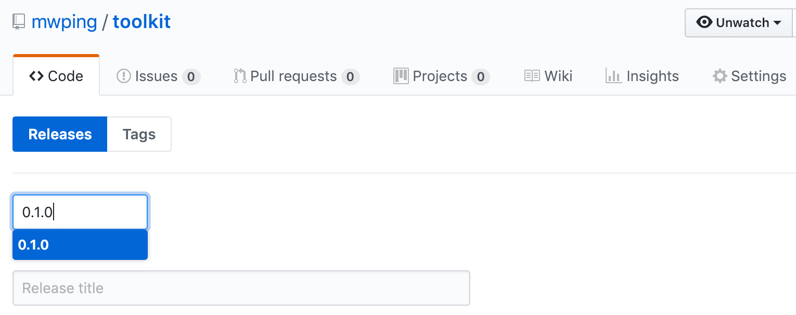
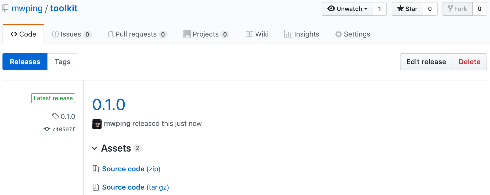
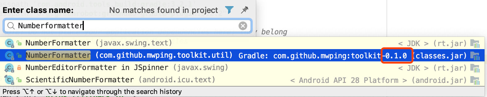

## jitpack发布指南

#### 官方文档

* [https://jitpack.io/docs/ANDROID/](https://jitpack.io/docs/ANDROID/)
* [https://github.com/jitpack/android-example](https://github.com/jitpack/android-example)

#### 实战

**项目**：[https://github.com/mwping/toolkit](https://github.com/mwping/toolkit)

**根目录的build.gradle:**

```
buildscript { 
  dependencies {
    classpath 'com.github.dcendents:android-maven-gradle-plugin:2.1' // Add this line
```

**library/build.gradle 添加：**
```
//上传到jitpack
apply plugin: 'com.github.dcendents.android-maven'
group = 'com.github.mwping' // 必须对应GitHub账号，如mwping
version = '0.1.0'

// build a jar with source files
task sourcesJar(type: Jar) {
    from android.sourceSets.main.java.srcDirs
    classifier = 'sources'
}

task javadoc(type: Javadoc) {
    failOnError false
    source = android.sourceSets.main.java.sourceFiles
    classpath += project.files(android.getBootClasspath().join(File.pathSeparator))
    classpath += configurations.compile
}

// build a jar with javadoc
task javadocJar(type: Jar, dependsOn: javadoc) {
    classifier = 'javadoc'
    from javadoc.destinationDir
}

artifacts {
    archives sourcesJar
    archives javadocJar
}
```

**项目根目录执行：**

```
./gradlew install
```

执行成功之后，本地应该存在下列文件：

```
$ cd ~/.m2/repository/com/github/mwping/toolkit/0.1.0/
$ ls
toolkit-0.1.0-javadoc.jar	toolkit-0.1.0.aar
toolkit-0.1.0-sources.jar	toolkit-0.1.0.pom
```

**提交项目代码，并打上tag，tag名必须和version相同，如上面的0.1.0**

**登录GitHub，发布新版本**

点击Draft a new release：



选择刚刚的tag：



点击Publish release：


成功之后应该看到：



**引用**

项目根目录添加：
```
allprojects {
    repositories {
        maven { url "https://jitpack.io" } // Add this line
        google()
        jcenter()
    }
}
```

添加依赖：
```
api('com.github.mwping:toolkit:0.1.0')
```

Sync Gradle，成功之后应该能看到：
```
$ cd ~/.gradle/caches/modules-2/files-2.1/com.github.mwping/toolkit/
$ ls
0.1.0
```
尝试搜索toolkit库中的一个类来验证版本：
