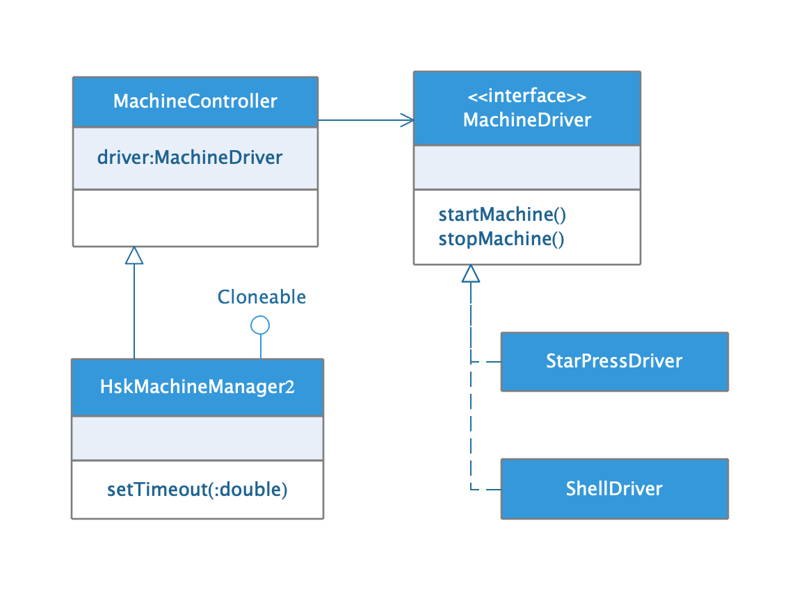

## UML基础

* ##### [简介](#1)

* ##### [参考文档](#2)
  1. [类](#2.1)
  2. [类关系](#2.2)
  3. [接口](#2.3)

<h3 id="1">简介</h3>

UML，Unified Modeling Language，统一建模语言。

<h3 id="2">参考文档</h3>

《Java设计模式(第2版)》附录D.

<h4 id="2.1">类</h4>

<h4 id="2.2">类关系</h4>

<h4 id="2.2">接口</h4>

