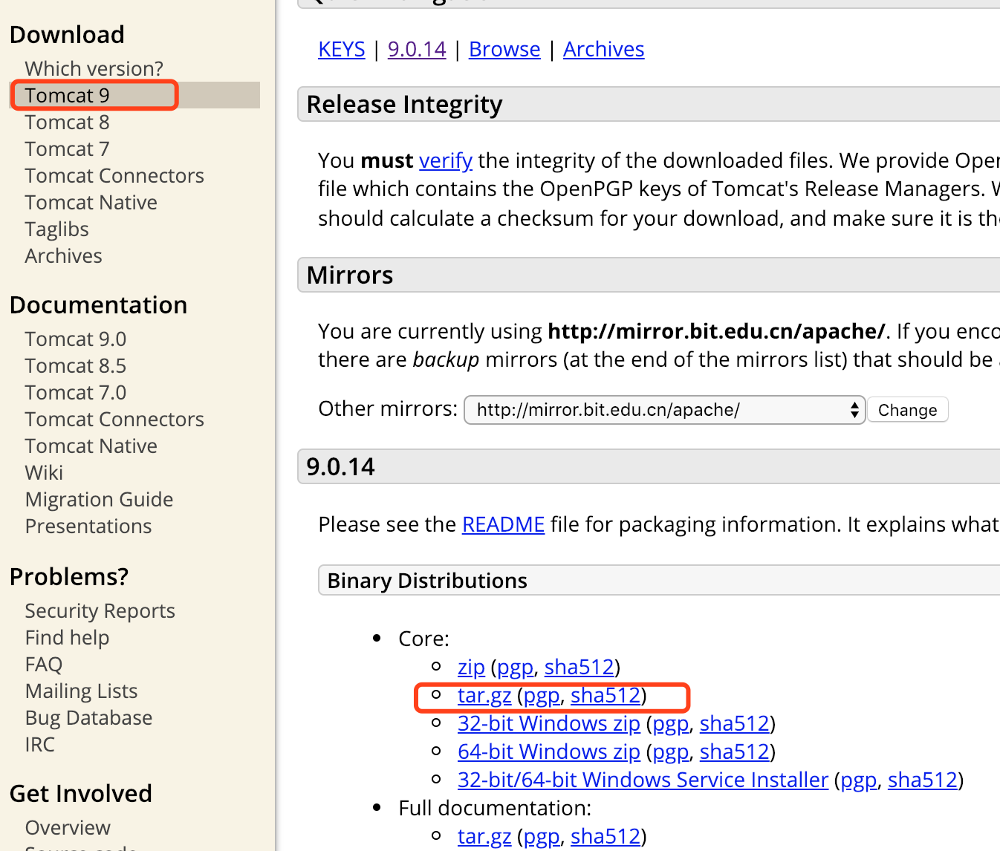
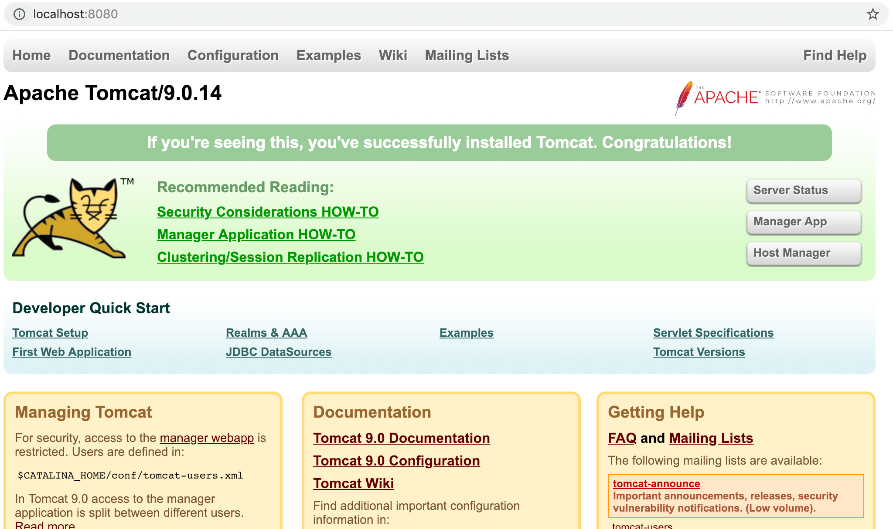
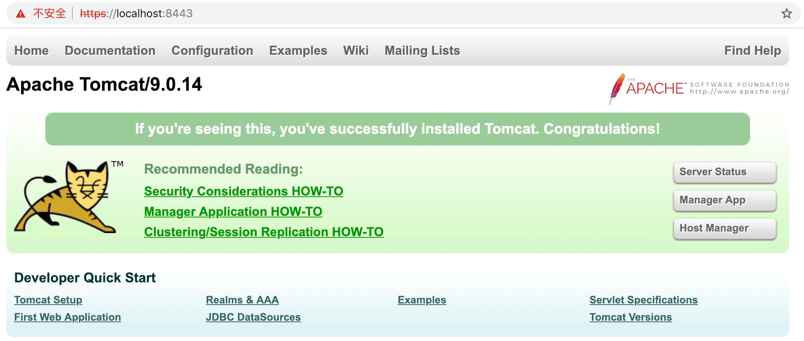
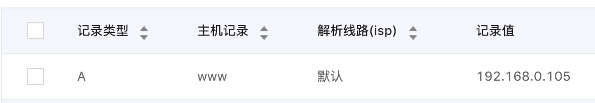
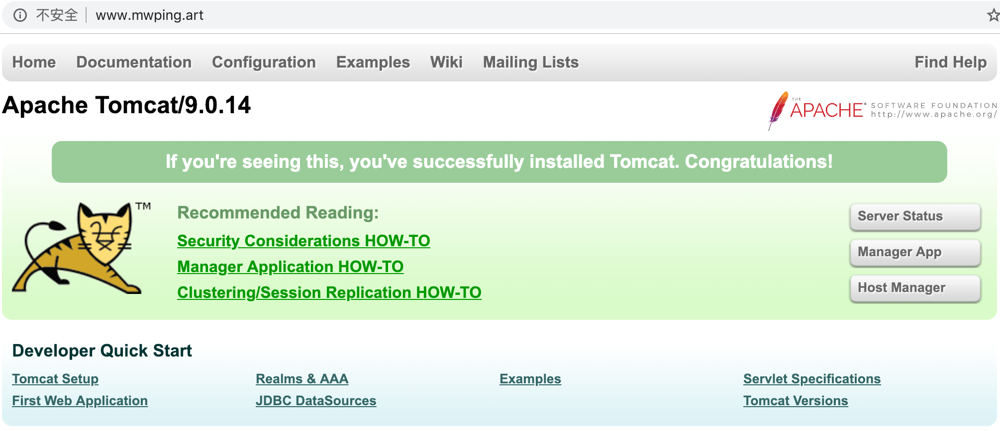
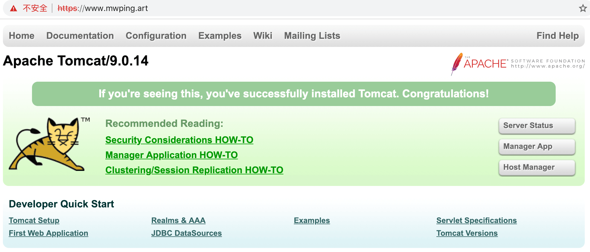

## 基于Tomcat调试Android http/https

### 目录

* ##### [配置Tomcat](#1)
  1. [下载](#1.1)
  2. [启动](#1.2)
  3. [停止](#1.3)

* ##### [创建服务器密钥库(keystore)](#2)
  1. [创建keystore](#2.1)
  2. [查看keystore](#2.2)

* ##### [开启https](#3)
  1. [开启8443端口](#3.1)
  2. [配置keystore路径和密码](#3.2)
  
* ##### [绑定域名](#4)
  1. [申请域名](#4.1)
  2. [添加域名解析](#4.2)
  3. [配置tomcat http端口](#4.3)
  4. [配置tomcat https端口](#4.4)
  5. [配置tomcat 域名](#4.5)

* ##### [导出客户端证书](#5)
  1. [导出证书](#5.1)
  2. [查看证书](#5.2)


<h3 id="1">配置Tomcat</h3>

<h4 id="1.1">下载</h4> 
进入tomcat官网：[http://tomcat.apache.org/](http://tomcat.apache.org/)，找到下载链接，点击下载，下载完成双击解压即可。


<h4 id="1.2">启动</h4> 
进入解压目录的bin文件夹。
```
$ cd /Users/lixiang/Mwp/Github/mwping/download/tomcat/apache-tomcat-9.0.14/bin/
$ sudo sh startup.sh
Password:
Using CATALINA_BASE:   /Users/lixiang/Mwp/Github/mwping/download/tomcat/apache-tomcat-9.0.14
Using CATALINA_HOME:   /Users/lixiang/Mwp/Github/mwping/download/tomcat/apache-tomcat-9.0.14
Using CATALINA_TMPDIR: /Users/lixiang/Mwp/Github/mwping/download/tomcat/apache-tomcat-9.0.14/temp
Using JRE_HOME:        /Library/Java/JavaVirtualMachines/jdk1.8.0_73.jdk/Contents/Home
Using CLASSPATH:       /Users/lixiang/Mwp/Github/mwping/download/tomcat/apache-tomcat-9.0.14/bin/bootstrap.jar:/Users/lixiang/Mwp/Github/mwping/download/tomcat/apache-tomcat-9.0.14/bin/tomcat-juli.jar
Tomcat started.
```

浏览器正常打开[http://localhost:8080/](http://localhost:8080/)，则说明配置成功：



<h4 id="1.3">停止</h4> 

```
$ sudo sh shutdown.sh
```

<h3 id="2">创建服务器密钥库(keystore)</h3>

<h4 id="2.1">创建keystore</h4> 

进入jdk安装路径的bin目录
```
Last login: Mon Dec 24 23:58:32 on ttys000
localhost:~ lixiang$ /usr/libexec/java_home -V
Matching Java Virtual Machines (1):
    1.8.0_73, x86_64: "Java SE 8" /Library/Java/JavaVirtualMachines/jdk1.8.0_73.jdk/Contents/Home

/Library/Java/JavaVirtualMachines/jdk1.8.0_73.jdk/Contents/Home
$ cd /Library/Java/JavaVirtualMachines/jdk1.8.0_73.jdk/Contents/Home/bin/
```
生成keystore
```
$ keytool -genkeypair -alias mwpingart01 -keyalg RSA -keystore /Users/lixiang/Mwp/Github/mwping/download/tomcat/apache-tomcat-9.0.14/conf/keystore/mwpingart.keystore
输入密钥库口令:  
再次输入新口令: 
您的名字与姓氏是什么?
  [Unknown]:  mwping.art
您的组织单位名称是什么?
  [Unknown]:  mwping.art
您的组织名称是什么?
  [Unknown]:  mwping.art
您所在的城市或区域名称是什么?
  [Unknown]:  hz
您所在的省/市/自治区名称是什么?
  [Unknown]:  zj
该单位的双字母国家/地区代码是什么?
  [Unknown]:  ZH
CN=mwping.art, OU=mwping.art, O=mwping.art, L=hz, ST=zj, C=ZH是否正确?
  [否]:  y

输入 <mwpingart01> 的密钥口令
  (如果和密钥库口令相同, 按回车):  
```
可以使用同样的方法，在mwpingart.keystore添加一个新的密钥对(alias=mwpingart02)。

<h4 id="2.2">查看keystore</h4> 

```
$ keytool -list -keystore /Users/lixiang/Mwp/Github/mwping/download/tomcat/apache-tomcat-9.0.14/conf/keystore/mwpingart.keystore 
输入密钥库口令:  

密钥库类型: JKS
密钥库提供方: SUN

您的密钥库包含 2 个条目

mwpingart02, 2018-12-25, PrivateKeyEntry, 
证书指纹 (SHA1): CF:8E:9F:5D:E5:01:C1:C2:89:2A:94:F4:CE:FB:6B:A0:6B:74:14:58
mwpingart01, 2018-12-25, PrivateKeyEntry, 
证书指纹 (SHA1): 7A:04:F7:BE:20:1B:D2:8E:A7:E8:8C:37:50:93:A1:A0:2F:6F:48:BE
```

<h3 id="3">开启https</h3>

<h4 id="3.1">开启8443端口</h4> 

找到apache-tomcat-9.0.14/conf/server.xml文件，修改代码片段：

```html
    <!--
    <Connector port="8443" protocol="org.apache.coyote.http11.Http11NioProtocol"
               maxThreads="150" SSLEnabled="true">
        <SSLHostConfig>
            <Certificate certificateKeystoreFile="conf/localhost-rsa.jks"
                         type="RSA" />
        </SSLHostConfig>
    </Connector>
    -->
```

改成

```html
    <Connector port="8443" protocol="org.apache.coyote.http11.Http11NioProtocol"
               maxThreads="150" SSLEnabled="true">
<!--         <SSLHostConfig>
            <Certificate certificateKeystoreFile="conf/localhost-rsa.jks"
                         type="RSA" />
        </SSLHostConfig> -->
    </Connector>
```

<h4 id="3.2">配置keystore路径和密码</h4> 

继续修改上面的代码片段，添加keystoreFile、keystorePass配置，最终此片段代码如下：
```html
    <Connector port="8443" protocol="org.apache.coyote.http11.Http11NioProtocol"
               maxThreads="150" SSLEnabled="true"
               keystoreFile="conf/keystore/mwpingart.keystore" 
               keystorePass="mwp123">
<!--         <SSLHostConfig>
            <Certificate certificateKeystoreFile="conf/localhost-rsa.jks"
                         type="RSA" />
        </SSLHostConfig> -->
    </Connector>
```

打开[https://localhost:8443/](https://localhost:8443/)验证配置是否生效。下图说明https配置成功。



<h3 id="4">绑定域名</h3>

<h4 id="4.1">申请域名</h4> 

登录阿里云申请注册域名：[https://www.aliyun.com/](https://www.aliyun.com/)

<h4 id="4.2">添加域名解析</h4> 

查询本机ip，这里查到的是192.168.0.105：
```
$ ifconfig en0
en0: flags=8863<UP,BROADCAST,SMART,RUNNING,SIMPLEX,MULTICAST> mtu 1500
  ether ac:bc:32:d2:68:c7 
  inet6 fe80::10a6:75b5:b221:abb6%en0 prefixlen 64 secured scopeid 0x5 
  inet 192.168.0.105 netmask 0xffffff00 broadcast 192.168.0.255
  nd6 options=201<PERFORMNUD,DAD>
  media: autoselect
  status: active
```

阿里云域名管理-解析，添加刚刚查到的ipv4地址(192.168.0.105)：


验证域名解析是否生效，下面能ping通说明已生效：
```
$ ping www.mwping.art
PING www.mwping.art (192.168.0.105): 56 data bytes
64 bytes from 192.168.0.105: icmp_seq=0 ttl=64 time=0.087 ms
64 bytes from 192.168.0.105: icmp_seq=1 ttl=64 time=0.100 ms
```

<h4 id="4.3">配置tomcat http端口</h4> 

找到apache-tomcat-9.0.14/conf/server.xml文件，port改成\"80\"，redirectPort改成\"443\"：

```html
    <Connector port="8080" protocol="HTTP/1.1"
               connectionTimeout="20000"
               redirectPort="8443" />
```

改成
```html
    <Connector port="80" protocol="HTTP/1.1"
               connectionTimeout="20000"
               redirectPort="443" />
```

<h4 id="4.4">配置tomcat https端口</h4> 

此处的8443改成443：

```html
    <Connector port="8443" protocol="org.apache.coyote.http11.Http11NioProtocol"
               maxThreads="150" SSLEnabled="true"
               keystoreFile="conf/keystore/mwpingart.keystore" 
               keystorePass="mwp123">
<!--         <SSLHostConfig>
            <Certificate certificateKeystoreFile="conf/localhost-rsa.jks"
                         type="RSA" />
        </SSLHostConfig> -->
    </Connector>
```

改成
```html
    <Connector port="443" protocol="org.apache.coyote.http11.Http11NioProtocol"
               maxThreads="150" SSLEnabled="true"
               keystoreFile="conf/keystore/mwpingart.keystore" 
               keystorePass="mwp123">
<!--         <SSLHostConfig>
            <Certificate certificateKeystoreFile="conf/localhost-rsa.jks"
                         type="RSA" />
        </SSLHostConfig> -->
    </Connector>
```

<h4 id="4.5">配置tomcat域名</h4> 

此处的localhost改成www.mwping.art

```html
<Engine name="Catalina" defaultHost="localhost">
```
改成：
```html
<Engine name="Catalina" defaultHost="www.mwping.art">
```

webapps的域名也需要修改：

```html
<Host name="localhost"  appBase="webapps"
            unpackWARs="true" autoDeploy="true">
```
改成
```html
<Host name="www.mwping.art"  appBase="webapps"
            unpackWARs="true" autoDeploy="true">
```

重启tomcat，打开下面的网址，验证域名是否生效：

1. [http://www.mwping.art/](http://www.mwping.art/)
2. [https://www.mwping.art/](https://www.mwping.art/)

下图说明域名绑定已生效：





<h3 id="5">导出客户端证书</h3>

<h4 id="5.1">导出证书</h4> 

由于之前生成了mwpingart01、mwpingart02两个证书，所以可以导出两份：

```
$ keytool -export -alias mwpingart01 -file /Users/lixiang/Mwp/Github/mwping/download/tomcat/apache-tomcat-9.0.14/conf/keystore/mwpingart01 -keystore /Users/lixiang/Mwp/Github/mwping/download/tomcat/apache-tomcat-9.0.14/conf/keystore/mwpingart.keystore
输入密钥库口令:  
存储在文件 </Users/lixiang/Mwp/Github/mwping/download/tomcat/apache-tomcat-9.0.14/conf/keystore/mwpingart01> 中的证书
```

<h4 id="5.2">查看证书</h4> 
```
$ keytool -printcert -file /Users/lixiang/Mwp/Github/mwping/download/tomcat/apache-tomcat-9.0.14/conf/keystore/mwpingart01 
所有者: CN=mwping.art, OU=mwping.art, O=mwping.art, L=hz, ST=zj, C=ZH
发布者: CN=mwping.art, OU=mwping.art, O=mwping.art, L=hz, ST=zj, C=ZH
序列号: 3e440104
有效期开始日期: Tue Dec 25 00:04:46 CST 2018, 截止日期: Mon Mar 25 00:04:46 CST 2019
证书指纹:
   MD5: 3E:29:F9:5A:84:9D:83:7B:3C:03:00:49:9D:08:47:DD
   SHA1: 7A:04:F7:BE:20:1B:D2:8E:A7:E8:8C:37:50:93:A1:A0:2F:6F:48:BE
   SHA256: CA:D2:02:4F:EA:A7:35:94:BC:41:81:19:F8:65:33:C9:18:D9:89:10:AE:8E:F7:76:4A:63:35:86:8E:D2:2F:F9
   签名算法名称: SHA256withRSA
   版本: 3

扩展: 

#1: ObjectId: 2.5.29.14 Criticality=false
SubjectKeyIdentifier [
KeyIdentifier [
0000: 93 33 CF 48 86 0C C4 ED   78 30 8C A2 70 A5 B0 BB  .3.H....x0..p...
0010: 60 1D 2B D7                                        `.+.
]
]
```
