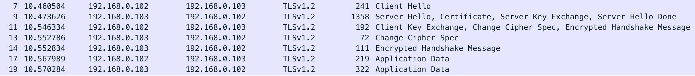

## SSL原理探索实战

### 目录

* ##### [概念](#1)
  1. [参考](#1.1)
  2. [SSL](#1.2)
  3. [TLS](#1.3)
  4. [公钥加密](#1.4)
  5. [数字证书](#1.5)

* ##### [SSL协议的工作方式](#2)
  1. [参考](#2.1)
  2. [握手过程](#2.2)


<h3 id="1">概念</h3>

<h4 id="1.1">参考</h4> 

1. [https://developer.android.com/training/articles/security-ssl](https://developer.android.com/training/articles/security-ssl)

<h4 id="1.2">SSL</h4> 
Secure Sockets Layer, [安全套接字层](https://zh.wikipedia.org/wiki/%E5%82%B3%E8%BC%B8%E5%B1%A4%E5%AE%89%E5%85%A8%E6%80%A7%E5%8D%94%E5%AE%9A)，TLS的前身。

<h4 id="1.3">TLS</h4> 
Transport Layer Security, [传输层安全协议](https://zh.wikipedia.org/wiki/%E5%82%B3%E8%BC%B8%E5%B1%A4%E5%AE%89%E5%85%A8%E6%80%A7%E5%8D%94%E5%AE%9A)。

<h4 id="1.4">公钥加密</h4> 
Public-key cryptography, [公开密钥加密](https://zh.wikipedia.org/zh-cn/%E5%85%AC%E5%BC%80%E5%AF%86%E9%92%A5%E5%8A%A0%E5%AF%86)，也称为非对称加密，是密码学的一种算法，它需要两个密钥，一个是公开密钥，另一个是私有密钥；一个用作加密，另一个则用作解密。使用其中一个密钥把明文加密后所得的密文，只能用相对应的另一个密钥才能解密得到原本的明文；甚至连最初用来加密的密钥也不能用作解密。由于加密和解密需要两个不同的密钥，故被称为非对称加密。

<h4 id="1.5">数字证书</h4>

在电脑上查看证书(改成.crt后缀打开)：


使用命令行查看：
```
$ openssl s_client -connect www.mwping.art:443
CONNECTED(00000003)
depth=0 C = ZH, ST = zj, L = hz, O = mwp, OU = mwp, CN = www.mwping.art
verify error:num=18:self signed certificate
verify return:1
depth=0 C = ZH, ST = zj, L = hz, O = mwp, OU = mwp, CN = www.mwping.art
verify return:1
---
Certificate chain
 0 s:/C=ZH/ST=zj/L=hz/O=mwp/OU=mwp/CN=www.mwping.art
   i:/C=ZH/ST=zj/L=hz/O=mwp/OU=mwp/CN=www.mwping.art
---
Server certificate
-----BEGIN CERTIFICATE-----
MIIDVzCCAj+gAwIBAgIEOb1xuzANBgkqhkiG9w0BAQsFADBcMQswCQYDVQQGEwJa
SDELMAkGA1UECBMCemoxCzAJBgNVBAcTAmh6MQwwCgYDVQQKEwNtd3AxDDAKBgNV
BAsTA213cDEXMBUGA1UEAxMOd3d3Lm13cGluZy5hcnQwHhcNMTgxMjI1MTcxOTI1
WhcNMTkwMzI1MTcxOTI1WjBcMQswCQYDVQQGEwJaSDELMAkGA1UECBMCemoxCzAJ
BgNVBAcTAmh6MQwwCgYDVQQKEwNtd3AxDDAKBgNVBAsTA213cDEXMBUGA1UEAxMO
d3d3Lm13cGluZy5hcnQwggEiMA0GCSqGSIb3DQEBAQUAA4IBDwAwggEKAoIBAQDB
BJuZSk6Q3wZ8e8fzb/vYeq/mR7ax4MB3WnZ3qOctsp7BW2bJYjZEYnjcEVRqxS5k
2WH+fYhHWupGizMywpisCyEfRnw2tw5hsNOeNcNsLkTeHBkOw7EYfZedOOmN1FvB
bTmIcsGOfj1Ni8IzN/gsW/Y7gzFG9ztnGlrP+t8LuhTm4i1pAkt1bqP0jNNJGnZE
Rv9UePTrMnOKZPk+R9u08P8umL7srv9fqjSshW+LaN8fMl9R0mz0lnnF9Utj2dGW
L9dsdHAoyB2JaRJJnPxLkGXUI/P4ASX92Z3fhykveGcFG8QDGu06wy7fFtFkqYpZ
NUTXlqa+o5ErWJZrZq6jAgMBAAGjITAfMB0GA1UdDgQWBBQF+OYt1Fhz0QNntUk7
NBxd/FNNKjANBgkqhkiG9w0BAQsFAAOCAQEAhrXqTSO2OtlSIlGVc+XM71zmSm7e
BS2o88X4jdx/1Nj6jjwdAK2A8IA4DfVgmlY7K3pH5XChZ99yUF2Jno76F1maO5np
py8gLrYct1+9ik38IRhqzeVoBl/HH48VymvKSSYhHVkLBgjiQ6KBy0Ss/AYWHpRO
Q9Zd7C5Ra1MxAKLr21c7HTXbcg8fqUyNnAJlnXb5RCc5Xan6GlSqsTsvXgYL5aa6
ZFPLuIUbB5BH+TBnRF5yYZfQxH7DFc6U/LOky2tIZzFLhCsslycxbhUoCrkEhATc
Cj6bdvI9iqINY7uiMJ5koGAcuPFy57vw12lvvyfmL70FALwrm3N3cHfAWw==
-----END CERTIFICATE-----
subject=/C=ZH/ST=zj/L=hz/O=mwp/OU=mwp/CN=www.mwping.art
issuer=/C=ZH/ST=zj/L=hz/O=mwp/OU=mwp/CN=www.mwping.art
---
No client certificate CA names sent
Peer signing digest: SHA512
Server Temp Key: ECDH, P-256, 256 bits
---
SSL handshake has read 1343 bytes and written 434 bytes
---
New, TLSv1/SSLv3, Cipher is ECDHE-RSA-AES128-GCM-SHA256
Server public key is 2048 bit
Secure Renegotiation IS supported
Compression: NONE
Expansion: NONE
No ALPN negotiated
SSL-Session:
    Protocol  : TLSv1.2
    Cipher    : ECDHE-RSA-AES128-GCM-SHA256
    Session-ID: 5C2CD82ADBF5C66A5EA2798A9A88DFC840DB2BD60D0AF18DFB4FC684AE374575
    Session-ID-ctx: 
    Master-Key: 59D87980A94E612132F56C8897BD9E4E4FDE94274CB2F50A439233852CE9FC52B2D2A883D48361D0A8C9A63B5E942083
    Key-Arg   : None
    PSK identity: None
    PSK identity hint: None
    SRP username: None
    Start Time: 1546442794
    Timeout   : 300 (sec)
    Verify return code: 18 (self signed certificate)
---
closed
```

<h3 id="2">SSL协议的工作方式</h3>

<h4 id="2.1">参考</h4>

1. [传输层安全性协议(维基百科)](https://zh.wikipedia.org/wiki/%E5%82%B3%E8%BC%B8%E5%B1%A4%E5%AE%89%E5%85%A8%E6%80%A7%E5%8D%94%E5%AE%9A)
2. [迪菲-赫尔曼密钥交换](https://zh.wikipedia.org/wiki/%E8%BF%AA%E8%8F%B2-%E8%B5%AB%E7%88%BE%E6%9B%BC%E5%AF%86%E9%91%B0%E4%BA%A4%E6%8F%9B)
3. [Announcing Keyless SSL™: All the Benefits of CloudFlare Without Having to Turn Over Your Private SSL Keys](https://blog.cloudflare.com/announcing-keyless-ssl-all-the-benefits-of-cloudflare-without-having-to-turn-over-your-private-ssl-keys/)
4. [Keyless SSL: The Nitty Gritty Technical Details](https://blog.cloudflare.com/keyless-ssl-the-nitty-gritty-technical-details/)

<h4 id="2.2">握手过程</h4>

抓包：


描述：
> 客户端：服务器你好，我是客户端，我要访问bank.com，这是我支持的加密算法列表和我的随机数；

> 服务器：客户端你好，我是服务器，这是我的数字证书，同时为了证明我有证书私钥，我把截至目前为止所有消息的签名发你了。我已经从你支持的加密算法里面选好了一个算法，我也有1个随机数。另外，这是Diffie-Hellman服务端Pubkey，你计算pre-master secret要用到。

> 客户端：你好，你的证书我收到了。经过我的手机里面预装的知名CA机构的公钥解密，你的证书确实是权威CA机构签发给bank.com的。同时你发的签名，我用你证书里面的公钥解密成功，确认你有证书私钥，看来你确实是bank.com服务器。另外，这是Diffie-Hellman客户端Pubkey。你发的Pubkey我收到了，现在我同时拥有了客户端、服务器的Pubkey，已经计算出了pre-master secret，加上我自己的随机数、服务端的随机数，已经算出来了共享密钥，现在我用这个共享密钥加密一个握手消息给你，你看看能不能解开；

> 服务器：你的加密握手消息我收到了，你的Pubkey我也收到了，现在我也能计算出pre-master secret，加上我们两个的随机数，得出了给你一样的共享密钥。你发的加密握手消息我能解开，我给你也发一个加密的握手消息，你也试试能不能解开。

> 客户端：你发的加密握手消息我也能解开。现在我们可以正式开始会话了，这是我的Application
Data，经过了共享密钥加密。

> 服务器：这是我的Application Data，是对你的回复，也经过了共享密钥加密。
