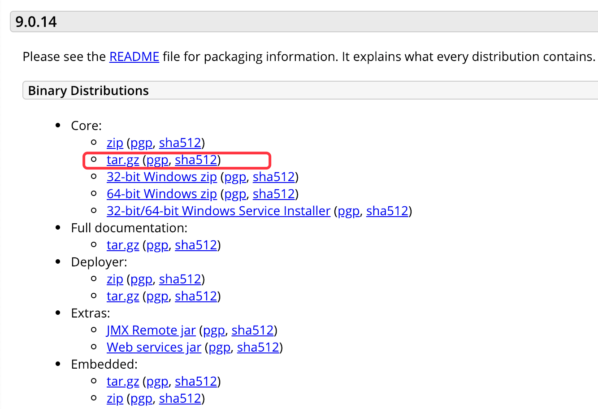

## Tomcat配置

#### 创建证书库

```
$ /usr/libexec/java_home -V
Matching Java Virtual Machines (1):
    1.8.0_73, x86_64:	"Java SE 8"	/Library/Java/JavaVirtualMachines/jdk1.8.0_73.jdk/Contents/Home

/Library/Java/JavaVirtualMachines/jdk1.8.0_73.jdk/Contents/Home
$ cd /Library/Java/JavaVirtualMachines/jdk1.8.0_73.jdk/Contents/Home/bin/
$ keytool -genkeypair -alias mwp -keyalg RSA -keystore /Users/lixiang/Mwp/Github/mwping/network/http/keystore/mwp123.keystore
输入密钥库口令:  
再次输入新口令: 
您的名字与姓氏是什么?
  [Unknown]:  localhost
您的组织单位名称是什么?
  [Unknown]:  mwp
您的组织名称是什么?
  [Unknown]:  mwp
您所在的城市或区域名称是什么?
  [Unknown]:  hz
您所在的省/市/自治区名称是什么?
  [Unknown]:  zj
该单位的双字母国家/地区代码是什么?
  [Unknown]:  ZH
CN=localhost, OU=mwp, O=mwp, L=hz, ST=zj, C=ZH是否正确?
  [否]:  y

输入 <mwp> 的密钥口令
	(如果和密钥库口令相同, 按回车):  
```

#### 查看证书库

```
$ keytool -list -keystore /Users/lixiang/Mwp/Github/mwping/network/http/keystore/mwp123.keystore
输入密钥库口令:  

密钥库类型: JKS
密钥库提供方: SUN

您的密钥库包含 1 个条目

mwp, 2018-12-23, PrivateKeyEntry, 
证书指纹 (SHA1): D9:48:B3:D4:A3:37:4D:D7:07:DF:3D:F8:3B:8A:0D:9D:67:03:70:F3
```

#### 导出证书
```
$ keytool -export -alias mwp -file /Users/lixiang/Mwp/Github/mwping/network/http/keystore/mwp123.crt -keystore /Users/lixiang/Mwp/Github/mwping/network/http/keystore/mwp123.keystore
输入密钥库口令:  
存储在文件 </Users/lixiang/Mwp/Github/mwping/network/http/keystore/mwp123.crt> 中的证书
```

#### 查看证书信息
```
$ keytool -printcert -file /Users/lixiang/Mwp/Github/mwping/network/http/keystore/mwp123.crt
所有者: CN=localhost, OU=mwp, O=mwp, L=hz, ST=zj, C=ZH
发布者: CN=localhost, OU=mwp, O=mwp, L=hz, ST=zj, C=ZH
序列号: 13c8c491
有效期开始日期: Sun Dec 23 22:47:02 CST 2018, 截止日期: Sat Mar 23 22:47:02 CST 2019
证书指纹:
	 MD5: 74:4F:70:D1:D3:5E:3F:5B:11:4F:64:C1:2B:FD:C2:9D
	 SHA1: D9:48:B3:D4:A3:37:4D:D7:07:DF:3D:F8:3B:8A:0D:9D:67:03:70:F3
	 SHA256: 1E:E7:D5:A0:9B:32:6F:38:16:C8:88:D2:9A:03:75:02:86:CA:A9:EE:F6:3A:5B:64:3E:72:78:F8:64:28:12:6E
	 签名算法名称: SHA256withRSA
	 版本: 3

扩展: 

#1: ObjectId: 2.5.29.14 Criticality=false
SubjectKeyIdentifier [
KeyIdentifier [
0000: 9F 56 19 AE 14 DC 3B 67   88 6B 88 ED 43 CF 10 4E  .V....;g.k..C..N
0010: 53 FB 9D 6A                                        S..j
]
]
```

#### 配置Tomcat

**下载安装**

进入Tomcat官网：[http://tomcat.apache.org/](http://tomcat.apache.org/)，下载Tomcat：



解压下载文件，并对解压后目录设置权限：

```
$ sudo chmod 755 /Users/lixiang/Mwp/download/apache-tomcat-9.0.14/bin/*.sh
Password:
```

**启动**

```
$ cd /Users/lixiang/Mwp/download/apache-tomcat-9.0.14/bin/
$ sudo sh startup.sh 
Using CATALINA_BASE:   /Users/lixiang/Mwp/download/apache-tomcat-9.0.14
Using CATALINA_HOME:   /Users/lixiang/Mwp/download/apache-tomcat-9.0.14
Using CATALINA_TMPDIR: /Users/lixiang/Mwp/download/apache-tomcat-9.0.14/temp
Using JRE_HOME:        /Library/Java/JavaVirtualMachines/jdk1.8.0_73.jdk/Contents/Home
Using CLASSPATH:       /Users/lixiang/Mwp/download/apache-tomcat-9.0.14/bin/bootstrap.jar:/Users/lixiang/Mwp/download/apache-tomcat-9.0.14/bin/tomcat-juli.jar
Tomcat started.
```

浏览器正常打开[http://localhost:8080/](http://localhost:8080/)，则说明配置成功：


**停止**

```
$ sudo sh shutdown.sh
```


