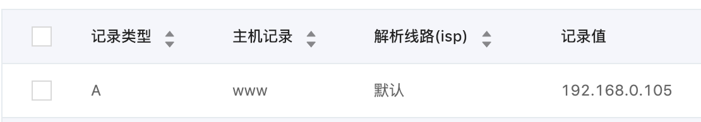

## Tomcat配置

#### 创建证书库

```
$ /usr/libexec/java_home -V
Matching Java Virtual Machines (1):
    1.8.0_73, x86_64:	"Java SE 8"	/Library/Java/JavaVirtualMachines/jdk1.8.0_73.jdk/Contents/Home

/Library/Java/JavaVirtualMachines/jdk1.8.0_73.jdk/Contents/Home
$ cd /Library/Java/JavaVirtualMachines/jdk1.8.0_73.jdk/Contents/Home/bin/
$ keytool -genkeypair -alias mwp -keyalg RSA -keystore /Users/lixiang/Mwp/Github/mwping/network/http/keystore/mwp123.keystore
输入密钥库口令:  
再次输入新口令: 
您的名字与姓氏是什么?
  [Unknown]:  mwping.art
您的组织单位名称是什么?
  [Unknown]:  mwping.art
您的组织名称是什么?
  [Unknown]:  mwping.art
您所在的城市或区域名称是什么?
  [Unknown]:  hz
您所在的省/市/自治区名称是什么?
  [Unknown]:  zj
该单位的双字母国家/地区代码是什么?
  [Unknown]:  ZH
CN=mwping.art, OU=mwping.art, O=mwping.art, L=hz, ST=zj, C=ZH是否正确?
  [否]:  y

输入 <mwp> 的密钥口令
  (如果和密钥库口令相同, 按回车):  
```

#### 查看证书库

```
$ keytool -list -keystore /Users/lixiang/Mwp/Github/mwping/network/http/keystore/mwp123.keystore
输入密钥库口令:  

密钥库类型: JKS
密钥库提供方: SUN

您的密钥库包含 1 个条目

mwp, 2018-12-24, PrivateKeyEntry, 
证书指纹 (SHA1): E6:49:48:DC:C5:8D:36:A9:6D:A5:CD:62:69:83:7E:D9:37:E9:9D:47
```

#### 导出证书
```
$ keytool -export -alias mwp -file /Users/lixiang/Mwp/Github/mwping/network/http/keystore/mwp123 -keystore /Users/lixiang/Mwp/Github/mwping/network/http/keystore/mwp123.keystore
输入密钥库口令:  
存储在文件 </Users/lixiang/Mwp/Github/mwping/network/http/keystore/mwp123> 中的证书
```

#### 查看证书信息
```
$ keytool -printcert -file /Users/lixiang/Mwp/Github/mwping/network/http/keystore/mwp123
所有者: CN=mwping.art, OU=mwping.art, O=mwping.art, L=hz, ST=zj, C=ZH
发布者: CN=mwping.art, OU=mwping.art, O=mwping.art, L=hz, ST=zj, C=ZH
序列号: 2dd035f8
有效期开始日期: Mon Dec 24 14:51:52 CST 2018, 截止日期: Sun Mar 24 14:51:52 CST 2019
证书指纹:
   MD5: A5:F4:24:32:CD:F4:6B:1C:31:BF:AB:B9:02:07:8E:DE
   SHA1: E6:49:48:DC:C5:8D:36:A9:6D:A5:CD:62:69:83:7E:D9:37:E9:9D:47
   SHA256: D4:19:FB:69:D8:D9:A9:D3:6F:A2:BB:48:64:F1:BD:59:E6:60:0F:52:C4:BA:EE:8B:80:90:31:20:05:42:CA:A3
   签名算法名称: SHA256withRSA
   版本: 3

扩展: 

#1: ObjectId: 2.5.29.14 Criticality=false
SubjectKeyIdentifier [
KeyIdentifier [
0000: 3B D7 F9 2C 07 87 AE 70   D8 BA 55 2D E3 82 0A 2D  ;..,...p..U-...-
0010: E9 5F 33 05                                        ._3.
]
]
```

#### 配置Tomcat

**下载安装**

进入Tomcat官网：[http://tomcat.apache.org/](http://tomcat.apache.org/)，下载Tomcat：


解压下载文件，并对解压后目录设置权限：

```
$ sudo chmod 755 /Users/lixiang/Mwp/download/apache-tomcat-9.0.14/bin/*.sh
Password:
```

**启动**

```
$ cd /Users/lixiang/Mwp/download/apache-tomcat-9.0.14/bin/
$ sudo sh startup.sh 
Using CATALINA_BASE:   /Users/lixiang/Mwp/download/apache-tomcat-9.0.14
Using CATALINA_HOME:   /Users/lixiang/Mwp/download/apache-tomcat-9.0.14
Using CATALINA_TMPDIR: /Users/lixiang/Mwp/download/apache-tomcat-9.0.14/temp
Using JRE_HOME:        /Library/Java/JavaVirtualMachines/jdk1.8.0_73.jdk/Contents/Home
Using CLASSPATH:       /Users/lixiang/Mwp/download/apache-tomcat-9.0.14/bin/bootstrap.jar:/Users/lixiang/Mwp/download/apache-tomcat-9.0.14/bin/tomcat-juli.jar
Tomcat started.
```

浏览器正常打开[http://localhost:8080/](http://localhost:8080/)，则说明配置成功：


**停止**

```
$ sudo sh shutdown.sh
```

**启用https**

1.把刚刚生成的mwp123.keystore移到apache-tomcat-9.0.14/conf目录下

2.修改conf/server.xml文件：

初始状态(代码片段)：
```html
    <!--
    <Connector port="8443" protocol="org.apache.coyote.http11.Http11NioProtocol"
               maxThreads="150" SSLEnabled="true">
        <SSLHostConfig>
            <Certificate certificateKeystoreFile="conf/localhost-rsa.jks"
                         type="RSA" />
        </SSLHostConfig>
    </Connector>
    -->
```

配置秘钥库路径和密码，变成：

```html
    <Connector port="8443" protocol="org.apache.coyote.http11.Http11NioProtocol"
               maxThreads="150" SSLEnabled="true"
               keystoreFile="conf/mwp123.keystore" 
               keystorePass="mwp123"
               >
<!--         <SSLHostConfig>
            <Certificate certificateKeystoreFile="conf/localhost-rsa.jks"
                         type="RSA" />
        </SSLHostConfig> -->
    </Connector>
```

打开[https://localhost:8443/](https://localhost:8443/)验证配置是否生效：


注意每次修改了配置需要重启Tomcat才能生效(`sudo sh shutdown.sh`、`sudo sh startup.sh`)。

#### 绑定域名

**申请域名，并添加解析**



其中192.168.0.105是本机ip。

**修改conf/server.xml**

修改http端口号：8080改成80：
```html
    <Connector port="8080" protocol="HTTP/1.1"
               connectionTimeout="20000"
               redirectPort="8443" />
```

改成
```html
    <Connector port="80" protocol="HTTP/1.1"
               connectionTimeout="20000"
               redirectPort="443" />
```

修改https端口号，8443改成443：
```html
    <Connector port="8443" protocol="org.apache.coyote.http11.Http11NioProtocol"
               maxThreads="150" SSLEnabled="true"
               keystoreFile="conf/mwp123.keystore" 
               keystorePass="mwp123"
               >
<!--         <SSLHostConfig>
            <Certificate certificateKeystoreFile="conf/localhost-rsa.jks"
                         type="RSA" />
        </SSLHostConfig> -->
    </Connector>
```
改成
```html
    <Connector port="443" protocol="org.apache.coyote.http11.Http11NioProtocol"
               maxThreads="150" SSLEnabled="true"
               keystoreFile="conf/mwp123.keystore" 
               keystorePass="mwp123"
               >
<!--         <SSLHostConfig>
            <Certificate certificateKeystoreFile="conf/localhost-rsa.jks"
                         type="RSA" />
        </SSLHostConfig> -->
    </Connector>
```

把
```html
<Engine name="Catalina" defaultHost="localhost">
```
改成
```html
<Engine name="Catalina" defaultHost="www.mwping.art">
```

把
```html
      <Host name="localhost"  appBase="webapps"
            unpackWARs="true" autoDeploy="true">

        <!-- SingleSignOn valve, share authentication between web applications
             Documentation at: /docs/config/valve.html -->
        <!--
        <Valve className="org.apache.catalina.authenticator.SingleSignOn" />
        -->

        <!-- Access log processes all example.
             Documentation at: /docs/config/valve.html
             Note: The pattern used is equivalent to using pattern="common" -->
        <Valve className="org.apache.catalina.valves.AccessLogValve" directory="logs"
               prefix="localhost_access_log" suffix=".txt"
               pattern="%h %l %u %t &quot;%r&quot; %s %b" />

      </Host>
```

改成
```html
      <Host name="www.mwping.art"  appBase="webapps"
            unpackWARs="true" autoDeploy="true">

        <!-- SingleSignOn valve, share authentication between web applications
             Documentation at: /docs/config/valve.html -->
        <!--
        <Valve className="org.apache.catalina.authenticator.SingleSignOn" />
        -->

        <!-- Access log processes all example.
             Documentation at: /docs/config/valve.html
             Note: The pattern used is equivalent to using pattern="common" -->
        <Valve className="org.apache.catalina.valves.AccessLogValve" directory="logs"
               prefix="localhost_access_log" suffix=".txt"
               pattern="%h %l %u %t &quot;%r&quot; %s %b" />

      </Host>
```

重启tomcat验证如下：

配置http完成：


配置https完成：

