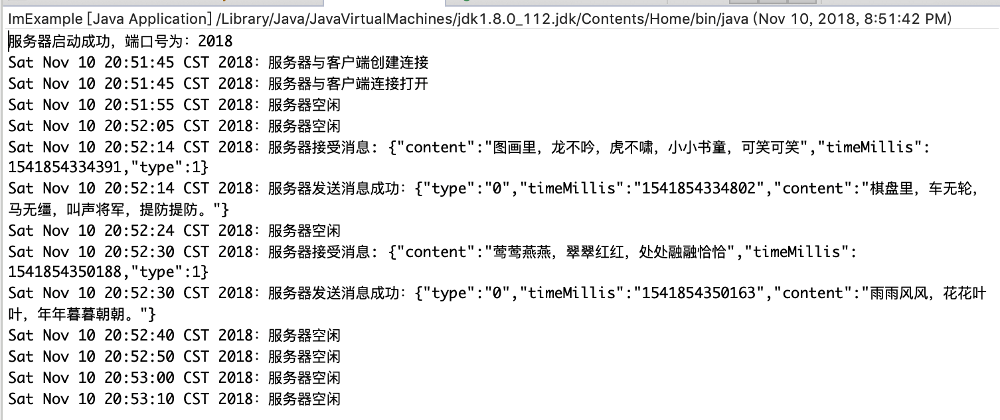

## 长连接

#### Mina框架介绍

* [Mina Github项目](https://github.com/apache/mina)
* [Mina 官网](http://mina.apache.org/)

MINA全称Multipurpose Infrastructure for Network Applications，网络应用的多用途基础设施。

#### MINA框架实践

**Eclipse构建服务端**

1. [http://mina.apache.org/mina-project/downloads.html](http://mina.apache.org/mina-project/downloads.html) 下载MINA库
2. [https://www.slf4j.org/download.html](https://www.slf4j.org/download.html) 下载log相关的库，不然demo报错。

配置之后应该依赖如下这些库：


服务端Demo地址(开发环境：Eclipse)：
[https://github.com/mwping/MinaExample](https://github.com/mwping/MinaExample)

**Android Studio构建客户端App**

Android依赖的库，上面已经下载好了，依赖如下：


客户端Demo地址(开发环境：Android Studio)：
[https://github.com/mwping/LordHelper](https://github.com/mwping/LordHelper)

客户端和服务端互相发送消息演示：




#### Mina框架解读

##### 服务端

**NioSocketAcceptor初始化**

```java
    IoAcceptor acceptor = new NioSocketAcceptor();
```
初始化IoFilterChainBuilder、监听接口、线程池(AbstractIoService.java)
```java
    /**
     * Current filter chain builder.
     */
    private IoFilterChainBuilder filterChainBuilder = new DefaultIoFilterChainBuilder();
    /**
     * Maintains the {@link IoServiceListener}s of this service.
     */
    private final IoServiceListenerSupport listeners;
    /**
     * The associated executor, responsible for handling execution of I/O events.
     */
    private final Executor executor;
    protected AbstractIoService(IoSessionConfig sessionConfig, Executor executor) {
        // ...

        // Create the listeners, and add a first listener : a activation listener
        // for this service, which will give information on the service state.
        listeners = new IoServiceListenerSupport(this);
        listeners.add(serviceActivationListener);

        if (executor == null) {
            this.executor = Executors.newCachedThreadPool();
            createdExecutor = true;
        } else {
            // ...
        }
    }
```
初始化IoProcessor(AbstractPollingIoAcceptor.java)
```java
    /**
     * SimpleIoProcessorPool
     */
    private final IoProcessor<S> processor;

    protected AbstractPollingIoAcceptor(IoSessionConfig sessionConfig, Class<? extends IoProcessor<S>> processorClass) {
        this(sessionConfig, null, new SimpleIoProcessorPool<S>(processorClass), true, null);
    }

    private AbstractPollingIoAcceptor(IoSessionConfig sessionConfig, Executor executor, IoProcessor<S> processor,
            boolean createdProcessor, SelectorProvider selectorProvider) {
        super(sessionConfig, executor);

        if (processor == null) {
            throw new IllegalArgumentException("processor");
        }

        this.processor = processor;
        this.createdProcessor = createdProcessor;

        try {
            // Initialize the selector
            init(selectorProvider);

            // The selector is now ready, we can switch the
            // flag to true so that incoming connection can be accepted
            selectable = true;
        } catch (RuntimeException e) {
            throw e;
        } catch (Exception e) {
            throw new RuntimeIoException("Failed to initialize.", e);
        } finally {
            if (!selectable) {
                try {
                    destroy();
                } catch (Exception e) {
                    ExceptionMonitor.getInstance().exceptionCaught(e);
                }
            }
        }
    }
```
SimpleIoProcessorPool也会创建一个线程池：
```java
    public SimpleIoProcessorPool(Class<? extends IoProcessor<S>> processorType, Executor executor, int size, 
            SelectorProvider selectorProvider) {
        if (createdExecutor) {
            this.executor = Executors.newCachedThreadPool();
            // Set a default reject handler
            ((ThreadPoolExecutor) this.executor).setRejectedExecutionHandler(new ThreadPoolExecutor.CallerRunsPolicy());
        } else {
            // ...
        }
    }
```
初始化NioProcessor
```java
    /**
     *
     * Creates a new instance of NioProcessor.
     *
     * @param executor The executor to use, 和SimpleIoProcessorPool是同一个。
     */
    public NioProcessor(Executor executor) {
        super(executor);

        try {
            // Open a new selector
            selector = Selector.open();
        } catch (IOException e) {
            throw new RuntimeIoException("Failed to open a selector.", e);
        }
    }
```
初始化selector(NioSocketAcceptor.java)
```java
    private volatile Selector selector;
    @Override
    protected void init(SelectorProvider selectorProvider) throws Exception {
        if (selectorProvider == null) {
            // go here
            selector = Selector.open();
        } else {
            // ...
        }
    }
```
**绑定本地地址，监听连接**
```java
    acceptor.bind(new InetSocketAddress(PORT));
```
启动Acceptor(AbstractPollingIoAcceptor.java)
```java
    @Override
    protected final Set<SocketAddress> bindInternal(List<? extends SocketAddress> localAddresses) throws Exception {

        // creates the Acceptor instance and has the local
        // executor kick it off.
        startupAcceptor();
    }
    /**
     * This class is called by the startupAcceptor() method and is
     * placed into a NamePreservingRunnable class.
     * It's a thread accepting incoming connections from clients.
     * The loop is stopped when all the bound handlers are unbound.
     * 
     * 循环检查是否有新连接。
     */
    private class Acceptor implements Runnable {
        @Override
        public void run() {
            while (selectable) {
                try {
                    // Process the bound sockets to this acceptor.
                    // this actually sets the selector to OP_ACCEPT,
                    // and binds to the port on which this class will
                    // listen on. We do that before the select because 
                    // the registerQueue containing the new handler is
                    // already updated at this point.
                    registerHandles();

                    // Detect if we have some keys ready to be processed
                    // The select() will be woke up if some new connection
                    // have occurred, or if the selector has been explicitly
                    // woke up
                    int selected = select();

                    if (selected > 0) {
                        // We have some connection request, let's process
                        // them here.
                        processHandles(selectedHandles());
                    }
                } catch (ClosedSelectorException cse) {
                    // ...
                } catch (Exception e) {
                    // ...
                }
            }
        }

        /**
         * This method will process new sessions for the Worker class.  All
         * keys that have had their status updates as per the Selector.selectedKeys()
         * method will be processed here.  Only keys that are ready to accept
         * connections are handled here.
         * <p/>
         * Session objects are created by making new instances of SocketSessionImpl
         * and passing the session object to the SocketIoProcessor class.
         */
        @SuppressWarnings("unchecked")
        private void processHandles(Iterator<H> handles) throws Exception {
            while (handles.hasNext()) {
                // Associates a new created connection to a processor,
                // and get back a session
                S session = accept(processor, handle);

                // add the session to the SocketIoProcessor
                session.getProcessor().add(session);
            }
        }

        private int registerHandles() {
            for (;;) {
                try {
                    // Process all the addresses
                    for (SocketAddress a : localAddresses) {
                        H handle = open(a);
                    }
                } catch (Exception e) {
                    // ...
                } finally {
                    // ...
                }
            }
        }
    }
```
创建ServerSocketChannel(NioSocketAcceptor.java)
```java
    @Override
    protected ServerSocketChannel open(SocketAddress localAddress) throws Exception {
        // Creates the listening ServerSocket

        ServerSocketChannel channel = null;

        if (selectorProvider != null) {
            // ...
        } else {
            // go here
            channel = ServerSocketChannel.open();
        }

        boolean success = false;

        try {
            // This is a non blocking socket channel
            channel.configureBlocking(false);

            // Configure the server socket,
            ServerSocket socket = channel.socket();

            // Set the reuseAddress flag accordingly with the setting
            // isReuseAddress()默认返回false
            socket.setReuseAddress(isReuseAddress());

            // and bind.
            try {
                // getBacklog()默认返回50
                socket.bind(localAddress, getBacklog());
            } catch (IOException ioe) {
                // ...
            }

            // Register the channel within the selector for ACCEPT event
            channel.register(selector, SelectionKey.OP_ACCEPT);
            success = true;
        } finally {
            // ...
        }
        return channel;
    }
```
监听是否有新连接进入(NioSocketAcceptor.java)
```java
    /**
     * Check if we have at least one key whose corresponding channels is
     * ready for I/O operations.
     *
     * This method performs a blocking selection operation.
     * It returns only after at least one channel is selected,
     * this selector's wakeup method is invoked, or the current thread
     * is interrupted, whichever comes first.
     * 
     * @return The number of keys having their ready-operation set updated
     * @throws IOException If an I/O error occurs
     */
    @Override
    protected int select() throws Exception {
        return selector.select();
    }
```
接收新连接请求(NioSocketAcceptor.java)
```java
   @Override
    protected NioSession accept(IoProcessor<NioSession> processor, ServerSocketChannel handle) throws Exception {

        SelectionKey key = null;

        if (handle != null) {
            key = handle.keyFor(selector);
        }

        if ((key == null) || (!key.isValid()) || (!key.isAcceptable())) {
            return null;
        }

        // accept the connection from the client
        try {
            SocketChannel ch = handle.accept();
    
            if (ch == null) {
                return null;
            }
            /**
             * processor: SimpleIoProcessorPool
             */
            return new NioSocketSession(this, processor, ch);
        } catch (Throwable t) {
            // ...
            return null;
        }
    }
```
NioSocketSession交给NioProcessor处理(AbstractPollingIoProcessor.java)
```java
    @Override
    public final void add(S session) {
        startupProcessor();
    }

    /**
     * The main loop. This is the place in charge to poll the Selector, and to
     * process the active sessions. It's done in - handle the newly created
     * sessions -
     */
    private class Processor implements Runnable {
        @Override
        public void run() {
            for (;;) {
                handleNewSessions();
            }
        }
        /**
         * Loops over the new sessions blocking queue and returns the number of
         * sessions which are effectively created
         * 
         * @return The number of new sessions
         */
        private int handleNewSessions() {
            int addedSessions = 0;

            for (S session = newSessions.poll(); session != null; session = newSessions.poll()) {
                if (addNow(session)) {
                    // A new session has been created
                    addedSessions++;
                }
            }

            return addedSessions;
        }
        /**
         * Process a new session : - initialize it - create its chain - fire the
         * CREATED listeners if any
         * 
         * @param session
         *            The session to create
         * @return <tt>true</tt> if the session has been registered
         */
        private boolean addNow(S session) {
            boolean registered = false;

            try {
                init(session);
                registered = true;

                // Build the filter chain of this session.
                /**
                 * 把NioSocketAcceptor.getFilterChainBuilder()的元素合并到session的chain中：
                 * session的Head->NioSocketAcceptor.getFilterChainBuilder()->session的Tail
                 */
                
                IoFilterChainBuilder chainBuilder = session.getService().getFilterChainBuilder();
                chainBuilder.buildFilterChain(session.getFilterChain());

                // DefaultIoFilterChain.CONNECT_FUTURE is cleared inside here
                // in AbstractIoFilterChain.fireSessionOpened().
                // Propagate the SESSION_CREATED event up to the chain
                IoServiceListenerSupport listeners = ((AbstractIoService) session.getService()).getListeners();
                listeners.fireSessionCreated(session);
            } catch (Exception e) {
                // ...
            }

            return registered;
        }
    }
```
NioProcessor.java
```java
    @Override
    protected void init(NioSession session) throws Exception {
        SelectableChannel ch = (SelectableChannel) session.getChannel();
        ch.configureBlocking(false);
        selectorLock.readLock().lock();
        
        try {
            session.setSelectionKey(ch.register(selector, SelectionKey.OP_READ, session));
        } finally {
            selectorLock.readLock().unlock();
        }
    }
```
回调生命周期(IoServiceListenerSupport.java)
```java
    public void fireSessionCreated(IoSession session) {
        // Fire session events.
        IoFilterChain filterChain = session.getFilterChain();
        filterChain.fireSessionCreated();
        filterChain.fireSessionOpened();
    }
```
TailFilter调用自定义IoHandler的回调方法(`acceptor.setHandler()`)：
```java
    private static class TailFilter extends IoFilterAdapter {
        @Override
        public void sessionCreated(NextFilter nextFilter, IoSession session) throws Exception {
            session.getHandler().sessionCreated(session);
        }

        @Override
        public void sessionOpened(NextFilter nextFilter, IoSession session) throws Exception {
            session.getHandler().sessionOpened(session);
        }

        @Override
        public void sessionClosed(NextFilter nextFilter, IoSession session) throws Exception {
            AbstractIoSession s = (AbstractIoSession) session;
            s.getHandler().sessionClosed(session);
        }

        @Override
        public void sessionIdle(NextFilter nextFilter, IoSession session, IdleStatus status) throws Exception {
            session.getHandler().sessionIdle(session, status);
        }

        @Override
        public void exceptionCaught(NextFilter nextFilter, IoSession session, Throwable cause) throws Exception {
            AbstractIoSession s = (AbstractIoSession) session;
            s.getHandler().exceptionCaught(s, cause);
        }

        @Override
        public void inputClosed(NextFilter nextFilter, IoSession session) throws Exception {
            session.getHandler().inputClosed(session);
        }

        @Override
        public void messageReceived(NextFilter nextFilter, IoSession session, Object message) throws Exception {
            AbstractIoSession s = (AbstractIoSession) session;
            session.getHandler().messageReceived(s, message);
        }

        @Override
        public void messageSent(NextFilter nextFilter, IoSession session, WriteRequest writeRequest) throws Exception {
            // Propagate the message
            session.getHandler().messageSent(session, writeRequest.getMessage());
        }

        @Override
        public void filterWrite(NextFilter nextFilter, IoSession session, WriteRequest writeRequest) throws Exception {
            nextFilter.filterWrite(session, writeRequest);
        }

        @Override
        public void filterClose(NextFilter nextFilter, IoSession session) throws Exception {
            nextFilter.filterClose(session);
        }
    }
```
接收client数据(AbstractPollingIoProcessor.java)：
```java
    private void read(S session) {
        IoSessionConfig config = session.getConfig();
        int bufferSize = config.getReadBufferSize();
        IoBuffer buf = IoBuffer.allocate(bufferSize);

        final boolean hasFragmentation = session.getTransportMetadata().hasFragmentation();

        try {
            int readBytes = 0;
            int ret;

            try {
                if (hasFragmentation) {

                    while ((ret = read(session, buf)) > 0) {
                        readBytes += ret;

                        if (!buf.hasRemaining()) {
                            break;
                        }
                    }
                } else {
                    ret = read(session, buf);

                    if (ret > 0) {
                        readBytes = ret;
                    }
                }
            } finally {
                buf.flip();
            }

            if (readBytes > 0) {
                IoFilterChain filterChain = session.getFilterChain();
                filterChain.fireMessageReceived(buf);
                buf = null;

                if (hasFragmentation) {
                    if (readBytes << 1 < config.getReadBufferSize()) {
                        session.decreaseReadBufferSize();
                    } else if (readBytes == config.getReadBufferSize()) {
                        session.increaseReadBufferSize();
                    }
                }
            } else {
                // release temporary buffer when read nothing
                buf.free(); 
            }

            if (ret < 0) {
                IoFilterChain filterChain = session.getFilterChain();
                filterChain.fireInputClosed();
            }
        } catch (Exception e) {
            if ((e instanceof IOException) &&
                (!(e instanceof PortUnreachableException)
                        || !AbstractDatagramSessionConfig.class.isAssignableFrom(config.getClass())
                        || ((AbstractDatagramSessionConfig) config).isCloseOnPortUnreachable())) {
                scheduleRemove(session);
            }

            IoFilterChain filterChain = session.getFilterChain();
            filterChain.fireExceptionCaught(e);
        }
    }
```
ProtocolCodecFilter把数据解码成字符串
```java
    @Override
    public void messageReceived(NextFilter nextFilter, IoSession session, Object message) throws Exception {
        LOGGER.debug("Processing a MESSAGE_RECEIVED for session {}", session.getId());

        if (!(message instanceof IoBuffer)) {
            nextFilter.messageReceived(session, message);
            return;
        }

        IoBuffer in = (IoBuffer) message;
        ProtocolDecoder decoder = factory.getDecoder(session);
        ProtocolDecoderOutput decoderOut = getDecoderOut(session, nextFilter);

        // Loop until we don't have anymore byte in the buffer,
        // or until the decoder throws an unrecoverable exception or
        // can't decoder a message, because there are not enough
        // data in the buffer
        while (in.hasRemaining()) {
            int oldPos = in.position();
            try {
                synchronized (session) {
                    // Call the decoder with the read bytes
                    decoder.decode(session, in, decoderOut);
                }
                // Finish decoding if no exception was thrown.
                decoderOut.flush(nextFilter, session);
            } catch (Exception e) {
                ProtocolDecoderException pde;
                if (e instanceof ProtocolDecoderException) {
                    pde = (ProtocolDecoderException) e;
                } else {
                    pde = new ProtocolDecoderException(e);
                }
                if (pde.getHexdump() == null) {
                    // Generate a message hex dump
                    int curPos = in.position();
                    in.position(oldPos);
                    pde.setHexdump(in.getHexDump());
                    in.position(curPos);
                }
                // Fire the exceptionCaught event.
                decoderOut.flush(nextFilter, session);
                nextFilter.exceptionCaught(session, pde);
                // Retry only if the type of the caught exception is
                // recoverable and the buffer position has changed.
                // We check buffer position additionally to prevent an
                // infinite loop.
                if (!(e instanceof RecoverableProtocolDecoderException) || (in.position() == oldPos)) {
                    break;
                }
            }
        }
    }
```
服务端写数据：(AbstractIoSession.java)
```java
    public WriteFuture write(Object message) {
        return write(message, null);
    }
```
ProtocolCodecFilter把要写的数据进行编码：
```java
    /**
     * {@inheritDoc}
     */
    @Override
    public void filterWrite(NextFilter nextFilter, IoSession session, WriteRequest writeRequest) throws Exception {
        Object message = writeRequest.getMessage();

        // Bypass the encoding if the message is contained in a IoBuffer,
        // as it has already been encoded before
        if ((message instanceof IoBuffer) || (message instanceof FileRegion)) {
            nextFilter.filterWrite(session, writeRequest);
            return;
        }

        // Get the encoder in the session
        ProtocolEncoder encoder = factory.getEncoder(session);

        ProtocolEncoderOutput encoderOut = getEncoderOut(session, nextFilter, writeRequest);

        if (encoder == null) {
            throw new ProtocolEncoderException("The encoder is null for the session " + session);
        }

        try {
            // Now we can try to encode the response
            encoder.encode(session, message, encoderOut);

            // Send it directly
            Queue<Object> bufferQueue = ((AbstractProtocolEncoderOutput) encoderOut).getMessageQueue();

            // Write all the encoded messages now
            while (!bufferQueue.isEmpty()) {
                Object encodedMessage = bufferQueue.poll();

                if (encodedMessage == null) {
                    break;
                }

                // Flush only when the buffer has remaining.
                if (!(encodedMessage instanceof IoBuffer) || ((IoBuffer) encodedMessage).hasRemaining()) {
                    SocketAddress destination = writeRequest.getDestination();
                    WriteRequest encodedWriteRequest = new EncodedWriteRequest(encodedMessage, null, destination);

                    nextFilter.filterWrite(session, encodedWriteRequest);
                }
            }

            // Call the next filter
            nextFilter.filterWrite(session, new MessageWriteRequest(writeRequest));
        } catch (Exception e) {
            ProtocolEncoderException pee;

            // Generate the correct exception
            if (e instanceof ProtocolEncoderException) {
                pee = (ProtocolEncoderException) e;
            } else {
                pee = new ProtocolEncoderException(e);
            }

            throw pee;
        }
    }
```
DefaultIoFilterChain.HeadFilter写到socket：
```java
    private class HeadFilter extends IoFilterAdapter {
        @SuppressWarnings("unchecked")
        @Override
      public void filterWrite(NextFilter nextFilter, IoSession session, WriteRequest writeRequest) throws Exception {
            AbstractIoSession s = (AbstractIoSession) session;

            // Maintain counters.
            if (writeRequest.getMessage() instanceof IoBuffer) {
                IoBuffer buffer = (IoBuffer) writeRequest.getMessage();
                // I/O processor implementation will call buffer.reset()
                // it after the write operation is finished, because
                // the buffer will be specified with messageSent event.
                buffer.mark();
                int remaining = buffer.remaining();

                if (remaining > 0) {
                    s.increaseScheduledWriteBytes(remaining);
                }
            }

            if (!writeRequest.isEncoded()) {
                s.increaseScheduledWriteMessages();
            }

            WriteRequestQueue writeRequestQueue = s.getWriteRequestQueue();

            if (!s.isWriteSuspended()) {
                if (writeRequestQueue.isEmpty(session)) {
                    // We can write directly the message
                    s.getProcessor().write(s, writeRequest);
                } else {
                    s.getWriteRequestQueue().offer(s, writeRequest);
                    s.getProcessor().flush(s);
                }
            } else {
                s.getWriteRequestQueue().offer(s, writeRequest);
            }
        }


        @SuppressWarnings("unchecked")
        @Override
        public void filterClose(NextFilter nextFilter, IoSession session) throws Exception {
            ((AbstractIoSession) session).getProcessor().remove(session);
        }
    }
```
AbstractPollingIoProcessor写入：
```java
    @Override
    public void write(S session, WriteRequest writeRequest) {
        WriteRequestQueue writeRequestQueue = session.getWriteRequestQueue();

        writeRequestQueue.offer(session, writeRequest);

        if (!session.isWriteSuspended()) {
            this.flush(session);
        }
    }
```

##### 客户端

创建NioSocketConnector并连接服务端地址：
```java
    NioSocketConnector connector = new NioSocketConnector();
    SocketAddress address = new InetSocketAddress("192.168.0.1", 1234);
    ConnectFuture future = connector.connect(address);
```
AbstractPollingIoConnector.java
```java
    protected final ConnectFuture connect0(SocketAddress remoteAddress, SocketAddress localAddress,
            IoSessionInitializer<? extends ConnectFuture> sessionInitializer) {
        H handle = null;
        boolean success = false;
        try {
            handle = newHandle(localAddress);
            if (connect(handle, remoteAddress)) {
                ConnectFuture future = new DefaultConnectFuture();
                S session = newSession(processor, handle);
                initSession(session, future, sessionInitializer);
                // Forward the remaining process to the IoProcessor.
                session.getProcessor().add(session);
                success = true;
                return future;
            }

            success = true;
        } catch (Exception e) {
            return DefaultConnectFuture.newFailedFuture(e);
        } finally {
            if (!success && handle != null) {
                try {
                    close(handle);
                } catch (Exception e) {
                    ExceptionMonitor.getInstance().exceptionCaught(e);
                }
            }
        }

        ConnectionRequest request = new ConnectionRequest(handle, sessionInitializer);
        connectQueue.add(request);
        startupWorker();
        wakeup();

        return request;
    }

    @Override
    protected SocketChannel newHandle(SocketAddress localAddress) throws Exception {
        SocketChannel ch = SocketChannel.open();

        int receiveBufferSize = (getSessionConfig()).getReceiveBufferSize();

        if (receiveBufferSize > 65535) {
            ch.socket().setReceiveBufferSize(receiveBufferSize);
        }

        if (localAddress != null) {
            try {
                ch.socket().bind(localAddress);
            } catch (IOException ioe) {
                // Add some info regarding the address we try to bind to the
                // message
                String newMessage = "Error while binding on " + localAddress + "\n" + "original message : "
                        + ioe.getMessage();
                Exception e = new IOException(newMessage);
                e.initCause(ioe.getCause());

                // Preemptively close the channel
                ch.close();
                throw e;
            }
        }

        ch.configureBlocking(false);

        return ch;
    }
```
NioSocketConnector.java
```java
    @Override
    protected boolean connect(SocketChannel handle, SocketAddress remoteAddress) throws Exception {
        return handle.connect(remoteAddress);
    }
```

