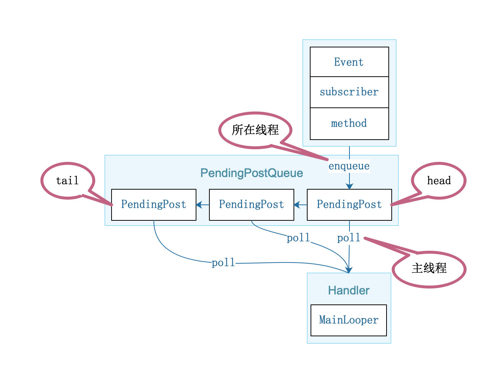

## 图解EventBus

### 目录

* ##### [注册](#1)

* ##### [发送事件](#2)

* ##### [反注册](#3)

* ##### [主线程模式](#4)

* ##### [postSticky](#5)

* ##### [设计模式](#6)
  1. [单例](#6.1)

<h3 id="1">注册</h3>


<h3 id="2">发送事件</h3>


<h3 id="3">反注册</h3>


<h3 id="4">主线程模式</h3>

使用方法
```java
    @Subscribe(threadMode = ThreadMode.MAIN)
    public void methodA1(MessageEvent event) {

    }
```


<h3 id="5">postSticky</h3>

```java
    public void postSticky(Object event) {
        synchronized (stickyEvents) {
            stickyEvents.put(event.getClass(), event);
        }
        // Should be posted after it is putted, in case the subscriber wants to remove immediately
        post(event);
    }
```

<h3 id="6">设计模式</h3>

<h4 id="6.1">单例</h4> 
```java
public class EventBus {

    static volatile EventBus defaultInstance;
    
    /** Convenience singleton for apps using a process-wide EventBus instance. */
    public static EventBus getDefault() {
        EventBus instance = defaultInstance;
        if (instance == null) {
            synchronized (EventBus.class) {
                instance = EventBus.defaultInstance;
                if (instance == null) {
                    instance = EventBus.defaultInstance = new EventBus();
                }
            }
        }
        return instance;
    }
}
```