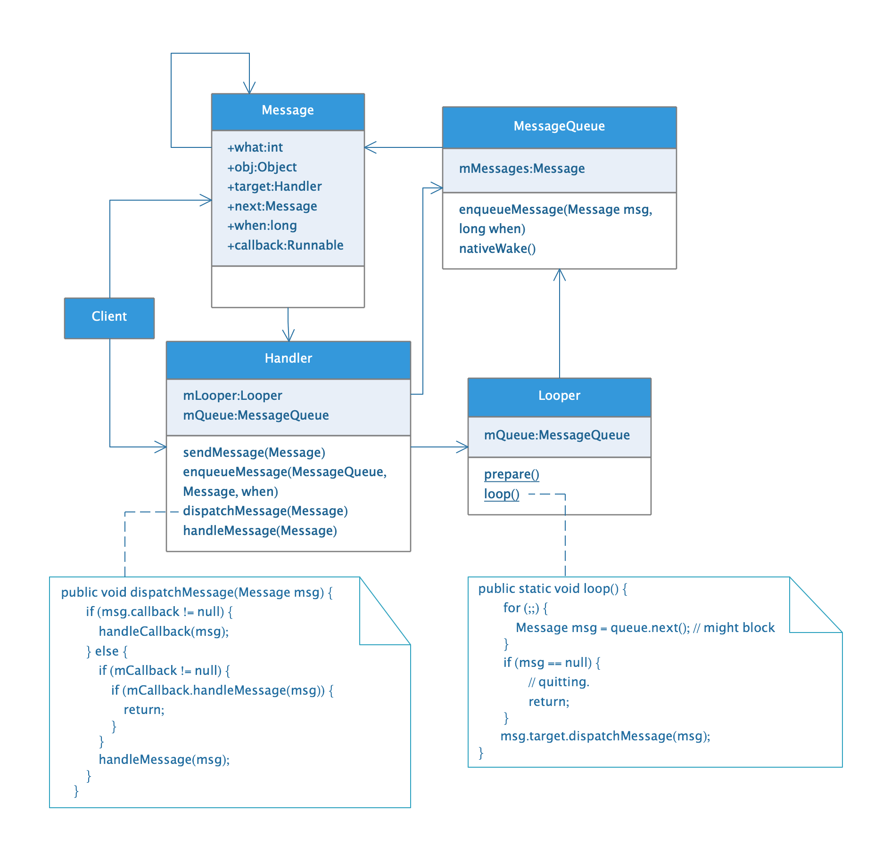

## Handler机制分析

### 目录

* ##### [框架图](#1)

* ##### [主线程Handler和Looper](#2)

* ##### [AsyncTask的Handler](#3)
  1. [创建Handler](#3.1)
  2. [发送消息](#3.2)

<h3 id="1">框架图</h3>



和上图有关的Message的几个成员变量：

```java
public final class Message implements Parcelable {
    /*package*/ Handler target;

    /*package*/ Runnable callback;

    // sometimes we store linked lists of these things
    /*package*/ Message next;
}
```

<h3 id="2">主线程Handler和Looper</h3>

```java
public final class ActivityThread extends ClientTransactionHandler {
    final Looper mLooper = Looper.myLooper();
    final H mH = new H();
    static volatile Handler sMainThreadHandler;  // set once in main()
    public static void main(String[] args) {
    	Looper.prepareMainLooper();
    	ActivityThread thread = new ActivityThread();
    	if (sMainThreadHandler == null) {
            sMainThreadHandler = thread.getHandler();
        }
        Looper.loop();
    }
    final Handler getHandler() {
        return mH;
    }
    class H extends Handler {
    	// ...
    }
}
```

<h3 id="3">AsyncTask的Handler</h3>

<h4 id="3.1">创建Handler</h4>

```java
public abstract class AsyncTask<Params, Progress, Result> {
    private static InternalHandler sHandler;
    private final Handler mHandler;

    public AsyncTask(@Nullable Looper callbackLooper) {
        mHandler = callbackLooper == null || callbackLooper == Looper.getMainLooper()
            ? getMainHandler()
            : new Handler(callbackLooper);
    }

    private Result postResult(Result result) {
        @SuppressWarnings("unchecked")
        Message message = getHandler().obtainMessage(MESSAGE_POST_RESULT,
                new AsyncTaskResult<Result>(this, result));
        message.sendToTarget();
        return result;
    }

    private Handler getHandler() {
        return mHandler;
    }
}
```

<h4 id="3.2">发送消息</h4>

```java
    private Result postResult(Result result) {
        @SuppressWarnings("unchecked")
        Message message = getHandler().obtainMessage(MESSAGE_POST_RESULT,
                new AsyncTaskResult<Result>(this, result));
        message.sendToTarget();
        return result;
    }
```